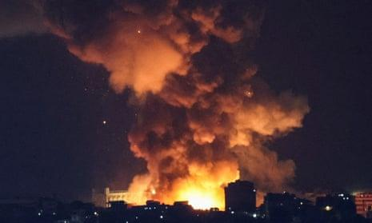
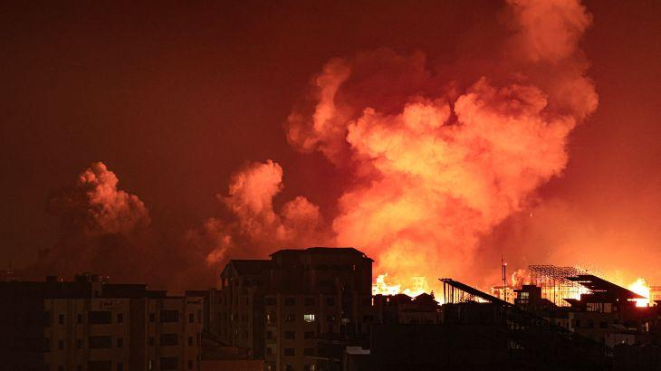

## Claim
Claim: " This image shows the U.S. bombarding Yemen on December 22, 2024 in reprisal after Yemen launched an attack on Israel's capital."

## Actions
```
geolocate()
web_search("Anadolu images bombing")
web_search("Getty images bombing")
image_search("bombing city night")
```

## Evidence
### Evidence from `geolocate`
The most likely countries where the image was taken are: {'Palestine': 0.55, 'Israel': 0.3, 'United Arab Emirates': 0.1, 'Jordan': 0.02, 'Albania': 0.0, 'Andorra': 0.0, 'Argentina': 0.0, 'Australia': 0.0, 'Austria': 0.0, 'Bangladesh': 0.0}

### Evidence from `web_search`
Anadolu published an article on October 15, 2023, stating that images taken by Anadolu photojournalists prove Israel used white phosphorus in Gaza. Amnesty International verified the use of white phosphorus artillery rounds by Israeli military units striking Gaza. The image 

### Evidence from `web_search`
From [Source](https://www.gettyimages.com/photos/bombing): 
Content: The search result from Getty Images contains various images related to "bombing", including explosions, fireballs, and smoke. , . The images are stock photos and illustrations.


### Evidence from `image_search`
The Guardian published an image of a bombing at night (). Al Jazeera published an image of a bombing ().


## Elaboration
The claim is not supported by the evidence. The image is likely taken in Palestine or Israel. The evidence suggests that the image was taken by Anadolu and may depict the use of white phosphorus by Israel in Gaza. There is no evidence to support the claim that the image shows the U.S. bombarding Yemen. The date in the claim (December 22, 2024) is also not supported by the evidence.


## Final Judgement
The image is likely from Palestine or Israel and is related to the conflict there. The claim that the image shows the U.S. bombarding Yemen on December 22, 2024, is not supported by the evidence.

`false`

### Verdict: FALSE

### Justification
The image in the claim, sourced from Anadolu, likely depicts a bombing in Palestine or Israel, possibly related to the use of white phosphorus by Israel, as indicated by the search results. The claim that the image shows the U.S. bombarding Yemen on December 22, 2024, is not supported by the evidence.
