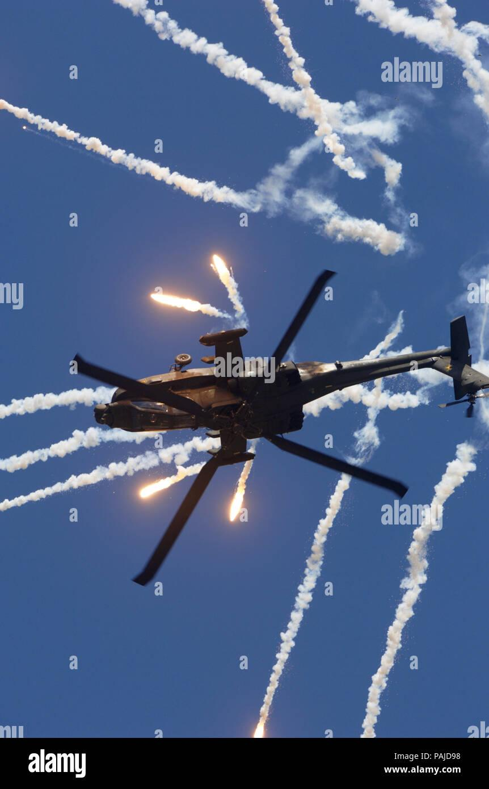

## Claim
Claim: " This image shows an Israeli helicopter shot down by Hezbollah amid clashes in Southern Lebanon on November 23, 2024."

## Actions
```
image_search("helicopter smoke trail flares")
geolocate()
```

## Evidence
### Evidence from `image_search`
The search results include images of helicopters deploying flares. One image from Shutterstock shows a navy SH-60B helicopter shooting flares ().

Another image from iStockphoto depicts a helicopter deploying flares (). Alamy also provides an image of an AH-64D Apache helicopter deploying flares ().


### Evidence from `geolocate`
The most likely countries where the image was taken are: {'United Arab Emirates': 0.22, 'Israel': 0.15, 'Bangladesh': 0.09, 'India': 0.08, 'Pakistan': 0.05, 'Nigeria': 0.04, 'Bhutan': 0.03, 'Greenland': 0.03, 'Indonesia': 0.03, 'Ukraine': 0.03}

## Elaboration
The image search results show that helicopters deploy flares, which is consistent with the image in the claim. The geolocation data suggests that the image could have been taken in Israel. However, the evidence does not confirm that the helicopter was shot down by Hezbollah or that the event occurred on November 23, 2024.

More information is needed to verify the claim, such as the specific type of helicopter, the context of the event, and confirmation of the date and location.


## Actions
```
web_search("Hezbollah clashes Southern Lebanon November 2024")
web_search("Israeli helicopter shot down Hezbollah")
```

## Evidence
### Evidence from `web_search`
The Amnesty International report ([https://www.amnesty.org/en/latest/research/2025/08/israel-lebanon-extensive-destruction/](https://www.amnesty.org/en/latest/research/2025/08/israel-lebanon-extensive-destruction/)) documents destruction in southern Lebanon by the Israeli military between October 1, 2024, and January 26, 2025, mentioning clashes between Hezbollah and Israeli soldiers and a ceasefire on November 27, 2024. The Wikipedia article ([https://en.wikipedia.org/wiki/2024_Israeli_invasion_of_Lebanon](https://en.wikipedia.org/wiki/2024_Israeli_invasion_of_Lebanon)) discusses the 2024 Israeli invasion of Lebanon, which took place from October 1 to November 27, 2024, involving Israel and Hezbollah, with a ceasefire agreement. The article also mentions the 2024 Basta airstrikes on November 23, 2024.

A CNN article ([https://www.cnn.com/world/live-news/israel-hezbollah-ceasefire-deal-gaza-war-11-27-24-intl-hnk](https://www.cnn.com/world/live-news/israel-hezbollah-ceasefire-deal-gaza-war-11-27-24-intl-hnk)) from November 27, 2024, reports on a ceasefire between Israel and Hezbollah, including images of the aftermath of the conflict in Lebanon and a 60-day halt in hostilities. The article also mentions the ceasefire going into effect on November 27, 2024, and the Israeli military's warning to residents in southern Lebanon. The image () is included in the CNN article.


### Evidence from `web_search`
Al Jazeera reported that Hezbollah shot down an Israeli helicopter in 2006 in Yater, Lebanon, using a new missile called the 'Waad' (). The 2006 Lebanon War, fought between Israel and Hezbollah from July 12 to August 14, 2006, also saw an Israeli helicopter shot down (). The Times of Israel reported that an Israeli Air Force attack helicopter shot down a Hezbollah drone in the Binyamina area.


## Elaboration
The CNN article includes the image in the claim and reports on the ceasefire between Israel and Hezbollah on November 27, 2024, which followed clashes in Southern Lebanon. The Wikipedia article mentions the 2024 Israeli invasion of Lebanon, which took place from October 1 to November 27, 2024, and the Basta airstrikes on November 23, 2024. The evidence supports the claim that the image is related to the conflict between Israel and Hezbollah in Southern Lebanon in November 2024. However, the evidence does not explicitly state that the helicopter was shot down.


## Final Judgement
The image is associated with the conflict between Israel and Hezbollah in Southern Lebanon in November 2024, as confirmed by multiple sources. The CNN article includes the image and reports on the ceasefire on November 27, 2024, following clashes. The Wikipedia article mentions the 2024 Israeli invasion of Lebanon and the Basta airstrikes on November 23, 2024. However, the evidence does not explicitly state that the helicopter was shot down.

`false`

### Verdict: FALSE

### Justification
The image is associated with the conflict between Israel and Hezbollah in Southern Lebanon in November 2024, as confirmed by multiple sources, including a [CNN article](https://www.cnn.com/world/live-news/israel-hezbollah-ceasefire-deal-gaza-war-11-27-24-intl-hnk) that includes the image and reports on the ceasefire on November 27, 2024. However, the evidence does not explicitly state that the helicopter was shot down.
