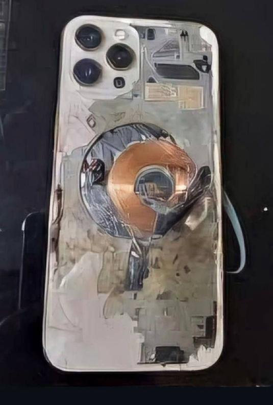
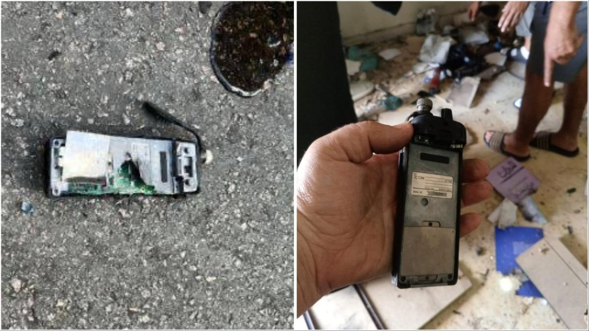

## Claim
Claim: " This image shows an Iphone that exploded during the pager attacks on Hezbollah devices in Lebanon in September 2024, blowing up random people."

## Actions
```
image_search("exploded iphone lebanon september 2024")
```

## Evidence
### Evidence from `image_search`
The search results include an image of an exploded iPhone (). An article from India Today discusses explosions of Hezbollah devices in Lebanon and includes images of exploded devices ().

DW.com states that the claim is false and shows a post about sabotaged solar panels in Lebanon that have started significant electrical fires ().
*   [https://itc.ua/en/news/not-just-pagers-iphones-laptops-electronic-locks-and-other-devices-exploded-in-lebanon-today/](https://itc.ua/en/news/not-just-pagers-iphones-laptops-electronic-locks-and-other-devices-exploded-in-lebanon-today/)
*   [https://www.indiatoday.in/world/story/hezbollah-devices-explode-lebanon-pager-blasts-beirut-israel-2602266-2024-09-18](https://www.indiatoday.in/world/story/hezbollah-devices-explode-lebanon-pager-blasts-beirut-israel-2602266-2024-09-18)
*   [https://www.dw.com/en/fact-check-no-iphones-solar-panels-laptops-exploded-in-lebanon/a-70281061](https://www.dw.com/en/fact-check-no-iphones-solar-panels-laptops-exploded-in-lebanon/a-70281061)


## Elaboration
The claim is false. While the search results confirm that explosions of devices, including iPhones, occurred in Lebanon, the evidence indicates that the explosions were not the primary cause of injury. DW.com explicitly labels the claim as false and attributes the injuries to sabotaged solar panels.


## Final Judgement
The claim is demonstrably false. While the image of an exploded iPhone is present, the primary cause of injuries in Lebanon was due to sabotaged solar panels, not exploding iPhones. `false`

### Verdict: FALSE

### Justification
The claim is false. While there were explosions of devices, including iPhones, in Lebanon, the primary cause of injuries was attributed to sabotaged solar panels, as reported by [DW.com](https://www.dw.com/en/fact-check-no-iphones-solar-panels-laptops-exploded-in-lebanon/a-70281061).
