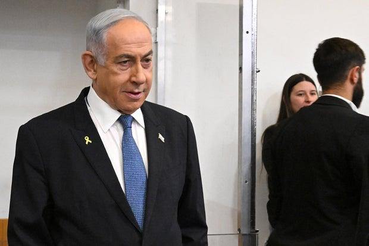
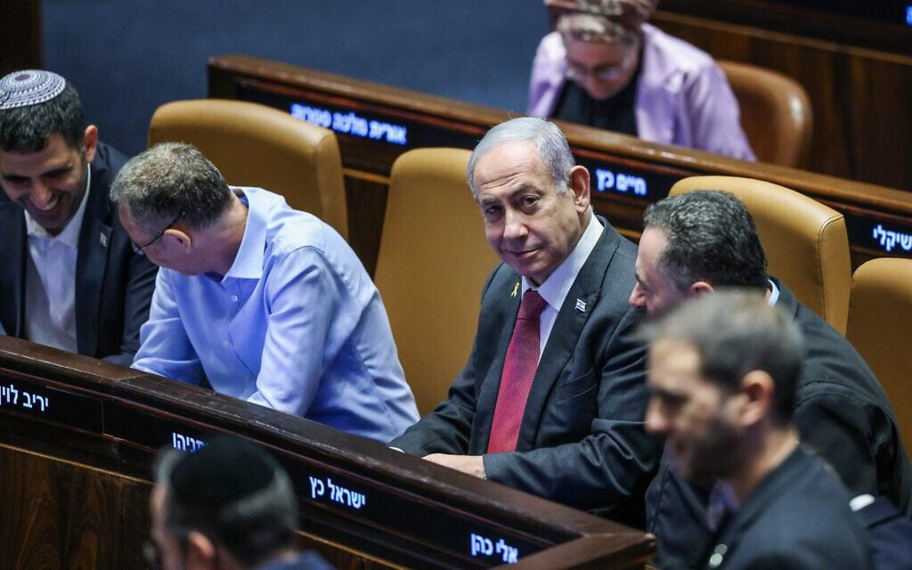
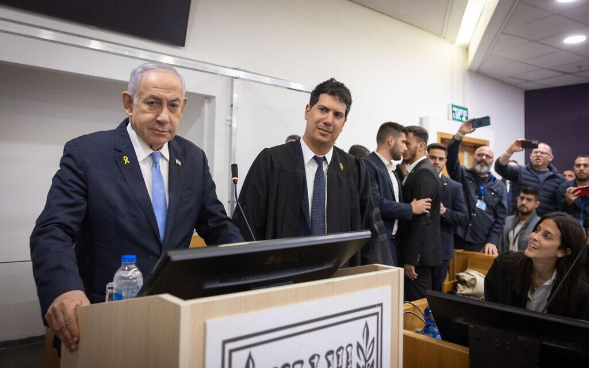
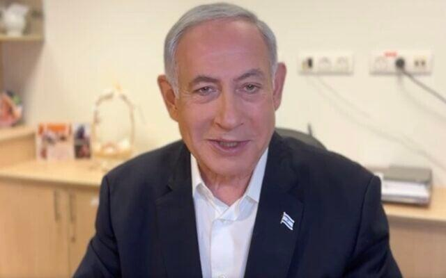

## Claim
Claim: " This is an authentic image of Benjamin Netanyahu being hospitalized in Tel Aviv in November 2024 due to a serious health issue."

## Actions
```
web_search("Benjamin Netanyahu hospitalized Tel Aviv November 2024")
```

## Evidence
### Evidence from `web_search`
Reuters reported on April 1, 2024, that Benjamin Netanyahu was to be released from the hospital after a hernia procedure, which was successful. ([https://www.reuters.com/world/middle-east/israeli-pm-netanyahus-hernia-operation-was-successful-hospital-says-2024-04-01/](https://www.reuters.com/world/middle-east/israeli-pm-netanyahus-hernia-operation-was-successful-hospital-says-2024-04-01/)) 

The Times of Israel reported that Netanyahu missed a cabinet meeting in July 2025 due to illness. ([https://www.timesofisrael.com/liveblog_entry/pm-suffering-from-food-poisoning-his-office-says-after-he-skipped-cabinet-meeting/](https://www.timesofisrael.com/liveblog_entry/pm-suffering-from-food-poisoning-his-office-says-after-he-skipped-cabinet-meeting/))  CBS News reported that Netanyahu underwent prostate removal surgery and was hospitalized. ([https://www.cbsnews.com/news/israel-benjamin-netanyahu-prostate-removal-surgery-gaza-war-hamas/](https://www.cbsnews.com/news/israel-benjamin-netanyahu-prostate-removal-surgery-gaza-war-hamas/)) 


## Elaboration
The provided evidence indicates that Benjamin Netanyahu was hospitalized for a hernia procedure in April 2024 ([https://www.reuters.com/world/middle-east/israeli-pm-netanyahus-hernia-operation-was-successful-hospital-says-2024-04-01/](https://www.reuters.com/world/middle-east/israeli-pm-netanyahus-hernia-operation-was-successful-hospital-says-2024-04-01/)) and underwent prostate removal surgery ([https://www.cbsnews.com/news/israel-benjamin-netanyahu-prostate-removal-surgery-gaza-war-hamas/](https://www.cbsnews.com/news/israel-benjamin-netanyahu-prostate-removal-surgery-gaza-war-hamas/)). He also missed a cabinet meeting in July 2025 due to illness ([https://www.timesofisrael.com/liveblog_entry/pm-suffering-from-food-poisoning-his-office-says-after-he-skipped-cabinet-meeting/](https://www.timesofisrael.com/liveblog_entry/pm-suffering-from-food-poisoning-his-office-says-after-he-skipped-cabinet-meeting/)).

The evidence does not mention any hospitalization in Tel Aviv in November 2024 due to a serious health issue. Therefore, the claim cannot be verified with the provided information.

To verify the claim, information about Netanyahu's hospitalization in Tel Aviv in November 2024 is needed.


## Actions
```
image_search("Benjamin Netanyahu hospital mask")
```

## Evidence
### Evidence from `image_search`
The search results include images of Benjamin Netanyahu wearing a mask from [Source](https://www.aspistrategist.org.au/netanyahus-poisoned-legacy/) , [Source](https://www.latimes.com/world-nation/story/2022-10-06/israel-benjamin-netanyahu-leaves-hospital-overnight-stay) , and receiving a COVID-19 vaccine from [Source](https://www.aljazeera.com/news/2020/12/19/netanyahu-gets-covid-vaccine-starts-israel-rollout) .


## Elaboration
The image search results show Benjamin Netanyahu wearing masks in different contexts, including a COVID-19 vaccine. However, none of the images match the one in the claim. The evidence still does not provide any information about Netanyahu being hospitalized in Tel Aviv in November 2024.


## Actions
```
web_search("Benjamin Netanyahu health issues November 2024")
```

## Evidence
### Evidence from `web_search`
The Times of Israel reported that Benjamin Netanyahu underwent prostate removal surgery in December 2024 and was in the Knesset on November 11, 2024. ([https://www.timesofisrael.com/netanyahu-awake-recovering-after-successful-prostate-removal-surgery-pms-office/](https://www.timesofisrael.com/netanyahu-awake-recovering-after-successful-prostate-removal-surgery-pms-office/)) , ,  Anadolu Agency reported in July 2025 that Netanyahu was diagnosed with intestinal inflammation and would rest for three days. ([https://www.aa.com.tr/en/middle-east/israeli-prime-minister-diagnosed-with-intestinal-inflammation-after-suffering-from-food-poisoning/3636595](https://www.aa.com.tr/en/middle-east/israeli-prime-minister-diagnosed-with-intestinal-inflammation-after-suffering-from-food-poisoning/3636595)) The Jerusalem Post reported on Netanyahu's health report, mentioning his attendance at the Tel Aviv District Court on December 24, 2024. ([https://www.jpost.com/health-and-wellness/article-842412](https://www.jpost.com/health-and-wellness/article-842412)) 


## Elaboration
The evidence indicates that Benjamin Netanyahu was in the Knesset on November 11, 2024, and underwent prostate removal surgery in December 2024. He also attended the Tel Aviv District Court on December 24, 2024. The evidence does not mention any hospitalization in Tel Aviv in November 2024 due to a serious health issue. Therefore, the claim cannot be verified with the provided information.


## Final Judgement
The claim is not supported by the provided evidence. While Netanyahu has had health issues and hospitalizations, there is no evidence to support the specific claim of hospitalization in Tel Aviv in November 2024 due to a serious health issue.

`false`

### Verdict: FALSE

### Justification
The claim is not supported by the evidence. While Benjamin Netanyahu has had health issues and hospitalizations, including a hernia procedure in April 2024 ([https://www.reuters.com/world/middle-east/israeli-pm-netanyahus-hernia-operation-was-successful-hospital-says-2024-04-01/](https://www.reuters.com/world/middle-east/israeli-pm-netanyahus-hernia-operation-was-successful-hospital-says-2024-04-01/)) and prostate removal surgery in December 2024, there is no evidence of hospitalization in Tel Aviv in November 2024 due to a serious health issue.
