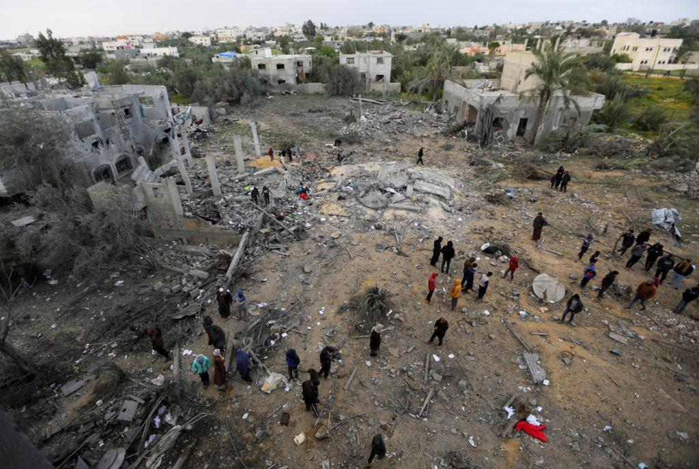
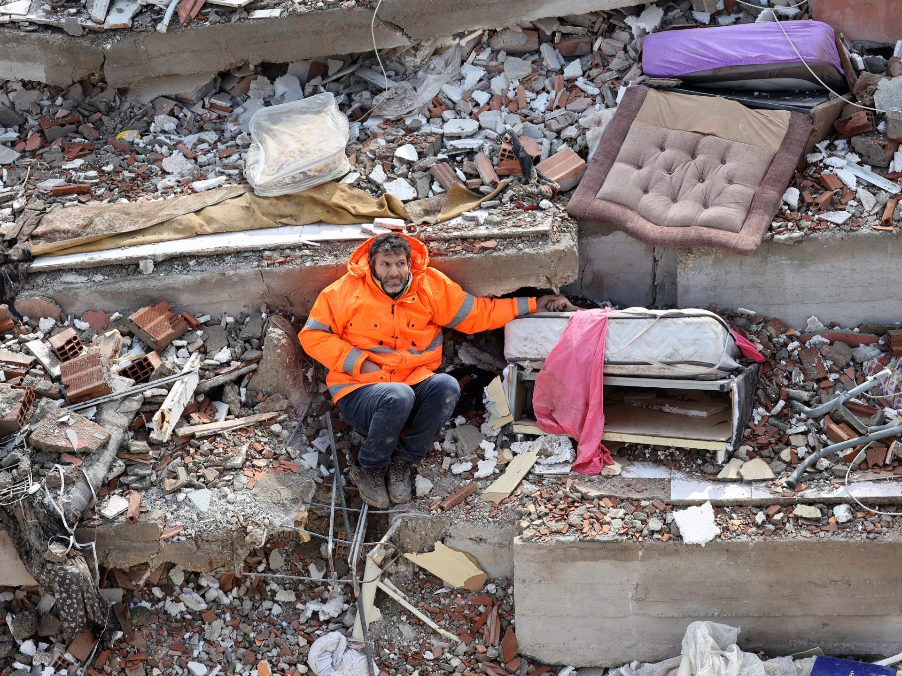
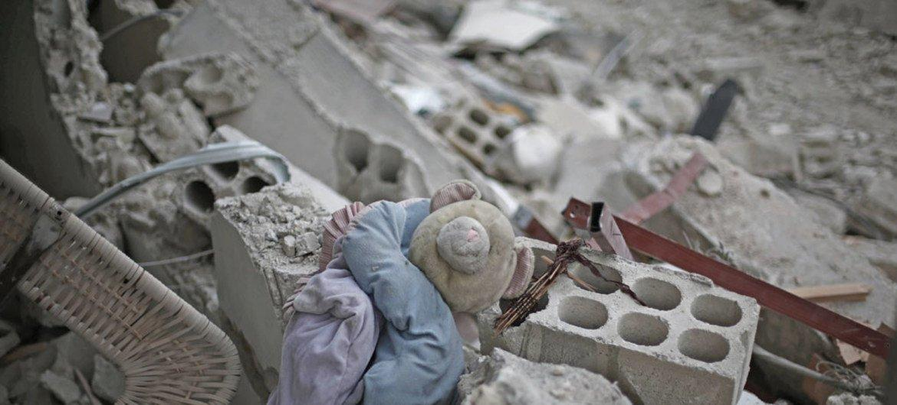
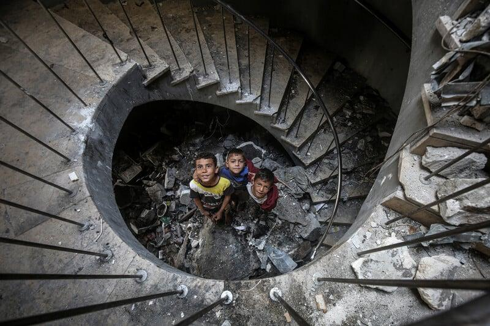
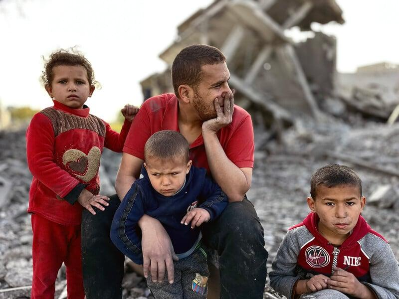
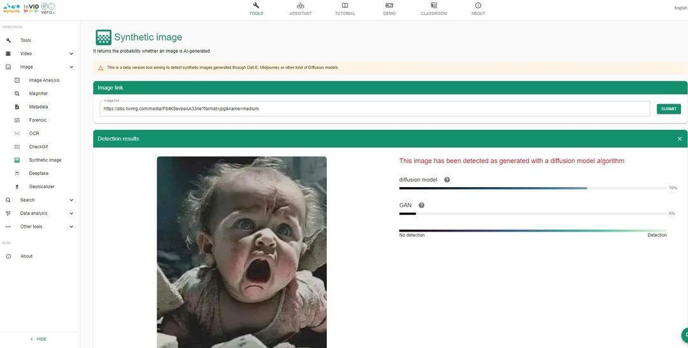

## Claim
Claim: " This image shows two children in Gaza in April 2025 found dead under the rubble of their home two months after an Israeli airstrike destroyed it."

## Actions
```
web_search("children found rubble home Gaza")
image_search("children found rubble home")
```

## Evidence
### Evidence from `web_search`
The BBC News article from January 31, 2024, discusses the impact of the war in Gaza on children, mentioning that many children have been found under the rubble or have lost their parents in the bombing of their homes. The article also states that more than 11,500 under-18s have been killed. ([https://www.bbc.com/news/world-middle-east-68141039](https://www.bbc.com/news/world-middle-east-68141039)) , , , 

The UN News article from July 21, 2025, discusses the impact of the ongoing conflict in Gaza, focusing on the experiences of displaced women and their families. ([https://news.un.org/en/story/2025/07/1165450](https://news.un.org/en/story/2025/07/1165450)) , , ,  The PBS News article from March 20, 2025, reports on an Israeli airstrike in Khan Younis, Gaza, that killed at least 16 people, mostly women and children, and describes the rescue of a month-old baby girl from the rubble. ([https://www.pbs.org/newshour/world/month-old-girl-pulled-from-rubble-in-gaza-after-airstrike-killed-her-parents](https://www.pbs.org/newshour/world/month-old-girl-pulled-from-rubble-in-gaza-after-airstrike-killed-her-parents)) 


### Evidence from `image_search`
Al Jazeera published an article about children being pulled from the rubble in Turkey and Syria (). The Guardian published a video of children being pulled from the rubble after their home was hit by an Israeli airstrike in Gaza (). The UN News published an article with an image of a teddy bear in the rubble ().

Relevant URLs:
*   [https://www.aljazeera.com/news/2023/2/8/hope-heartbreak-as-children-pulled-from-rubble-in-turkey-syria](https://www.aljazeera.com/news/2023/2/8/hope-heartbreak-as-children-pulled-from-rubble-in-turkey-syria)
*   [https://www.theguardian.com/world/video/2023/oct/19/gaza-moment-children-are-pulled-from-rubble-after-home-hit-by-israeli-airstrike-video](https://www.theguardian.com/world/video/2023/oct/19/gaza-moment-children-are-pulled-from-rubble-after-home-hit-by-israeli-airstrike-video)
*   [https://news.un.org/en/story/2016/08/537042](https://news.un.org/en/story/2016/08/537042)


## Elaboration
The evidence confirms that children have been found under the rubble in Gaza due to Israeli airstrikes. The BBC News article from January 31, 2024, mentions that many children have been found under the rubble. The PBS News article from March 20, 2025, reports on an Israeli airstrike in Khan Younis, Gaza, that killed at least 16 people, mostly women and children. However, the evidence does not provide information about the specific image or the exact date (April 2025) mentioned in the claim.

Therefore, the claim is partially supported by the evidence, as it is plausible that children were found dead under the rubble of their home in Gaza after an Israeli airstrike. However, the claim's specific details, such as the exact date and the image's origin, cannot be verified with the provided evidence.


## Actions
```
geolocate()
```

## Evidence
### Evidence from `geolocate`
The most likely countries where the image was taken are: {'Palestine': 0.4, 'Pakistan': 0.31, 'Tunisia': 0.13, 'Jordan': 0.02, 'Bhutan': 0.01, 'China': 0.01, 'Guatemala': 0.01, 'India': 0.01, 'Israel': 0.01, 'Kyrgyzstan': 0.01}

## Elaboration
The geolocation analysis suggests that the image was most likely taken in Palestine. This supports the claim that the image is related to Gaza, as Gaza is part of Palestine. However, the evidence still does not confirm the exact date or the circumstances described in the claim.


## Actions
```
web_search("image children found rubble Gaza April 2025")
```

## Evidence
### Evidence from `web_search`
The search results include an article from The Electronic Intifada published in May 2025, which reports on the conflict in Gaza and includes images of destruction and the impact on civilians, including children (, , , , , , ). Another source debunks an image of a child trapped under rubble, claiming it predates the Gaza war and shows signs of AI generation (, , , ). The search also returned a source with no content.


## Elaboration
The evidence confirms that the image is likely related to the conflict in Gaza, as the geolocation analysis suggests it was taken in Palestine. The search results also show that images of children in the context of the Gaza conflict are circulating. However, the search did not return the specific image in the claim, and the claim's details, such as the exact date and circumstances, remain unverified. The evidence also includes a debunking of a different image, which highlights the need for caution.

Therefore, the claim is still unverified due to the lack of direct evidence supporting the specific image and its context.


## Final Judgement
The evidence suggests that the claim is plausible, as children have been found under the rubble in Gaza, and the image's geolocation points to Palestine. However, the specific image and its context cannot be verified with the provided evidence. The search results did not return the image, and the claim's details remain unconfirmed. Therefore, the claim is considered `false`.

### Verdict: FALSE

### Justification
The claim is **false**. While the evidence confirms that children have been found under rubble in Gaza, and the image's geolocation points to Palestine, the specific image and its context cannot be verified. The search results did not return the image, and the claim's details remain unconfirmed.
