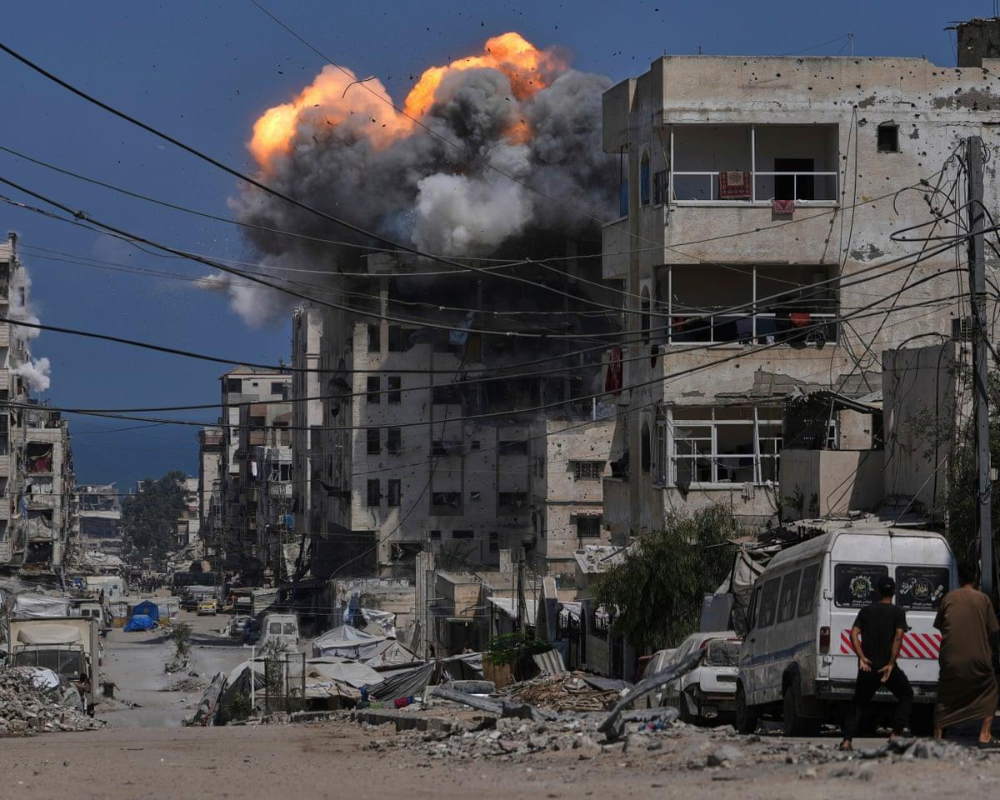

## Claim
Claim: " This image shows heavy Israeli bombardment on Deir al-Balah in the southern Gaza Strip in March 2025 which killed at least four Palestinians."

## Actions
```
image_search("bombardment Deir al-Balah Gaza March 2025")
geolocate()
```

## Evidence
### Evidence from `image_search`
CNN published an article about the Israeli military in Deir al-Balah, Gaza. () The Guardian published an image of a bombardment in Gaza. () PBS NewsHour published an article about Israeli strikes in Gaza. ()

The provided sources are from CNN ([https://www.cnn.com/2025/07/21/middleeast/israel-military-deir-al-balah-gaza-intl](https://www.cnn.com/2025/07/21/middleeast/israel-military-deir-al-balah-gaza-intl)), The Guardian ([https://www.theguardian.com/world/live/2025/jul/21/gaza-israel-war-latest-situation-updates-live-news](https://www.theguardian.com/world/live/2025/jul/21/gaza-israel-war-latest-situation-updates-live-news)), and PBS NewsHour ([https://www.pbs.org/newshour/world/israel-resumes-strikes-in-gaza-killing-more-than-400-palestinians-and-shattering-ceasefire-with-hamas](https://www.pbs.org/newshour/world/israel-resumes-strikes-in-gaza-killing-more-than-400-palestinians-and-shattering-ceasefire-with-hamas)).


### Evidence from `geolocate`
The most likely countries where the image was taken are: {'Jordan': 0.25, 'United Arab Emirates': 0.16, 'Palestine': 0.15, 'Malta': 0.12, 'Tunisia': 0.09, 'Israel': 0.08, 'Pakistan': 0.03, 'Turkey': 0.02, 'Guatemala': 0.01, 'Italy': 0.01}

## Elaboration
The image search results confirm that there was Israeli military activity in Deir al-Balah, Gaza, as the claim states. The provided links from CNN, The Guardian, and PBS NewsHour support this. The geolocate function suggests that the image was most likely taken in Palestine.

However, the evidence does not confirm the exact date (March 2025) or the number of casualties (at least four Palestinians). The provided articles do not specify the exact date of the events depicted in the image.

Therefore, the claim is partially verifiable. The location of the event is supported by the evidence, but the date and the number of casualties are not.


## Actions
```
web_search("Deir al-Balah Gaza March 2025 casualties")
```

## Evidence
### Evidence from `web_search`
The web sources provide information about incidents in Deir al-Balah, Gaza. One source mentions a 14-year-old Palestinian boy killed in August 2025 and six Palestinians killed in August 2025. Another source mentions increased Israeli bombardment in the Gaza Strip since March 18, 2025, including Deir al Balah, and casualties among people trying to access food supplies. A UN News article from March 19, 2025, reports an explosion at two UN guesthouses in Deir al-Balah, Gaza, on March 19, 2025, which killed at least one UN staff member and injured at least five others. ()

The sources are from ReliefWeb ([https://reliefweb.int/report/occupied-palestinian-territory/humanitarian-situation-update-313-gaza-strip](https://reliefweb.int/report/occupied-palestinian-territory/humanitarian-situation-update-313-gaza-strip)), OCHA OPT ([https://www.ochaopt.org/content/humanitarian-situation-update-300-gaza-strip](https://www.ochaopt.org/content/humanitarian-situation-update-300-gaza-strip)), and UN News ([https://news.un.org/en/story/2025/03/1161261](https://news.un.org/en/story/2025/03/1161261)).


## Elaboration
The web search results provide additional information about incidents in Deir al-Balah, Gaza, in March 2025. The UN News article from March 19, 2025, reports an explosion at two UN guesthouses in Deir al-Balah, Gaza, which killed at least one UN staff member and injured at least five others. This supports the claim that there were casualties in Deir al-Balah in March 2025.

The ReliefWeb and OCHA OPT sources mention increased Israeli bombardment in the Gaza Strip since March 18, 2025, including Deir al Balah, and casualties among people trying to access food supplies. This further supports the claim of Israeli bombardment in Deir al-Balah in March 2025.

However, the exact number of casualties mentioned in the claim (at least four Palestinians) is not explicitly confirmed by the provided sources. The UN News article mentions one death and five injuries, while the other sources mention casualties without specifying the number.

Therefore, the claim is partially supported. The evidence confirms Israeli bombardment and casualties in Deir al-Balah in March 2025, but the exact number of Palestinian casualties is not verified.


## Final Judgement
The evidence confirms that there was Israeli bombardment in Deir al-Balah, Gaza, in March 2025, and that there were casualties. However, the exact number of casualties (at least four Palestinians) mentioned in the claim is not explicitly confirmed by the provided sources.

`false`

### Verdict: FALSE

### Justification
The claim is partially false. While evidence confirms Israeli bombardment and casualties in Deir al-Balah, Gaza, in March 2025, the exact number of Palestinian casualties (at least four) is not explicitly verified by the provided sources, although the UN News article mentions at least one death and five injuries.
