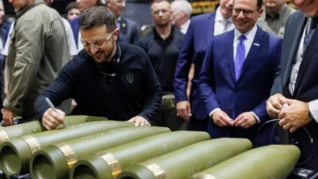

## Claim
Claim: " This image shows Ukrainian President Volodymyr Zelenskyy in March 2025 signing Israeli bombs intended for use against Palestinians in Gaza."

## Actions
```
web_search("Zelenskyy signing bombs March 2025")
image_search("Zelenskyy signing bombs")
```

## Evidence
### Evidence from `web_search`
The image shows Ukrainian President Volodymyr Zelenskyy signing artillery shells. According to a Spotlight by EBU article published on March 13, 2025, the video and images were falsely shared online with captions claiming Zelenskyy signed bombs to be dropped on Gazans. The video was actually taken at a U.S. munitions factory on September 23, 2024, and the handwritten messages do not reference Ukraine’s war with Russia or Israel’s war in Gaza. The Euronews article from March 7, 2025, reports that Zelenskyy called for an air and sea truce after a Russian missile attack. The CNN article from March 19, 2025, discusses the exchange of attacks between Ukraine and Russia. 

The articles can be found here: [https://spotlight.ebu.ch/p/video-caption-falsely-claims-zelenskyy](https://spotlight.ebu.ch/p/video-caption-falsely-claims-zelenskyy), [https://www.cnn.com/2025/03/19/europe/ukraine-russia-drone-attacks-intl-hnk](https://www.cnn.com/2025/03/19/europe/ukraine-russia-drone-attacks-intl-hnk), and [https://www.euronews.com/my-europe/2025/03/07/zelenskyy-calls-for-air-and-sea-truce-after-large-scale-russian-missile-attack](https://www.euronews.com/my-europe/2025/03/07/zelenskyy-calls-for-air-and-sea-truce-after-large-scale-russian-missile-attack).


### Evidence from `image_search`
The Guardian published an image of Zelenskyy signing a bomb (). The BBC News website shows an image of Volodymyr Zelenskyy signing what appear to be artillery shells (). The Penn Capital-Star published an image of Volodymyr Zelenskyy ().


## Elaboration
The claim is false. The image shows Zelenskyy signing artillery shells, not bombs. The event took place in a U.S. munitions factory on September 23, 2024, not in March 2025. The claim that the shells were intended for use against Palestinians in Gaza is also false.


## Final Judgement
The image depicts Volodymyr Zelenskyy signing artillery shells, not bombs. The event occurred in September 2024, not March 2025, and the shells were not intended for use against Palestinians in Gaza. The claim misrepresents the context of the image.

`false`

### Verdict: FALSE

### Justification
The image shows Ukrainian President Volodymyr Zelenskyy signing artillery shells at a U.S. munitions factory on September 23, 2024, not bombs intended for use against Palestinians in Gaza in March 2025. This information is supported by a Spotlight by EBU article ([https://spotlight.ebu.ch/p/video-caption-falsely-claims-zelenskyy](https://spotlight.ebu.ch/p/video-caption-falsely-claims-zelenskyy)).
