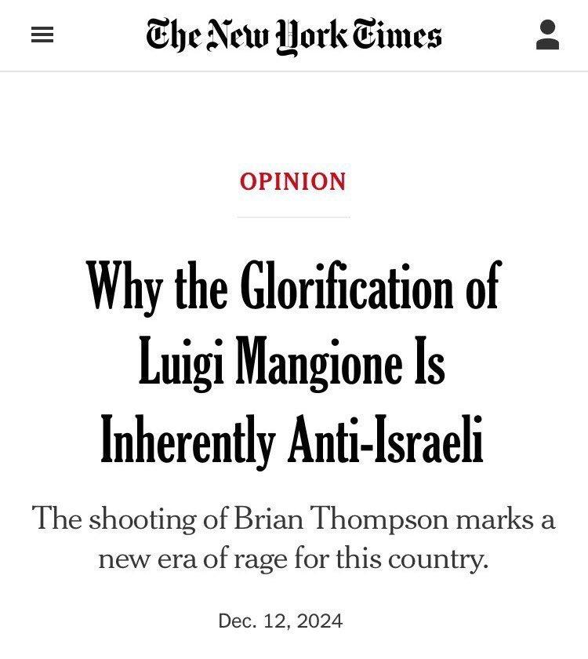

## Claim
Claim: " This image shows a screenshot of an authentic New York Times article from December, 12, 2024 with the title 'Why the Glorification of Luigi Mangione Is Inherently Anti-Israeli."

## Actions
```
web_search("New York Times Luigi Mangione Anti-Israeli")
image_search("New York Times Luigi Mangione")
```

## Evidence
### Evidence from `web_search`
From [Source](https://www.nytco.com/press/tracking-misinformation-fabricated-opinion-headline/): 
Content: The New York Times did not publish a headline or story titled, “Why the Glorification of Luigi Mangione Is Inherently Anti-Israel.” . The source is from nytco.com.


### Evidence from `image_search`
The New York Times published an article about Luigi Mangione on December 11, 2024, according to [this source](https://www.nytimes.com/2024/12/11/style/luigi-mangione-uhc-social.html). The New Yorker also published an article about Luigi Mangione, as stated in [this source](https://www.newyorker.com/news/the-lede/luigi-mangione-and-the-making-of-a-modern-antihero). CBS News published an article about Luigi Mangione as well, according to [this source](https://www.cbsnews.com/news/luigi-mangione-healthcare-ceo-shooting-what-we-know/).

The search results include images of Luigi Mangione (, , ).


## Elaboration
The New York Times did not publish an article with the headline "Why the Glorification of Luigi Mangione Is Inherently Anti-Israeli," according to a search result from nytco.com ([https://www.nytco.com/press/tracking-misinformation-fabricated-opinion-headline/](https://www.nytco.com/press/tracking-misinformation-fabricated-opinion-headline/)). However, the New York Times did publish an article about Luigi Mangione on December 11, 2024 ([https://www.nytimes.com/2024/12/11/style/luigi-mangione-uhc-social.html](https://www.nytimes.com/2024/12/11/style/luigi-mangione-uhc-social.html)).

The image in the claim shows a screenshot of a New York Times article with the headline in question. Given the evidence, the headline is fabricated.


## Final Judgement
The New York Times did not publish an article with the headline "Why the Glorification of Luigi Mangione Is Inherently Anti-Israeli," as confirmed by a search result from nytco.com. While the New York Times did publish an article about Luigi Mangione, the specific headline in the image is fabricated.

`false`

### Verdict: FALSE

### Justification
The claim is false. The New York Times did not publish an article with the headline "Why the Glorification of Luigi Mangione Is Inherently Anti-Israeli," according to a search result from nytco.com ([https://www.nytco.com/press/tracking-misinformation-fabricated-opinion-headline/](https://www.nytco.com/press/tracking-misinformation-fabricated-opinion-headline/)).
