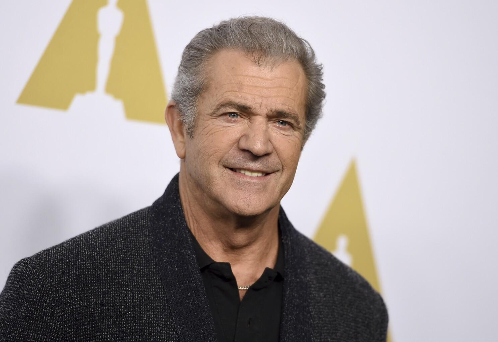

## Claim
Claim: " The image shows a screenshot of an authentic social media post from Mel Gibson saying that Israel will end soon and therefore destroy everything in its way together with a flag in the color of Israel that shows an hourglass."

## Actions
```
web_search("Mel Gibson Israel hourglass")
image_search("Mel Gibson Israel flag hourglass")
```

## Evidence
### Evidence from `web_search`
The image of Mel Gibson's post is fake, according to a Yahoo article, which includes an altered Israeli flag with an hourglass (, ). The article states that Gibson has no public-facing social media accounts. The World Jewish Congress published an article about Mel Gibson apologizing for an anti-Semitic slur ().

The BBC published an article discussing accusations of antisemitism against Mel Gibson ().


### Evidence from `image_search`
The Associated Press published a fact check about a social media post attributed to Mel Gibson (). Al Jazeera published an article about Mel Gibson ().

The sources are: [https://apnews.com/article/fact-check-mel-gibson-israel-post-342335121493](https://apnews.com/article/fact-check-mel-gibson-israel-post-342335121493) and [https://www.aljazeera.com/news/2004/4/4/palestinians-love-mel-gibsons-film](https://www.aljazeera.com/news/2004/4/4/palestinians-love-mel-gibsons-film).


## Elaboration
The claim is false. The evidence indicates that the social media post attributed to Mel Gibson is fake. Multiple sources, including a Yahoo article and the Associated Press, confirm that the image is fabricated. Furthermore, Gibson does not have any public-facing social media accounts.


## Final Judgement
The claim is demonstrably false. The image of the social media post attributed to Mel Gibson is fake. Multiple sources confirm the image's fabrication, and Gibson has no public social media accounts.

`false`

### Verdict: FALSE

### Justification
The claim is false. The image of the social media post attributed to Mel Gibson is fake, as confirmed by a [Yahoo article](https://apnews.com/article/fact-check-mel-gibson-israel-post-342335121493) and the [Associated Press](https://apnews.com/article/fact-check-mel-gibson-israel-post-342335121493). Gibson does not have any public-facing social media accounts.
