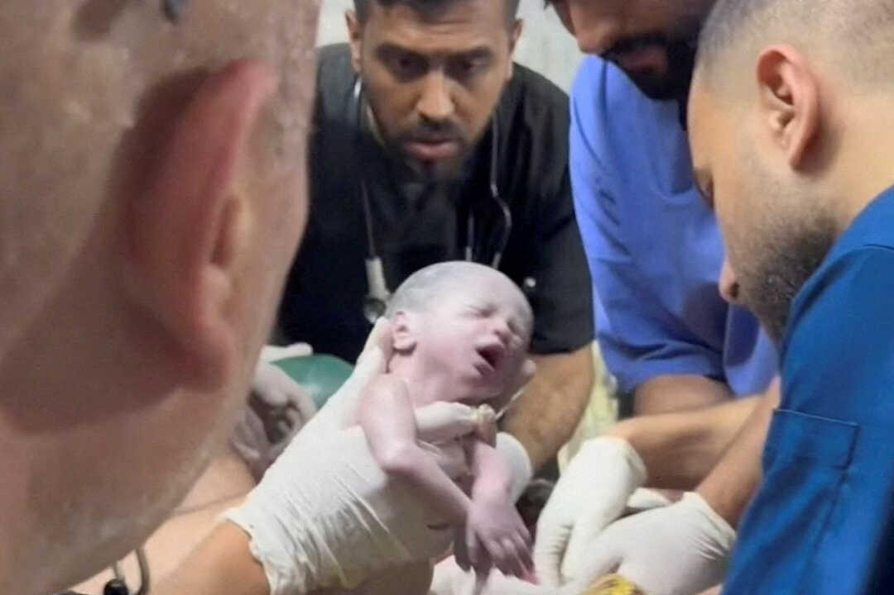
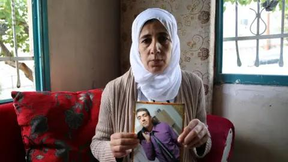
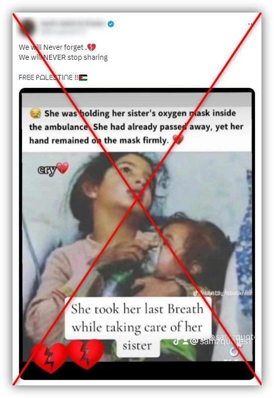
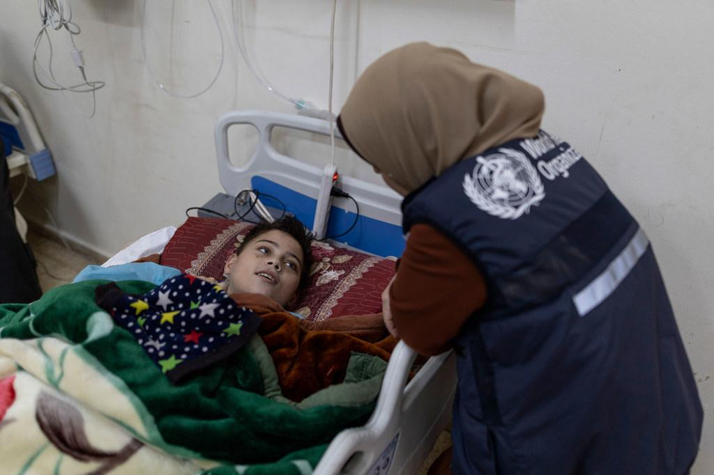
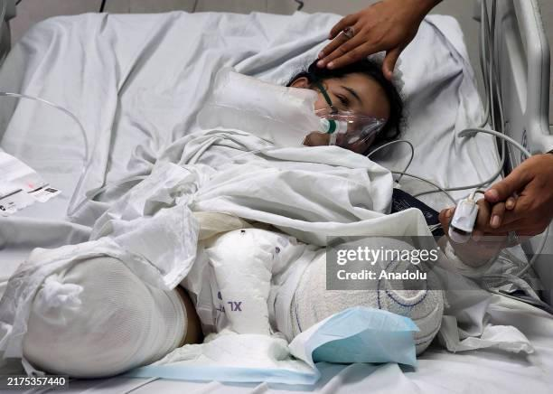

## Claim
Claim: " This image shows a Palestinian girl in the Gaza war in July 2024. She was holding her sister's oxygen mask inside the ambulance. She had already passed away, yet her hand remained on the mask firmly."

## Actions
```
geolocate()
web_search("Palestinian girl Gaza war oxygen mask")
image_search("Palestinian girl oxygen mask ambulance")
```

## Evidence
### Evidence from `geolocate`
The most likely countries where the image was taken are: {'Palestine': 0.85, 'Jordan': 0.04, 'Israel': 0.02, 'Tunisia': 0.02, 'Bhutan': 0.01, 'Russia': 0.01, 'Turkey': 0.01, 'United Arab Emirates': 0.01, 'Albania': 0.0, 'Andorra': 0.0}

### Evidence from `web_search`
An NPR article from April 26, 2024, discusses the death of a baby girl in Gaza who was born prematurely after her mother was killed in an Israeli airstrike. The article includes images of the baby in an incubator  and being held by a medic . The BBC published an article about a video released by Hamas, which appears to show an Israeli citizen, Hisham al-Sayed, being held captive in the Gaza Strip, wearing an oxygen mask .

The Middle East Eye published an article on April 24, 2025, discussing the impact of the war on Gaza, including the decline in life expectancy and malnutrition. The article includes images of injured Palestinians in hospitals in December 2023 and July 2024, including one of a medic helping a woman with an oxygen mask <image:k>.


### Evidence from `image_search`
The image in question is of a Syrian girl holding a baby's oxygen mask, according to a source ([https://belux.edmo.eu/photo-of-syrian-girl-holding-babys-oxygen-mask-misrepresented-online/](https://belux.edmo.eu/photo-of-syrian-girl-holding-babys-oxygen-mask-misrepresented-online/)). Other sources show images of Palestinian girls, one in a hospital bed ([https://news.un.org/en/story/2025/04/1162206](https://news.un.org/en/story/2025/04/1162206)) and another available on Getty Images ([https://www.gettyimages.com/photos/palestine-girl](https://www.gettyimages.com/photos/palestine-girl)). , , 


## Elaboration
The claim is inaccurate. The image search reveals that the picture is of a Syrian girl, not a Palestinian girl. The image was misrepresented online.


## Final Judgement
The image is of a Syrian girl, not a Palestinian girl as the claim states. The image has been misrepresented. `false`

### Verdict: FALSE

### Justification
The image in the claim is of a Syrian girl, not a Palestinian girl, and has been misrepresented online, as confirmed by an image search ([https://belux.edmo.eu/photo-of-syrian-girl-holding-babys-oxygen-mask-misrepresented-online/](https://belux.edmo.eu/photo-of-syrian-girl-holding-babys-oxygen-mask-misrepresented-online/)).
