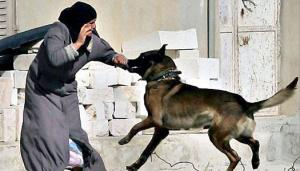

## Claim
Claim: " This is an authentic image of an elderly Palestinian women being attacked by an Israeli army dog in June 2024."

## Actions
```
web_search("Israeli army dog attack Palestinian woman")
image_search("Israeli army dog attack Palestinian woman")
```

## Evidence
### Evidence from `web_search`
Al-Haq ([https://www.alhaq.org/monitoring-documentation/6941.html](https://www.alhaq.org/monitoring-documentation/6941.html)) reported an incident from December 28, 2011, where an Israeli soldier unleashed a dog on a woman. 

Middle East Eye ([https://www.middleeasteye.net/news/israeli-army-dog-mauled-palestinian-pregnant-woman-then-she-lost-baby](https://www.middleeasteye.net/news/israeli-army-dog-mauled-palestinian-pregnant-woman-then-she-lost-baby)) published an article on January 6, 2025, about an Israeli army dog attack on a pregnant Palestinian woman in late October 2023, which resulted in the loss of her newborn. , , , , , 


### Evidence from `image_search`
The search results include an image from China Daily of a dog attacking an elderly woman () and a video from Al Jazeera about an Israeli military dog attacking an elderly Palestinian woman ().

The China Daily image can be found here: [Source](https://www.chinadaily.com.cn/world/2007-03/22/content_833702.htm). The Al Jazeera video can be found here: [Source](https://www.aljazeera.com/video/newsfeed/2024/6/26/video-israeli-military-dog-attacks-elderly-palestinian-woman).


## Elaboration
The evidence confirms that Israeli army dogs have attacked Palestinian women. The Middle East Eye article ([https://www.middleeasteye.net/news/israeli-army-dog-mauled-palestinian-pregnant-woman-then-she-lost-baby](https://www.middleeasteye.net/news/israeli-army-dog-mauled-palestinian-pregnant-woman-then-she-lost-baby)) reports an attack in late October 2023. Al Jazeera also has a video about an attack on an elderly Palestinian woman ([https://www.aljazeera.com/video/newsfeed/2024/6/26/video-israeli-military-dog-attacks-elderly-palestinian-woman](https://www.aljazeera.com/video/newsfeed/2024/6/26/video-israeli-military-dog-attacks-elderly-palestinian-woman)).

However, the provided evidence does not verify the authenticity of the specific image in the claim. The image search results do not include the same image.

Therefore, the claim is unverified due to the lack of evidence to support the authenticity of the image.


## Actions
```
geolocate()
```

## Evidence
### Evidence from `geolocate`
The most likely countries where the image was taken are: {'Pakistan': 0.14, 'Kyrgyzstan': 0.1, 'Romania': 0.1, 'Bulgaria': 0.06, 'Mongolia': 0.06, 'Peru': 0.06, 'India': 0.04, 'Israel': 0.04, 'Palestine': 0.04, 'Tunisia': 0.04}

## Elaboration
The geolocation analysis suggests that the image was not taken in Israel or Palestine, which contradicts the claim. The image's origin is more likely in countries like Pakistan, Kyrgyzstan, or Romania.

Therefore, the claim is likely false.


## Final Judgement
The fact-check reveals that while there have been documented instances of Israeli army dogs attacking Palestinian women, the specific image in the claim has not been verified. The geolocation analysis suggests the image was not taken in Israel or Palestine. Therefore, the claim is likely false. `false`

### Verdict: FALSE

### Justification
The claim is likely false. While there is evidence of Israeli army dogs attacking Palestinian women, the specific image in the claim has not been verified. Furthermore, geolocation analysis suggests the image was not taken in Israel or Palestine.
