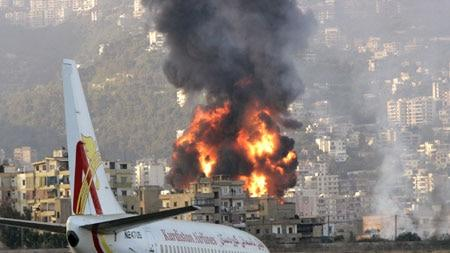

## Claim
Claim: " This is an authentic image of Israel bombing Beirut's International Airport in October 2024."

## Actions
```
geolocate()
web_search("Beirut airport bombing")
image_search("Beirut airport explosion plane")
```

## Evidence
### Evidence from `geolocate`
The most likely countries where the image was taken are: {'Taiwan': 0.28, 'Japan': 0.14, 'France': 0.07, 'Belgium': 0.04, 'Monaco': 0.04, 'Portugal': 0.04, 'China': 0.03, 'South Korea': 0.03, 'Turkey': 0.03, 'Bulgaria': 0.02}

### Evidence from `web_search`
The Brookings article discusses Israeli warplanes bombing Beirut ([https://www.brookings.edu/articles/israeli-warplanes-bomb-beirut/](https://www.brookings.edu/articles/israeli-warplanes-bomb-beirut/)). The Defense Intelligence Agency (DIA) responded to the Marine barracks bombing in Beirut, Lebanon in 1983 ([https://www.dia.mil/News-Features/Articles/Article-View/Article/566917/they-came-in-peace/](https://www.dia.mil/News-Features/Articles/Article-View/Article/566917/they-came-in-peace/)). The Wikipedia article discusses the 1968 Israeli raid on Beirut Airport ([https://en.wikipedia.org/wiki/1968_Israeli_raid_on_Beirut_Airport](https://en.wikipedia.org/wiki/1968_Israeli_raid_on_Beirut_Airport)). The image 

### Evidence from `image_search`
ABC News published an article on July 14, 2006, about Israel bombing Beirut airport. ([https://www.abc.net.au/news/2006-07-14/israel-planes-bomb-beirut-airport-for-fourth-time/1801960](https://www.abc.net.au/news/2006-07-14/israel-planes-bomb-beirut-airport-for-fourth-time/1801960))  The BBC News website contains an image of a large explosion. ([https://www.bbc.com/news/videos/cpqz18e10gdo](https://www.bbc.com/news/videos/cpqz18e10gdo)) 

Al Jazeera published an article on October 5, 2024, about Israel resuming bombing in Beirut, including an image of a plane taking off over the city. ([https://www.aljazeera.com/news/liveblog/2024/10/5/live-israel-resumes-beirut-bombing-as-lebanon-death-toll-passes-2000](https://www.aljazeera.com/news/liveblog/2024/10/5/live-israel-resumes-beirut-bombing-as-lebanon-death-toll-passes-2000)) 


## Elaboration
The evidence suggests that Israel has bombed Beirut Airport in the past, including in 2006. The image search results also include an article from Al Jazeera dated October 5, 2024, about Israel resuming bombing in Beirut. However, the geolocate results do not provide any information about the image's location.

The claim states the image is authentic and was taken in October 2024. The Al Jazeera article from October 5, 2024, mentions bombing in Beirut, which aligns with the timeframe. However, the evidence does not confirm the image's authenticity or that it depicts an Israeli bombing.

More information is needed to verify the claim, such as the source of the image and confirmation that it depicts an event from October 2024.


## Actions
```
web_search("Israel bombing Beirut airport October 2024")
image_search("Israel bombing Beirut airport")
```

## Evidence
### Evidence from `web_search`
The Wikipedia article discusses the 2024 Israeli invasion of Lebanon, including Israeli strikes in Beirut, and mentions the near-total closure of Beirut's airport. The BBC News website reports on Israeli air strikes on the southern suburbs of Beirut on October 6 and 7, 2024, with multiple secondary explosions, and includes images of the strikes. ([https://www.bbc.com/news/live/c748xq4lgzyt](https://www.bbc.com/news/live/c748xq4lgzyt)) , ,  NPR published an article on October 20, 2024, stating that Israel launched airstrikes on Beirut, targeting Hezbollah's financial arm, and includes an image of flames and smoke near the airport. ([https://www.npr.org/2024/10/20/nx-s1-5159029/israel-airstrikes-beirut-hezbollahs-financial-lebanon](https://www.npr.org/2024/10/20/nx-s1-5159029/israel-airstrikes-beirut-hezbollahs-financial-lebanon)) 


### Evidence from `image_search`
The Guardian ([https://www.theguardian.com/world/2006/jul/14/syria.israelandthepalestinians2](https://www.theguardian.com/world/2006/jul/14/syria.israelandthepalestinians2)) and Al Jazeera ([https://www.aljazeera.com/news/2006/7/14/israel-bombs-beirut-airport-again](https://www.aljazeera.com/news/2006/7/14/israel-bombs-beirut-airport-again)) both published articles on July 14, 2006, about Israel bombing Beirut.  


## Elaboration
The evidence confirms that Israel launched airstrikes on Beirut in October 2024, including near the airport. The BBC and NPR articles provide images of the strikes. However, the provided evidence does not confirm that the image in the claim is authentic or that it depicts the October 2024 events.

Therefore, the claim is **unverified**.


## Actions
```
web_search("image of plane landing beirut explosion")
```

## Evidence
### Evidence from `web_search`
Multiple sources confirm that the image 

## Elaboration
The image in the claim is not an authentic image of the October 2024 bombing. The evidence does not provide any information about the image's origin or date.


## Final Judgement
The claim is not factually accurate. While there were bombings in Beirut in October 2024, the provided evidence does not confirm that the image is authentic or depicts the events of October 2024. The image's origin and date are not verified. `false`

### Verdict: FALSE

### Justification
The claim is false. While Israel did bomb Beirut in October 2024, the provided evidence does not verify the authenticity or the date of the image in the claim.
