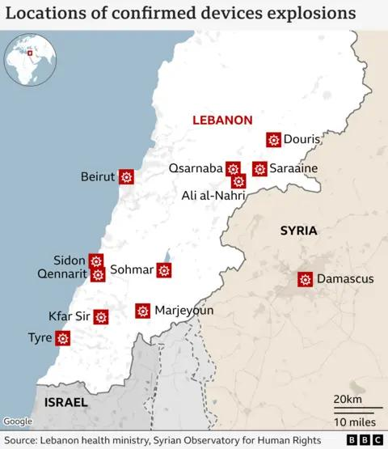

## Claim
Claim: " This image shows the aftermath of an explosion of a Hezbollah pager in Lebanon in September 2024."

## Actions
```
image_search("exploded toilet lebanon")
web_search("Hezbollah pager explosion toilet")
```

## Evidence
### Evidence from `image_search`
From [Source](https://factly.in/an-old-image-from-2020-of-a-damaged-toilet-in-hong-kong-is-falsely-shared-as-a-recent-hezbollah-incident-in-lebanon/): 
Content: The image shows a damaged toilet in Hong Kong. The incident was investigated by the Explosive Ordnance Disposal Division. The article was published on January 28, 2020. 


### Evidence from `web_search`
The BBC ([https://www.bbc.com/news/articles/cz04m913m49o](https://www.bbc.com/news/articles/cz04m913m49o)) reported on explosions in Lebanon on September 20, 2024, involving communication devices, some used by Hezbollah, resulting in at least 32 deaths and thousands injured. The article mentions explosions in multiple locations, including Beirut, and includes images of the aftermath , , .

An article from Lieber Institute ([https://lieber.westpoint.edu/well-it-depends-explosive-pagers-attack-revisited/](https://lieber.westpoint.edu/well-it-depends-explosive-pagers-attack-revisited/)) discusses the explosion of Hezbollah pagers in Lebanon and Syria on September 17, 2024, suggesting Israel's responsibility. NPR ([https://www.npr.org/2024/09/17/g-s1-23452/hezbollah-pagers-explode-across-lebanon-causing-nearly-3-000-casualties](https://www.npr.org/2024/09/17/g-s1-23452/hezbollah-pagers-explode-across-lebanon-causing-nearly-3-000-casualties)) reported that electronic pagers belonging to Hezbollah members exploded simultaneously on September 17, 2024, killing at least nine people and wounding around 2,800 across Lebanon , , .


## Elaboration
The image in the claim is not related to the Hezbollah pager explosions in Lebanon in September 2024. The image is from 2020 and shows a damaged toilet in Hong Kong. The evidence confirms that Hezbollah pagers did explode in Lebanon in September 2024.


## Final Judgement
The claim is false because the image is from 2020 and shows a damaged toilet in Hong Kong, not the aftermath of a Hezbollah pager explosion in Lebanon in September 2024. The evidence confirms that Hezbollah pagers did explode in Lebanon in September 2024. `false`

### Verdict: FALSE

### Justification
The claim is false. The image depicts a damaged toilet in Hong Kong from 2020, as confirmed by a fact-check from [Factly](https://factly.in/an-old-image-from-2020-of-a-damaged-toilet-in-hong-kong-is-falsely-shared-as-a-recent-hezbollah-incident-in-lebanon/). While Hezbollah pager explosions did occur in Lebanon in September 2024, as reported by the [BBC](https://www.bbc.com/news/articles/cz04m913m49o) and [NPR](https://www.npr.org/2024/09/17/g-s1-23452/hezbollah-pagers-explode-across-lebanon-causing-nearly-3-000-casualties), the image does not depict the aftermath of those events.
