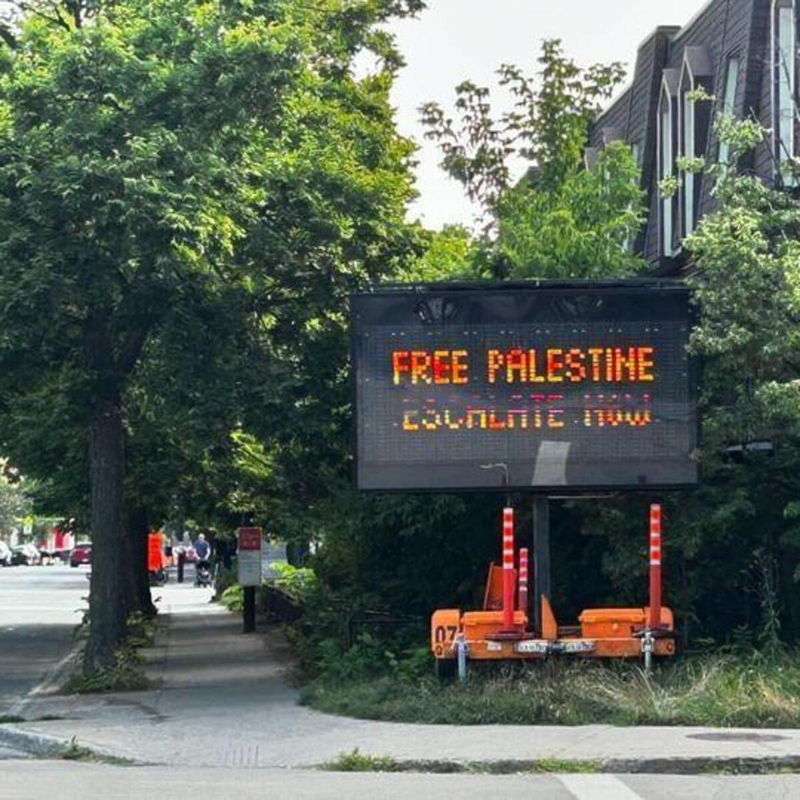

## Claim
Claim: " This image shows a traffic sign in Montreal in July 2024 which displays a 'Free Palestine. Escalate now' message and was authorized by Montreal's Mayor Valérie Plante."

## Actions
```
geolocate()
web_search("Montreal Mayor Valérie Plante Free Palestine")
image_search("Free Palestine sign Montreal")
```

## Evidence
### Evidence from `geolocate`
The most likely countries where the image was taken are: {'Palestine': 0.85, 'Canada': 0.07, 'Germany': 0.02, 'Austria': 0.01, 'Israel': 0.01, 'Poland': 0.01, 'Slovenia': 0.01, 'South Korea': 0.01, 'Albania': 0.0, 'Andorra': 0.0}

### Evidence from `web_search`
The Suburban published an article about Mayor Valérie Plante being served by bailiff regarding pro-Palestinian electronic signs that displayed messages like "Free Palestine. Escalate now" (). The signs were criticized for conveying anti-Israel messages and were brought to the attention of the authorities by Hampstead Mayor Jeremy Levi. The Maple reported on the City of Montreal's removal of pro-Palestine signs, and that the city is facing legal action. The article also mentions that Jeremy Levi called on Montreal Mayor Valerie Plante to "take a stand and restore order in our city" regarding the signs (). CTV News reported that Montreal Mayor Valérie Plante held a news conference to comment on pro-Palestinian protests ().

Sources:
*   [https://www.thesuburban.com/news/city\_news/plante-served-over-pro-palestinian-electronic-signs/article\_e0143fdc-d532-5ecf-9a66-095ad0ee8ab9.html](https://www.thesuburban.com/news/city_news/plante-served-over-pro-palestinian-electronic-signs/article_e0143fdc-d532-5ecf-9a66-095ad0ee8ab9.html)
*   [https://www.ctvnews.ca/montreal/article/montreal-mayor-says-friday-pro-palestinian-protests-were-taken-over-by-professional-vandals/](https://www.ctvnews.ca/montreal/article/montreal-mayor-says-friday-pro-palestinian-protests-were-taken-over-by-professional-vandals/)
*   [https://www.readthemaple.com/city-of-montreal-illegally-seized-pro-palestine-signs-activists-allege/](https://www.readthemaple.com/city-of-montreal-illegally-seized-pro-palestine-signs-activists-allege/)


### Evidence from `image_search`
The Globe and Mail reported on a traffic sign in Montreal displaying "Free Palestine. Escalate now" (). Another source shows a building in Montreal with a Palestine flag and the slogan "Palestine Libre" painted on the brick walls ().


## Elaboration
The evidence confirms that the image is likely from Montreal, Canada, and shows a traffic sign displaying "Free Palestine. Escalate now." The web search results indicate that Montreal Mayor Valérie Plante has been involved in discussions and actions related to pro-Palestinian signs, including the removal of some signs. However, the evidence does not explicitly state that Mayor Plante authorized the sign in the image.

Therefore, the claim is partially supported. The image is from Montreal and displays the message. However, the claim that the sign was authorized by Montreal's Mayor Valérie Plante is not directly supported by the evidence.


## Final Judgement
The image is from Montreal and shows a traffic sign with the message "Free Palestine. Escalate now." While the mayor of Montreal, Valérie Plante, has been involved in discussions and actions related to pro-Palestinian signs, there is no evidence that she authorized the specific sign in the image.

`false`

### Verdict: FALSE

### Justification
The image is from Montreal, Canada, and shows a traffic sign displaying "Free Palestine. Escalate now." While the mayor of Montreal, Valérie Plante, has been involved in discussions and actions related to pro-Palestinian signs, there is no evidence that she authorized the specific sign in the image. Therefore, the claim is partially supported, but the assertion that the sign was authorized by Mayor Plante is not directly supported by the evidence.
