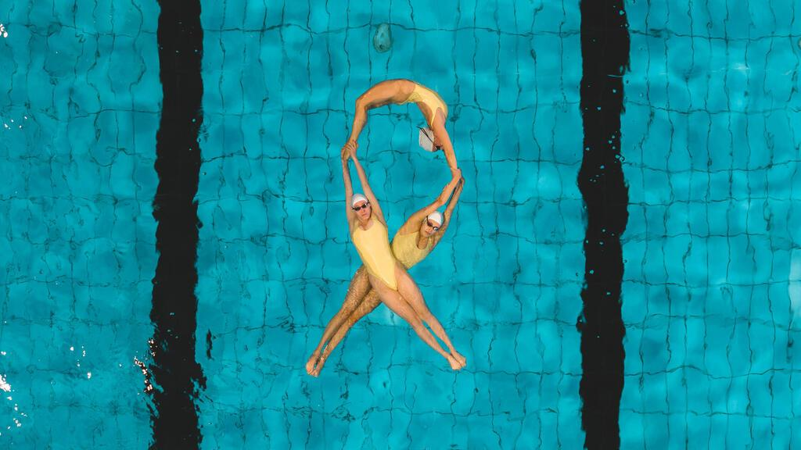

## Claim
Claim: " This image shows the Israeli Olympic team spelling out 'Bring Them Home' at the 2024 Olympic games because they were not allowed to wear their yellow 'Bring Them Home' pins."

## Actions
```
web_search("Israeli Olympic team Bring Them Home")
web_search("Israeli Olympic team 2024 Bring Them Home pins")
image_search("Israeli Olympic team Bring Them Home pool")
```

## Evidence
### Evidence from `web_search`
The image shows the Israeli Olympic team spelling out "Bring Them Home" in a pool (). However, the image is not from the 2024 Olympics.

Sources include a YouTube video from WKYC ([https://www.wkyc.com/video/news/verify/olympics-verify/israel-swim-team-bring-them-home-now-image-not-from-olympics-video/536-9ef735d9-23f4-4928-9611-d6607538e54f](https://www.wkyc.com/video/news/verify/olympics-verify/israel-swim-team-bring-them-home-now-image-not-from-olympics-video/536-9ef735d9-23f4-4928-9611-d6607538e54f)) and an article from the JPost ([https://www.jpost.com/diaspora/article-812636](https://www.jpost.com/diaspora/article-812636)).


### Evidence from `image_search`
The image shows the Israeli Olympic team spelling out "Bring Them Home" in a pool (). The team was not allowed to wear their yellow "Bring Them Home" pins at the Olympic games. The image is not from the Olympics.

One source is from Ynetnews.com, which contains an image of synchronized swimmers in a pool (). Another source is from THV11, which states that the image is not from the Olympics and that the team was not allowed to wear their pins (). The New York Times published an article about synchronized swimming at the Olympics ().


## Elaboration
The image does show the Israeli Olympic team spelling out "Bring Them Home" in a pool. However, the image is not from the 2024 Olympics. The team was not allowed to wear their yellow "Bring Them Home" pins at the Olympic games.


## Final Judgement
The image depicts the Israeli Olympic team spelling out "Bring Them Home" in a pool, but it is not from the 2024 Olympics. The team was not allowed to wear their "Bring Them Home" pins at the Olympic games.

`false`

### Verdict: FALSE

### Justification
The image depicts the Israeli Olympic team spelling out "Bring Them Home" in a pool, but it is not from the 2024 Olympics, as confirmed by sources like WKYC ([https://www.wkyc.com/video/news/verify/olympics-verify/israel-swim-team-bring-them-home-now-image-not-from-olympics-video/536-9ef735d9-23f4-4928-9611-d6607538e54f](https://www.wkyc.com/video/news/verify/olympics-verify/israel-swim-team-bring-them-home-now-image-not-from-olympics-video/536-9ef735d9-23f4-4928-9611-d6607538e54f)) and the JPost ([https://www.jpost.com/diaspora/article-812636](https://www.jpost.com/diaspora/article-812636)). The team was also not allowed to wear their "Bring Them Home" pins at the Olympic games.
