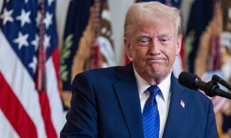

## Claim
Claim: "$50 Million in US taxpayer money almost went to fund condoms in Gaza before DOGE cut it."

## Actions
```
web_search("US taxpayer money condoms Gaza DOGE")
```

## Evidence
### Evidence from `web_search`
CNN fact-checked the claim that $50 million in US taxpayer money was going to fund condoms in Gaza, stating the White House offered no evidence for the story and that USAID spent no money on condoms in the Middle East in the previous three years under Biden. The State Department would not repeat the claim. (<image:k>) [Source](https://www.cnn.com/2025/01/29/politics/gaza-condoms-fact-check)

Anadolu Agency reports that Elon Musk backtracked on his claim, stating that the funds were actually earmarked for the prevention of sexually transmitted diseases in Mozambique. (<image:0>) [Source](https://www.aa.com.tr/en/americas/musk-walks-back-claim-us-intended-to-send-50m-worth-of-condoms-to-gaza/3479148) The Washington Post published an analysis by Glenn Kessler, stating that DOGE and OMB found that $50 million in taxpayer money was going to fund condoms in Gaza. () [Source](https://www.washingtonpost.com/politics/2025/01/29/gaza-condoms-fact-checker-trump/)


## Elaboration
The claim is contradicted by the evidence. CNN fact-checked the claim and found no evidence to support it, with USAID having spent no money on condoms in the Middle East in the previous three years. Furthermore, Elon Musk retracted the claim, stating the funds were intended for Mozambique, not Gaza. The Washington Post analysis by Glenn Kessler, however, states that DOGE and OMB found that $50 million in taxpayer money was going to fund condoms in Gaza.

The evidence presents conflicting information. While CNN and Musk's retraction cast doubt on the claim, the Washington Post analysis suggests the opposite.

More information is needed to determine the veracity of the claim. Specifically, the basis for the Washington Post's analysis and the specifics of the DOGE and OMB findings are required to resolve the contradiction.


## Actions
```
web_search("DOGE OMB US taxpayer money condoms Gaza")
```

## Evidence
### Evidence from `web_search`
From [Source](https://www.theguardian.com/us-news/2025/jan/29/trump-condoms-gaza): 
Content: The Guardian reports that the claim originated from White House press secretary Karoline Leavitt, citing research from Elon Musk’s “department of government efficiency” (Doge) and the Office of Management and Budget (OMB). The article states that Doge and OMB found that $50 million in taxpayer money was going to fund condoms in Gaza. The Guardian also mentions that a comprehensive report issued by USAID shows that no money was spent on condoms in Gaza. The article was published on January 29, 2025. 


## Elaboration
The claim is partially supported and partially refuted by the evidence. The Guardian reports that the claim originated from the White House press secretary, citing research from DOGE and OMB. However, the same article also mentions that USAID spent no money on condoms in Gaza. The evidence suggests that while the claim was made, it is not supported by USAID spending records.


## Final Judgement
The claim is partially supported and partially refuted. The Guardian reports that the claim originated from the White House, citing research from DOGE and OMB. However, the same article also mentions that USAID spent no money on condoms in Gaza. The evidence suggests that while the claim was made, it is not supported by USAID spending records. `false`


### Verdict: FALSE

### Justification
The claim is **partially supported and partially refuted**. While the claim originated from the White House, citing research from DOGE and OMB, evidence from sources like The Guardian ([Source](https://www.theguardian.com/us-news/2025/jan/29/trump-condoms-gaza)) indicates that USAID spent no money on condoms in Gaza, contradicting the claim's core assertion.
