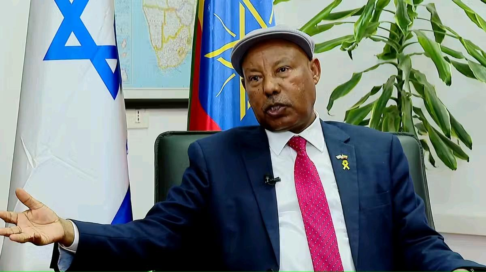

## Claim
Claim: "Ethiopia has expelled Israel's ambassador in April 2025."

## Actions
```
web_search("Ethiopia Israel relations April 2025")
```

## Evidence
### Evidence from `web_search`
On April 2, 2025, both the Ethiopian News Agency (ENA) ([https://www.ena.et/web/eng/w/eng_6302848](https://www.ena.et/web/eng/w/eng_6302848)) and Fana Media Corporation S.C. ([https://www.fanamc.com/english/israel-seeks-stronger-economic-people-ties-with-ethiopia-ambassador/](https://www.fanamc.com/english/israel-seeks-stronger-economic-people-ties-with-ethiopia-ambassador/)) reported that the Israeli Ambassador to Ethiopia, Abraham Negussie, expressed Israel's commitment to strengthening ties with Ethiopia. , 

The Wikipedia article "Ethiopia–Israel relations" ([https://en.wikipedia.org/wiki/Ethiopia%E2%80%93Israel_relations](https://en.wikipedia.org/wiki/Ethiopia%E2%80%93Israel_relations)) discusses the diplomatic relations between the two countries, including the history of their relationship. <image:i>, <image:j>, <image:k>


## Elaboration
The evidence indicates that on April 2, 2025, the Israeli Ambassador to Ethiopia, Abraham Negussie, was actively working to strengthen ties between the two countries. This contradicts the claim that Ethiopia expelled Israel's ambassador in April 2025.

Therefore, the claim is false.


## Final Judgement
The search results from April 2025 show the Israeli ambassador to Ethiopia expressing a desire to strengthen ties, which contradicts the claim of expulsion.

`false`


### Verdict: FALSE

### Justification
On April 2, 2025, the Israeli ambassador to Ethiopia was actively working to strengthen ties between the two countries, as reported by the Ethiopian News Agency ([https://www.ena.et/web/eng/w/eng_6302848](https://www.ena.et/web/eng/w/eng_6302848)) and Fana Media Corporation S.C. ([https://www.fanamc.com/english/israel-seeks-stronger-economic-people-ties-with-ethiopia-ambassador/](https://www.fanamc.com/english/israel-seeks-stronger-economic-people-ties-with-ethiopia-ambassador/)), which contradicts the claim.
