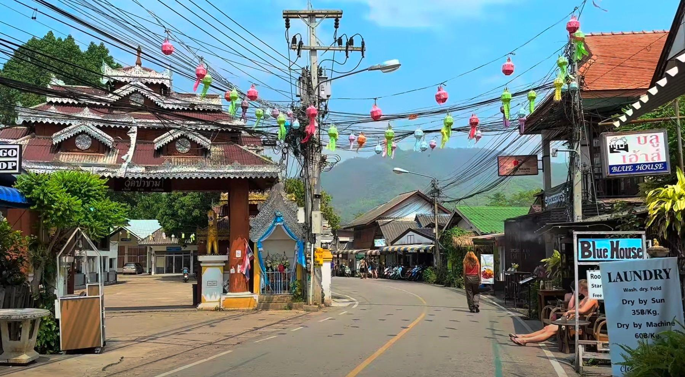

## Claim
Claim: " This image shows Israelis who have stopped fighting the wars in Gaza and Lebanon and moved to become 'settlers' in Pai District, Mae Hong Son Province, Thailand, in February 2025."

## Actions
```
web_search("Israelis settlers Pai District Mae Hong Son Thailand")
image_search("Israelis settlers Pai District Thailand")
```

## Evidence
### Evidence from `web_search`
The Bangkok Post published an article on February 23, 2025, stating that police in Pai district, Mae Hong Son, Thailand, found no evidence of Israeli influence, settlements, or business dominance. The article mentions that 4,573 Israelis visited Pai as of February 19, and only 24 sought to extend their stay. The Nation Thailand published an article on February 18, 2025, refuting social media claims that Israelis have established a permanent Jewish community in Pai district. The article states that the Mae Hong Son tourist police denied claims of a "promised land" and clarified that Israeli tourists visit legally. The Khaosod English article discusses fears among some Thais that Israelis are turning Pai District, Mae Hong Son Province, into an occupied land. The article mentions that these fears are fueled by online disinformation and the ongoing conflicts in the Middle East. The Israeli embassy in Bangkok urged Israeli tourists to respect local laws and culture. The image  is included in the Khaosod English article.

The Bangkok Post article can be found here: [https://www.bangkokpost.com/thailand/general/2966381/no-israeli-settlement-or-business-dominance-found-in-northern-thailands-pai](https://www.bangkokpost.com/thailand/general/2966381/no-israeli-settlement-or-business-dominance-found-in-northern-thailands-pai). The Nation Thailand article can be found here: [https://www.nationthailand.com/news/tourism/40046434](https://www.nationthailand.com/news/tourism/40046434). The Khaosod English article can be found here: [https://www.khaosodenglish.com/featured/2025/02/23/why-some-thais-fear-israelis-turning-pai-into-an-occupied-land/](https://www.khaosodenglish.com/featured/2025/02/23/why-some-thais-fear-israelis-turning-pai-into-an-occupied-land/).


### Evidence from `image_search`
From [Source](https://www.scmp.com/week-asia/lifestyle-culture/article/3299193/young-israelis-rile-thailands-pai-town-their-bad-behaviour): 
Content: The South China Morning Post discusses young Israelis in Pai, Thailand. 


## Elaboration
The evidence indicates that the claim is likely false. Multiple news sources from February 2025 refute the idea of Israelis settling in Pai District, Thailand. The Bangkok Post and The Nation Thailand both report that authorities found no evidence of settlements or business dominance. The Khaosod English article, which includes the image, discusses fears of such settlement, but these fears are attributed to online disinformation.

The evidence also shows that the image is related to the topic. The Khaosod English article includes the image and discusses the concerns about Israelis in Pai. The South China Morning Post article, which also includes an image, discusses young Israelis in Pai.

Based on the available evidence, the claim that the image shows Israelis who have stopped fighting wars and moved to become settlers in Pai District is not supported.


## Final Judgement
The fact-check reveals that multiple news sources from February 2025 refute the claim of Israelis settling in Pai District, Thailand. Authorities found no evidence of settlements or business dominance. The image is related to the topic, as it is included in an article discussing concerns about Israelis in Pai.

The claim is demonstrably false because it is disproven by evidence from multiple and reliable sources. `false`


### Verdict: FALSE

### Justification
The claim is demonstrably false. Multiple news sources from February 2025, such as the [Bangkok Post](https://www.bangkokpost.com/thailand/general/2966381/no-israeli-settlement-or-business-dominance-found-in-northern-thailands-pai) and [The Nation Thailand](https://www.nationthailand.com/news/tourism/40046434), refute the idea of Israeli settlements in Pai District, Thailand, finding no evidence of such. The image is related to the topic, as it is included in an article discussing concerns about Israelis in Pai.
