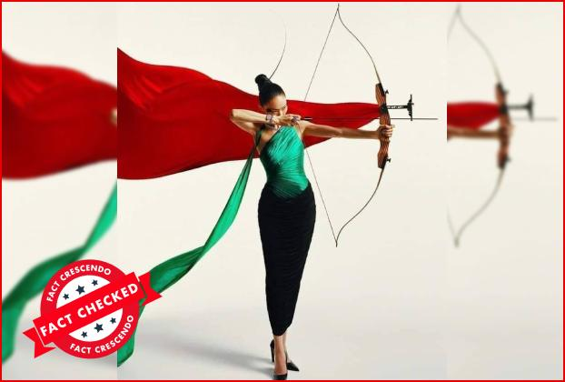
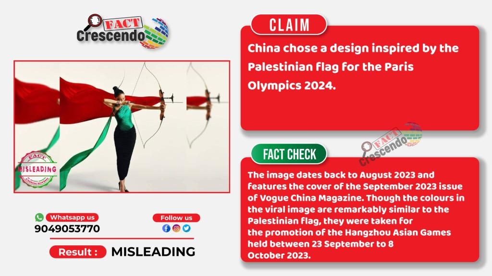

## Claim
Claim: " This image shows an athlete of China which has chosen a design of the Palestinian flag for the Paris 2024 Olympics."

## Actions
```
web_search("China design Palestinian flag Paris 2024 Olympics")
```

## Evidence
### Evidence from `web_search`
The image in the claim is from the September 2023 issue of Vogue China Magazine and was taken for the promotion of the Hangzhou Asian Games held between September 23 to October 8, 2023. The article from [Source](https://srilanka.factcrescendo.com/english/china-has-not-chosen-a-design-inspired-by-the-palestinian-flag-for-the-paris-olympics-2024/) is labeled as "Misleading". The image does not show China’s Olympic uniform for the 2024 Olympic Games. The Paris 2024 Summer Olympic Games will be held from July 26 to August 11, 2024.

The article from [Source](https://factly.in/an-old-photo-from-vogue-china-magazine-is-being-falsely-shared-as-showing-chinese-athletes-wearing-the-colours-of-the-palestinian-flag/) also mentions that the photo was taken for the Hangzhou Asian Games. , , , , , , 


## Elaboration
The claim is misleading. The image is from the September 2023 issue of Vogue China Magazine and was taken for the promotion of the Hangzhou Asian Games, not the Paris 2024 Olympics. The colors in the image are similar to the Palestinian flag, but the image's context is unrelated to the Olympics.


## Final Judgement
The claim is demonstrably false because the image is from Vogue China Magazine and was taken for the promotion of the Hangzhou Asian Games, not the Paris 2024 Olympics. The image is being misrepresented in a new context. `false`

### Verdict: FALSE

### Justification
The claim is false. The image in the claim is from the September 2023 issue of Vogue China Magazine and was taken for the promotion of the Hangzhou Asian Games, not the Paris 2024 Olympics, as reported by [Fact Crescendo](https://srilanka.factcrescendo.com/english/china-has-not-chosen-a-design-inspired-by-the-palestinian-flag-for-the-paris-olympics-2024/) and [Factly](https://factly.in/an-old-photo-from-vogue-china-magazine-is-being-falsely-shared-as-showing-chinese-athletes-wearing-the-colours-of-the-palestinian-flag/).
