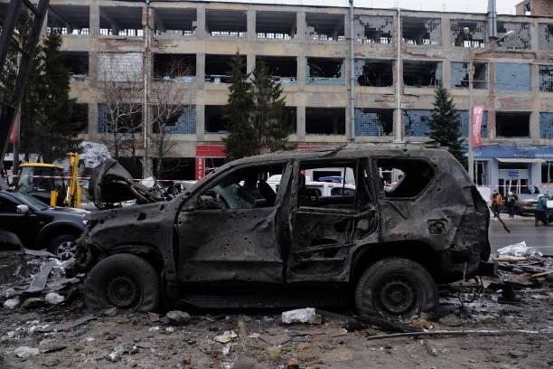

## Claim
Claim: " This image shows the U.S. bombarding Yemen on December 22, 2024 in reprisal after Yemen launched an attack on Israel's capital."

## Actions
```
geolocate()
web_search("Anadolu images bombing")
web_search("Getty images bombing")
```

## Evidence
### Evidence from `geolocate`
The most likely countries where the image was taken are: {'Palestine': 0.55, 'Israel': 0.3, 'United Arab Emirates': 0.1, 'Jordan': 0.02, 'Albania': 0.0, 'Andorra': 0.0, 'Argentina': 0.0, 'Australia': 0.0, 'Austria': 0.0, 'Bangladesh': 0.0}

### Evidence from `web_search`
Anadolu's images prove Israel used white phosphorus in Gaza. The images were taken by Anadolu photojournalist on Oct. 9, 2023. The article was published on October 15, 2023.  is not in the search result. The search result from Getty Images contains images from Anadolu Agency. One image shows the wreckage of a car after a Russian missile attack in Kharkiv, Ukraine, on January 11, 2024.  Another image shows smoke rising after Israeli fighter jets pounded Al Katiba region in Gaza City, Gaza on July 14, 2018.

The first source is from [https://www.aa.com.tr/en/middle-east/anadolus-images-prove-israel-used-white-phosphorus-in-gaza/3021073](https://www.aa.com.tr/en/middle-east/anadolus-images-prove-israel-used-white-phosphorus-in-gaza/3021073). The second source is from [https://www.anadoluimages.com/Search?collection=4393898](https://www.anadoluimages.com/Search?collection=4393898). The third source is from [https://www.gettyimages.com/photos/anadolu-agency](https://www.gettyimages.com/photos/anadolu-agency).


### Evidence from `web_search`
From [Source](https://www.gettyimages.com/photos/bombing): 
Content: The search result from Getty Images contains images related to explosions and bombings. , , <image:10089>, <image:10090>, <image:10091>, <image:10092>, <image:10093>, <image:10094>, <image:10095>, <image:10096>, <image:10097>, <image:10098>, <image:10099>, <image:10100>, <image:10101>, <image:10102>, <image:10103>, <image:10104>, <image:10105>, <image:10106>, <image:10107>, <image:10108>, <image:10109>.


## Elaboration
The evidence suggests the image was taken in Palestine or Israel. The image was taken by Anadolu Agency. The search results do not support the claim that the image shows the U.S. bombarding Yemen. The search results show images of bombings in Gaza and Ukraine.

The claim is not supported by the evidence. The date and location are not consistent with the claim.


## Final Judgement
The image is likely from Palestine or Israel, and the search results do not support the claim that the image shows the U.S. bombarding Yemen. The image was taken by Anadolu Agency.

The claim is demonstrably false because the image is not of the U.S. bombarding Yemen. `false`

### Verdict: FALSE

### Justification
The image, likely taken in Palestine or Israel, was captured by the Anadolu Agency and does not depict the U.S. bombarding Yemen. The search results reveal images of bombings in Gaza and Ukraine, contradicting the claim's context of the U.S. bombing Yemen on December 22, 2024.
