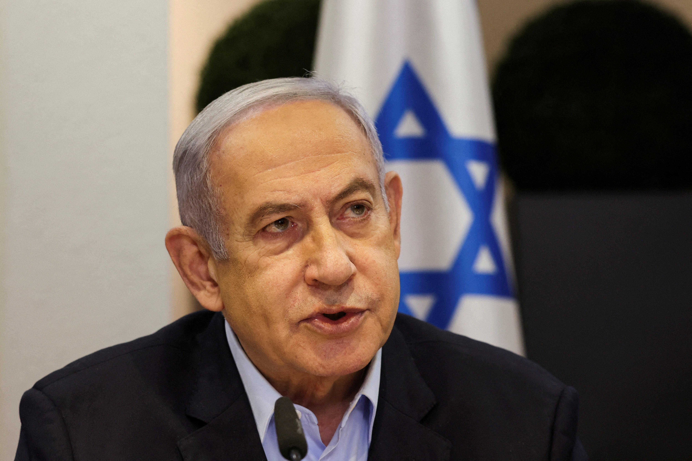
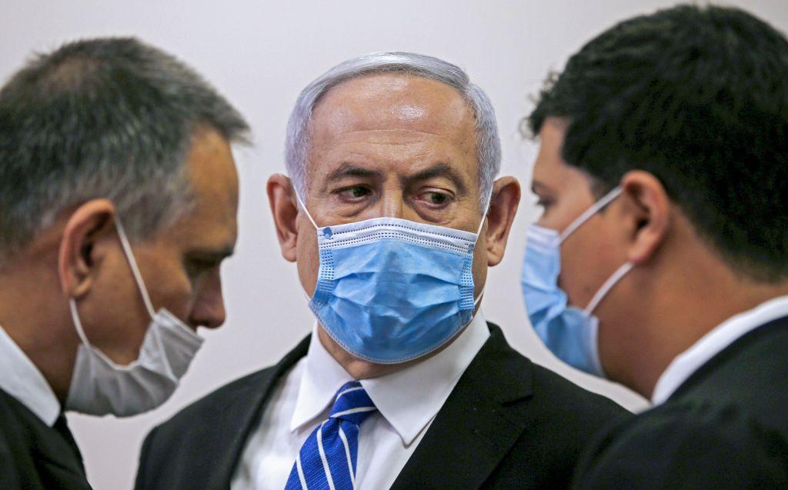
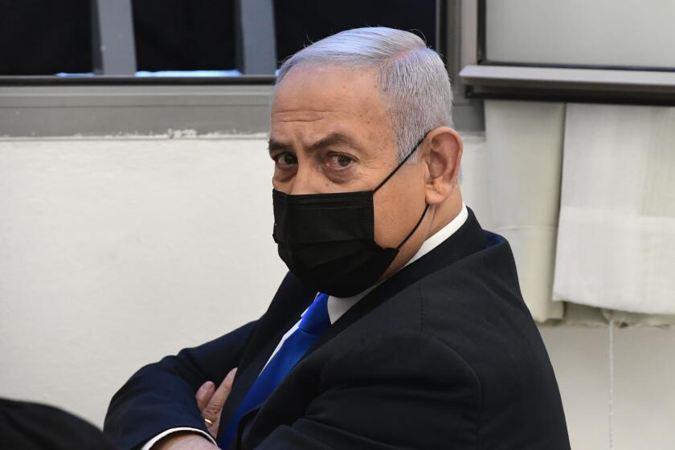

## Claim
Claim: " This is an authentic image of Benjamin Netanyahu being hospitalized in Tel Aviv in November 2024 due to a serious health issue."

## Actions
```
web_search("Benjamin Netanyahu hospitalized Tel Aviv November 2024")
image_search("Benjamin Netanyahu hospital bed")
```

## Evidence
### Evidence from `web_search`
Reuters reported that Benjamin Netanyahu had a successful hernia operation and was released from the hospital on April 1, 2024. The Times of Israel reported that Netanyahu was ill in July 2025 due to food poisoning and had previously undergone hernia surgery in March 2024. CBS News reported that Netanyahu underwent prostate removal surgery and was hospitalized in December 2024.

The sources are: [https://www.reuters.com/world/middle-east/israeli-pm-netanyahus-hernia-operation-was-successful-hospital-says-2024-04-01/](https://www.reuters.com/world/middle-east/israeli-pm-netanyahus-hernia-operation-was-successful-hospital-says-2024-04-01/), [https://www.timesofisrael.com/liveblog_entry/pm-suffering-from-food-poisoning-his-office-says-after-he-skipped-cabinet-meeting/](https://www.timesofisrael.com/liveblog_entry/pm-suffering-from-food-poisoning-his-office-says-after-he-skipped-cabinet-meeting/), and [https://www.cbsnews.com/news/israel-benjamin-netanyahu-prostate-removal-surgery-gaza-war-hamas/](https://www.cbsnews.com/news/israel-benjamin-netanyahu-prostate-removal-surgery-gaza-war-hamas/).   


## Elaboration
The evidence indicates that Benjamin Netanyahu was hospitalized in April 2024 for a hernia operation, in July 2025 due to food poisoning, and in December 2024 for prostate removal surgery. The claim states that the image is from November 2024.

The evidence does not mention any hospitalization in November 2024. Therefore, the claim cannot be verified.

The claim is missing information about the context of the image.


## Actions
```
image_search("Benjamin Netanyahu hospital mask")
```

## Evidence
### Evidence from `image_search`
The search results include images of Benjamin Netanyahu wearing a mask from [Source](https://www.aspistrategist.org.au/netanyahus-poisoned-legacy/) , [Source](https://www.latimes.com/world-nation/story/2022-10-06/israel-benjamin-netanyahu-leaves-hospital-overnight-stay/) , and receiving a COVID-19 vaccine from [Source](https://www.aljazeera.com/news/2020/12/19/netanyahu-gets-covid-vaccine-starts-israel-rollout/) .


## Elaboration
The new evidence shows images of Benjamin Netanyahu wearing masks and receiving a vaccine. However, none of the images match the one in the claim.

The claim cannot be verified because the evidence does not provide any information about the image's authenticity.


## Actions
```
geolocate()
```

## Evidence
### Evidence from `geolocate`
The most likely countries where the image was taken are: {'Pakistan': 0.21, 'Israel': 0.13, 'Jordan': 0.11, 'Turkey': 0.09, 'Palestine': 0.08, 'Tunisia': 0.06, 'United Arab Emirates': 0.05, 'Malaysia': 0.03, 'Malta': 0.03, 'Bangladesh': 0.02}

## Elaboration
The geolocation analysis suggests that the image was most likely taken in Pakistan, Israel, or Jordan. However, the evidence does not confirm the image's authenticity or the context of the image. The claim cannot be verified.


## Final Judgement
The evidence indicates that Benjamin Netanyahu was hospitalized at different times, but not in November 2024. The image search and geolocation analysis do not confirm the image's authenticity or the context of the image. Therefore, the claim is not supported by the evidence.

`false`

### Verdict: FALSE

### Justification
The claim that the image depicts Benjamin Netanyahu hospitalized in Tel Aviv in November 2024 is not supported by the evidence. While Netanyahu was hospitalized at other times, including for a hernia operation in April 2024 ([Reuters](https://www.reuters.com/world/middle-east/israeli-pm-netanyahus-hernia-operation-was-successful-hospital-says-2024-04-01/)) and prostate removal surgery in December 2024 ([CBS News](https://www.cbsnews.com/news/israel-benjamin-netanyahu-prostate-removal-surgery-gaza-war-hamas/)), there is no mention of a hospitalization in November 2024. The image search and geolocation analysis did not provide any information to verify the claim.
