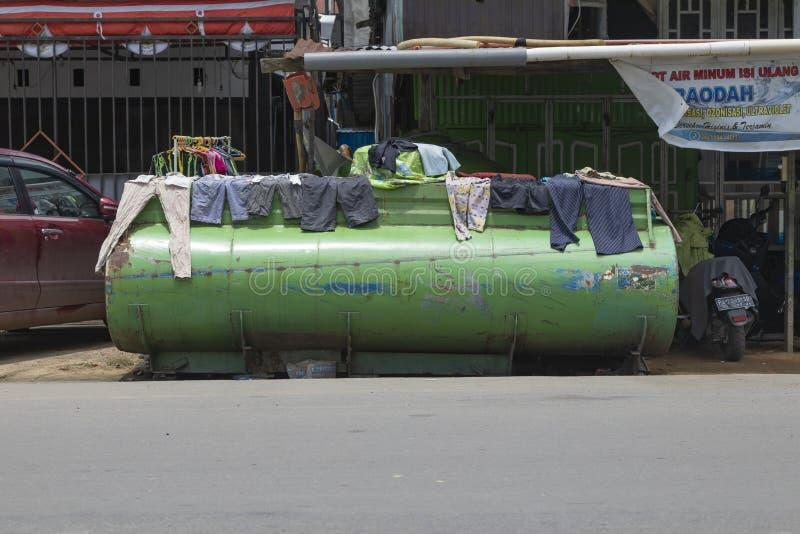
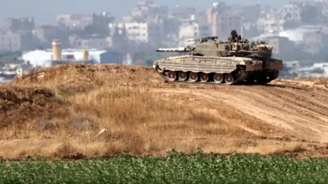
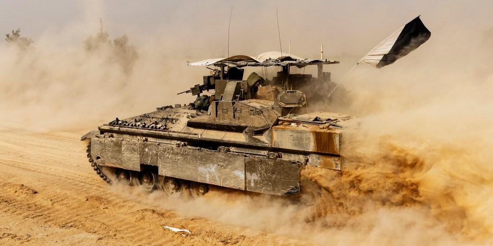
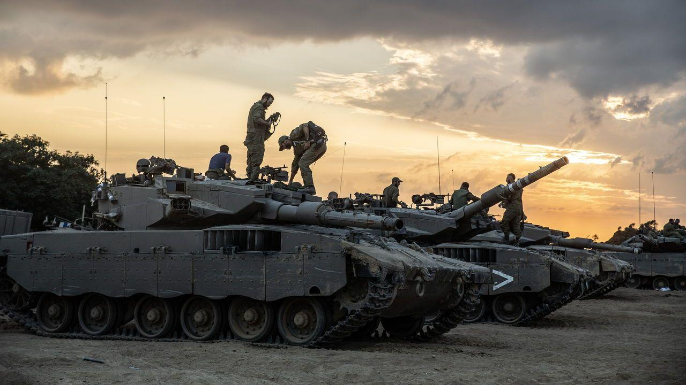
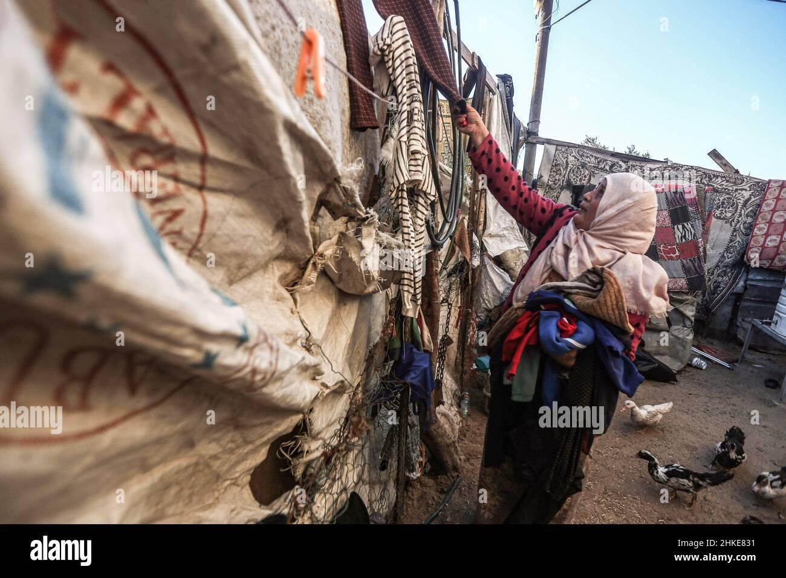
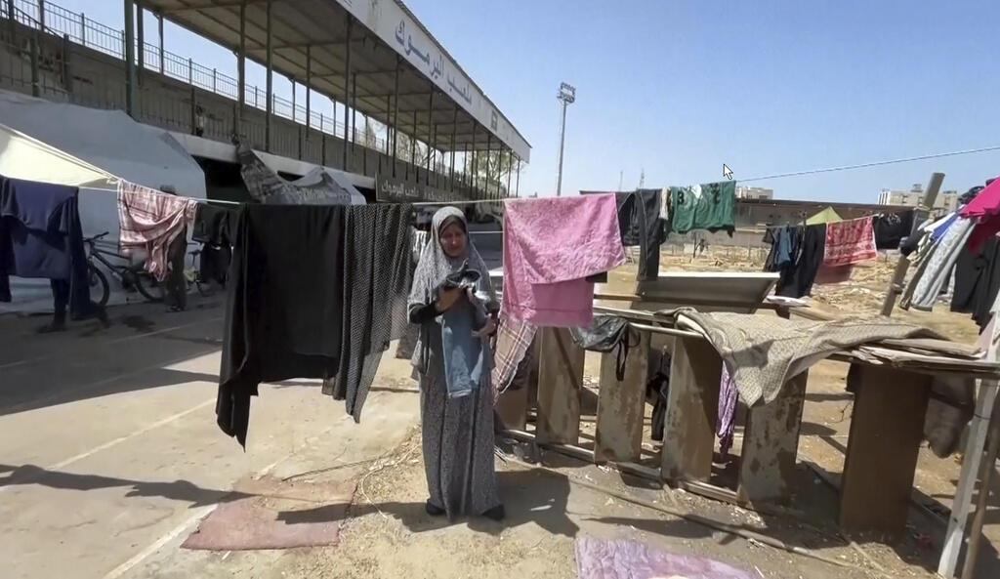
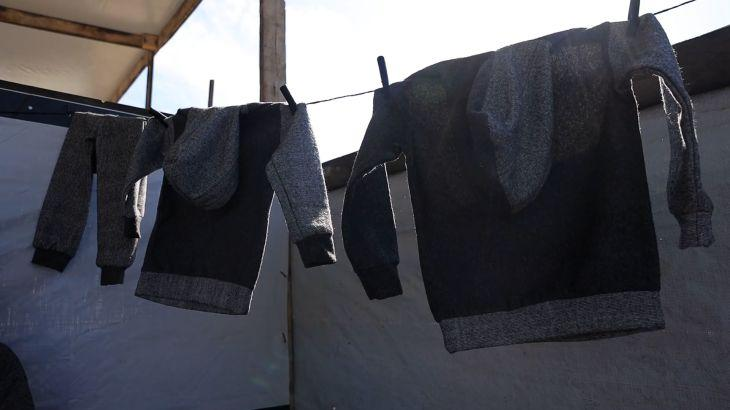

## Claim
Claim: " This image shows a Palestinian woman using an Israeli tank to dry clothes in Gaza in July 2024."

## Actions
```
geolocate()
web_search("tank drying clothes Gaza")
image_search("tank drying clothes")
```

## Evidence
### Evidence from `geolocate`
The most likely countries where the image was taken are: {'Palestine': 0.29, 'Tunisia': 0.26, 'Jordan': 0.19, 'United Arab Emirates': 0.09, 'Israel': 0.07, 'Pakistan': 0.04, 'China': 0.01, 'Albania': 0.0, 'Andorra': 0.0, 'Argentina': 0.0}

### Evidence from `web_search`
The Al Jazeera article from November 25, 2024, discusses flooding in Gaza and its impact on displaced Palestinians ([https://www.aljazeera.com/news/2024/11/25/flooding-in-gaza-compounds-hardship-of-people-displaced-by-israeli-attacks](https://www.aljazeera.com/news/2024/11/25/flooding-in-gaza-compounds-hardship-of-people-displaced-by-israeli-attacks)). The ReliefWeb report details the Israeli army's actions in Gaza, including incidents of tanks running over Palestinian civilians between October 7, 2023, and February 29, 2024 ([https://reliefweb.int/report/occupied-palestinian-territory/israeli-tanks-have-deliberately-run-over-dozens-palestinian-civilians-alive-enar](https://reliefweb.int/report/occupied-palestinian-territory/israeli-tanks-have-deliberately-run-over-dozens-palestinian-civilians-alive-enar)).

The article "The Walls of the Tank: On Palestinian Resistance" by Andreas Malm, published on May 1, 2017, discusses Palestinian resistance and includes a photograph of a tank ([https://salvage.zone/the-walls-of-the-tank-on-palestinian-resistance/](https://salvage.zone/the-walls-of-the-tank-on-palestinian-resistance/)).


### Evidence from `image_search`
From [Source](https://www.dreamstime.com/water-tank-clothes-drying-sun-west-papua-sorong-indonesia-oct-painted-green-one-streets-covered-spread-image228839856): 
Content: The search result from Dreamstime shows a water tank with clothes drying in Sorong, Indonesia. 


## Elaboration
The geolocation data suggests the image was most likely taken in Palestine. The web search results provide context about the conflict in Gaza, including the impact of flooding and actions by the Israeli army. The image search reveals a similar scene of drying clothes on a tank in Indonesia.

The claim states the image was taken in Gaza in July 2024. The Al Jazeera article from November 2024 discusses flooding in Gaza, which could be related to the image. However, the provided evidence does not confirm the image's date or location. The tank in the image could be an Israeli tank, but this is not explicitly stated in the evidence.

More information is needed to verify the claim, specifically the date and location of the image, and the type of tank.


## Actions
```
web_search("Israeli tank drying clothes Gaza")
image_search("Israeli tank Gaza")
```

## Evidence
### Evidence from `web_search`
The Al Jazeera article from February 18, 2024, discusses the harsh conditions in Gaza, including the presence of tanks and displaced people struggling with the cold and rain (, , ). The BBC article from November 13, 2023, reports on the conflict in Gaza, including the presence of Israeli tanks near hospitals (, ). The CNN article from August 23, 2024, discusses water shortages in Gaza and mentions the destruction of the Canada Water reservoir in Rafah in July 2024 (, , , ).


### Evidence from `image_search`
The BBC News, NBC News, and The Economist articles all feature images of Israeli tanks. The BBC News article is from May 2024 and shows an Israeli tank in Gaza. (, , )


## Elaboration
The evidence confirms the presence of Israeli tanks in Gaza. The image search results show Israeli tanks in Gaza. The CNN article mentions water shortages in Gaza in July 2024. The BBC article from May 2024 shows an Israeli tank in Gaza.

The claim states the image shows a Palestinian woman using an Israeli tank to dry clothes in Gaza in July 2024. While the evidence confirms the presence of Israeli tanks in Gaza, it does not confirm the image's date or the context of the image.

More information is needed to verify the claim, specifically the date and context of the image.


## Actions
```
web_search("Palestinian woman drying clothes on tank Gaza")
image_search("Palestinian woman drying clothes tank Gaza")
```

## Evidence
### Evidence from `web_search`
The Al Jazeera article from April 12, 2024, discusses Israeli soldiers posting photos and videos with lingerie found in Palestinian homes in Gaza, and the degradation of Palestinian women and men. The Reuters article from March 28, 2024, also discusses Israeli soldiers posting photos and videos with lingerie found in Palestinian homes in Gaza. The Alamy website provides an image from February 3, 2021, in Beit Lahia, Gaza, showing a Palestinian girl hanging clothes to dry in front of her house ().


### Evidence from `image_search`
The Alamy image from February 3, 2021, shows a Palestinian woman hanging clothes to dry in Beit Lahia, Gaza (). The Press Democrat article shows a Palestinian woman drying clothes in Gaza (). Al Jazeera published a video on November 11, 2024, about a Palestinian woman creating clothes from blankets in Gaza ().


## Elaboration
The evidence shows Palestinian women drying clothes in Gaza. However, there is no evidence of a Palestinian woman drying clothes on an Israeli tank. The claim cannot be verified.


## Final Judgement
The claim cannot be verified because there is no evidence of a Palestinian woman drying clothes on an Israeli tank. `false`

### Verdict: FALSE

### Justification
The claim is unverified. While the evidence confirms the presence of Israeli tanks in Gaza and shows Palestinian women drying clothes in Gaza, there is no evidence to support the specific scenario of a Palestinian woman using an Israeli tank to dry clothes.
