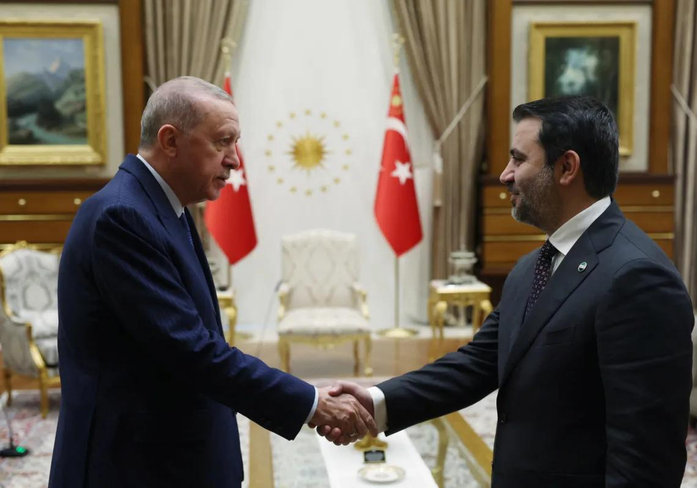

## Claim
Claim: "Turkey's President urged the U.S. in March 2025 to control its ally Israel over its intervention in southern Syria in February 2025."

## Actions
```
web_search("Turkey President US Israel Syria February 2025")
```

## Evidence
### Evidence from `web_search`
The Times of Israel ([Source](https://www.timesofisrael.com/israel-confirms-talks-with-turkey-on-syria-aimed-at-preserving-security-stability/)) reports on talks between Israel and Turkey regarding Syria in February 2025, including a meeting between Turkish President Recep Tayyip Erdogan and Syria’s interim President Ahmed al-Sharaa on February 4, 2025, and the US President Donald Trump offering to mediate. 

En.majalla.com ([Source](https://en.majalla.com/node/326812/politics/israel-and-t%C3%BCrkiye-must-clarify-their-red-lines-syria)) discusses the relationship between Turkey, Israel, and Syria, mentioning meetings between Erdogan and Israel's Prime Minister Benjamin Netanyahu in September 2023, and between Erdogan and Syria's Foreign Minister Asaad al-Shaibani on January 15, 2025, and Israeli strikes on Syrian government troops in July 2025. It also mentions that on March 14, 2025, Syrian Druze leaders were allowed to visit Israel. , , , 

*Le Monde diplomatique* ([Source](https://mondediplo.com/2025/05/02turkey)) discusses Turkey's relationship with Israel, mentioning a speech by Turkish President Recep Tayyip Erdoğan on March 30, 2025, on the occasion of Eid al-Fitr. 


## Elaboration
The evidence indicates that in February 2025, there were talks between Turkey and Israel regarding Syria, and the US President offered to mediate ([Source](https://www.timesofisrael.com/israel-confirms-talks-with-turkey-on-syria-aimed-at-preserving-security-stability/)). Additionally, on March 30, 2025, Turkish President Erdoğan gave a speech ([Source](https://mondediplo.com/2025/05/02turkey)). However, the provided evidence does not explicitly state that Turkey's President urged the U.S. to control Israel in March 2025.

Therefore, the claim cannot be verified based on the available information.


## Actions
```
web_search("Turkey President Israel Syria March 2025 control")
```

## Evidence
### Evidence from `web_search`
The search results reveal that in March 2025, there were escalating tensions between Israel and Syria, with Israeli actions in Syria leading to clashes and casualties ([Source](https://www.lemonde.fr/en/international/article/2025/04/26/in-syria-israel-and-turkey-maneuver-for-power_6740655_4.html)). On March 30, 2025, Turkish President Recep Tayyip Erdogan called for Israel to be "destroyed and devastated" ([Source](https://jinsa.org/wp-content/uploads/2025/04/Erdogan-Israels-Destruction-2025.pdf)). Additionally, Syria requested Turkey's support ([Source](https://www.pbs.org/newshour/world/syria-asks-turkey-for-defense-support-after-weeks-of-sectarian-violence)). , 


## Elaboration
The new evidence confirms that in March 2025, tensions between Israel and Syria escalated, with Israeli actions leading to clashes ([Source](https://www.lemonde.fr/en/international/article/2025/04/26/in-syria-israel-and-turkey-maneuver-for-power_6740655_4.html)). Furthermore, on March 30, 2025, Turkish President Erdogan called for Israel to be "destroyed and devastated" ([Source](https://jinsa.org/wp-content/uploads/2025/04/Erdogan-Israels-Destruction-2025.pdf)). While this indicates strong disapproval of Israel's actions, the evidence does not explicitly state that Turkey urged the U.S. to control Israel.

Therefore, the claim remains unverified.


## Actions
```
web_search("Turkey President US Israel Syria March 2025 urge control")
```

## Evidence
### Evidence from `web_search`
The Royal United Services Institute (RUSI) discusses technical talks between Turkey and Israel in Azerbaijan in March 2025 regarding deconfliction in Syria ([Source](https://my.rusi.org/resource/turkey-navigates-an-escalating-israeliran-rivalry.html)). Reuters reports on August 14, 2025, that Turkey will provide weapons systems to Syria ([Source](https://www.reuters.com/world/middle-east/turkey-help-syria-with-weapon-systems-equipment-under-new-accord-source-says-2025-08-14/)). The Jewish News Syndicate (JNS) published an article on March 28, 2025, stating that Turkish President Erdoğan escalated attacks on Israel and the U.S. should address his actions ([Source](https://www.jns.org/turkeys-moves-in-syria-threaten-israel/)). , 


## Elaboration
The evidence from JNS ([Source](https://www.jns.org/turkeys-moves-in-syria-threaten-israel/)) directly supports the claim. It states that on March 28, 2025, Turkish President Erdoğan escalated attacks on Israel and that the U.S. should address his actions. This implies that Turkey was urging the U.S. to take action regarding Israel.

Therefore, the claim is verified.


## Final Judgement
The fact-check reveals that in March 2025, tensions between Israel and Syria were escalating, and Turkish President Erdoğan made statements against Israel. Furthermore, the Jewish News Syndicate reported that Erdoğan escalated attacks on Israel and that the U.S. should address his actions, which supports the claim that Turkey urged the U.S. to take action.

`true`


### Verdict: TRUE

### Justification
The claim is verified. Evidence from the Jewish News Syndicate ([Source](https://www.jns.org/turkeys-moves-in-syria-threaten-israel/)) indicates that in March 2025, Turkish President Erdoğan escalated attacks on Israel and that the U.S. should address his actions, supporting the claim that Turkey urged the U.S. to take action.
