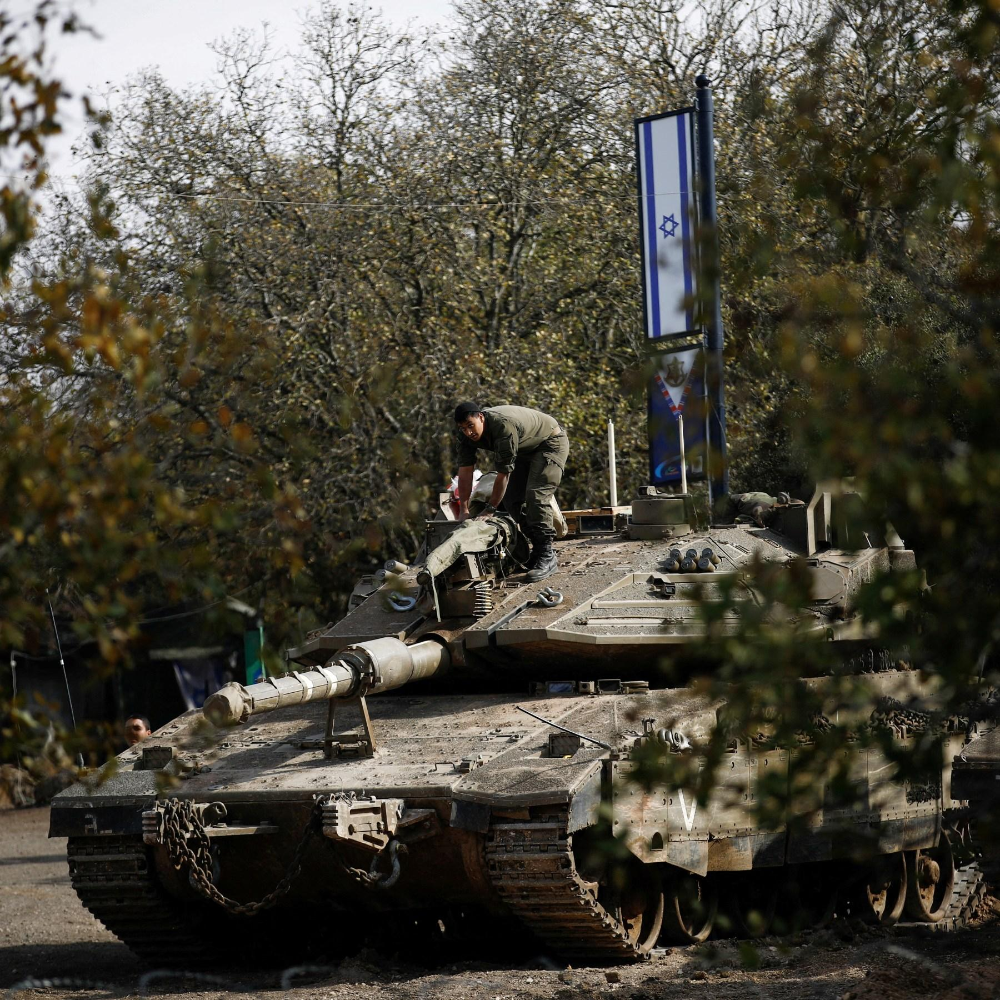

## Claim
Claim: " This image shows the Israeli army reaching Damascus in Syria in December 2024."

## Actions
```
web_search("Israeli army Damascus Syria")
image_search("Israeli tanks Damascus")
```

## Evidence
### Evidence from `web_search`
The provided web sources discuss Israeli actions in Damascus, Syria. Al Jazeera ([https://www.aljazeera.com/news/2025/7/16/israel-bombards-syrias-damascus-as-us-says-steps-agreed-to-end-violence](https://www.aljazeera.com/news/2025/7/16/israel-bombards-syrias-damascus-as-us-says-steps-agreed-to-end-violence)) reports on Israeli airstrikes near the presidential palace and military headquarters, with Israel stating the aim is to protect the Druze minority. CNN ([https://www.cnn.com/2025/07/16/middleeast/damascus-syria-airstrikes-intl](https://www.cnn.com/2025/07/16/middleeast/damascus-syria-airstrikes-intl)) discusses the withdrawal of Syrian troops after clashes and the involvement of the US.

The BBC ([https://www.bbc.com/news/articles/cp90l77187zo](https://www.bbc.com/news/articles/cp90l77187zo)) reports on Israeli strikes hitting Damascus and the Syrian defense ministry, also mentioning fighting in Suweida. The articles were published in July 2025. , , 


### Evidence from `image_search`
The Times of Israel published an image of an Israeli tank, and NDTV fact-checked a claim that Israeli tanks were near Damascus, stating the claim is false. The image in the claim is the same as the one in the search result. The search result was published on December 10, 2024. Al Jazeera published an article on December 8, 2024, about Israel seizing a buffer zone in Syria's Golan Heights, which includes an image of an Israeli tank.

The sources are: [The Times of Israel](https://www.timesofisrael.com/liveblog_entry/report-israeli-tanks-reach-point-25km-from-damascus/), [NDTV](https://www.ndtv.com/world-news/were-israeli-tanks-spotted-outside-damascus-a-fact-check-7224391), and [Al Jazeera](https://www.aljazeera.com/news/2024/12/8/israel-seizes-buffer-zone-in-syrias-golan-heights-after-al-assad-falls).   


## Elaboration
The claim that the image shows the Israeli army reaching Damascus in Syria in December 2024 is false. The image search results from NDTV and Globe Eye News fact-check the claim, stating it is false. The image was published on December 10, 2024. The evidence indicates that Israeli tanks were near Damascus, but not in the city.


## Final Judgement
The image search results from NDTV and Globe Eye News fact-check the claim, stating it is false. The image was published on December 10, 2024. The evidence indicates that Israeli tanks were near Damascus, but not in the city.

The claim is demonstrably false as the image is misrepresented. The image shows Israeli tanks near Damascus, but not in the city. `false`

### Verdict: FALSE

### Justification
The claim is false. While the image depicts Israeli tanks, the evidence from [NDTV](https://www.ndtv.com/world-news/were-israeli-tanks-spotted-outside-damascus-a-fact-check-7224391) and other sources indicates that the tanks were near Damascus, not in the city, and the claim misrepresents the situation.
