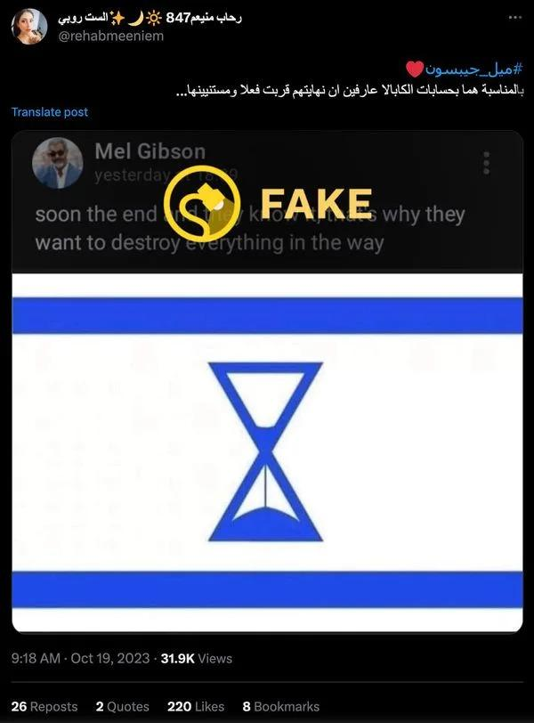
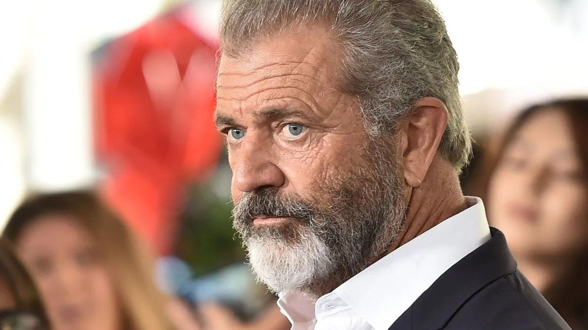
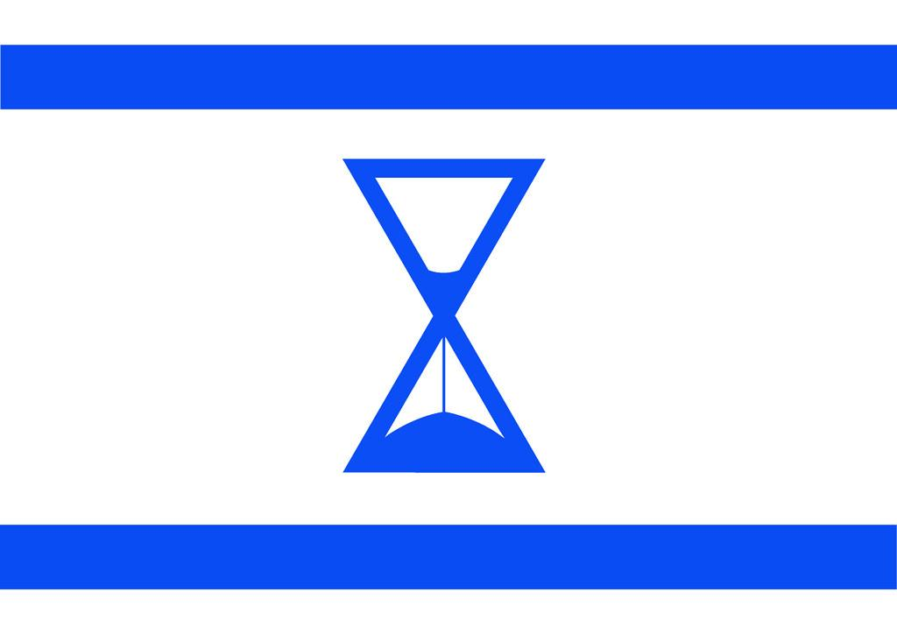
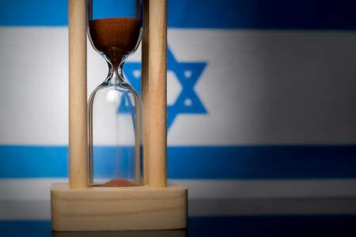

## Claim
Claim: " The image shows a screenshot of an authentic social media post from Mel Gibson saying that Israel will end soon and therefore destroy everything in its way together with a flag in the color of Israel that shows an hourglass."

## Actions
```
web_search("Mel Gibson Israel end destroy everything")
image_search("Israel flag hourglass")
```

## Evidence
### Evidence from `web_search`
The Associated Press ([Source](https://apnews.com/article/fact-check-mel-gibson-israel-post-342335121493)) and Yahoo ([Source](https://www.yahoo.com/entertainment/fact-check-mel-gibson-posted-235600604.html)) both state that the image of Mel Gibson's post is fake. The post includes an altered Israeli flag with an hourglass and was not made by Mel Gibson, who has no public social media accounts. , , , 


### Evidence from `image_search`
The search results include images of an hourglass with the colors of the Israeli flag. One image shows a flag with an hourglass in the middle ([https://www.flickr.com/photos/talporat/4728247932](https://www.flickr.com/photos/talporat/4728247932)) . Another image from Shutterstock shows an hourglass with the Israeli flag colors ([https://www.shutterstock.com/image-illustration/hourglass-colors-national-flag-concept-clip-2131517309](https://www.shutterstock.com/image-illustration/hourglass-colors-national-flag-concept-clip-2131517309)) .

Additionally, there is an image of an hourglass in front of an Israeli flag ([https://www.123rf.com/photo_152379279_hourglass-and-israel-flag-soft-focus-copy-space.html](https://www.123rf.com/photo_152379279_hourglass-and-israel-flag-soft-focus-copy-space.html)) .


## Elaboration
The claim is false. The evidence indicates that the social media post attributed to Mel Gibson is fake. The Associated Press ([https://apnews.com/article/fact-check-mel-gibson-israel-post-342335121493](https://apnews.com/article/fact-check-mel-gibson-israel-post-342335121493)) and Yahoo ([https://www.yahoo.com/entertainment/fact-check-mel-gibson-posted-235600604.html](https://www.yahoo.com/entertainment/fact-check-mel-gibson-posted-235600604.html)) both confirm that the post is fabricated. Furthermore, Mel Gibson does not have any public social media accounts.


## Final Judgement
The claim is demonstrably false. Multiple reliable sources confirm that the social media post attributed to Mel Gibson is fake. The post includes an altered Israeli flag with an hourglass and was not made by Mel Gibson, who has no public social media accounts.

`false`

### Verdict: FALSE

### Justification
The claim is false. Fact-checkers from the Associated Press ([Source](https://apnews.com/article/fact-check-mel-gibson-israel-post-342335121493)) and Yahoo ([Source](https://www.yahoo.com/entertainment/fact-check-mel-gibson-posted-235600604.html)) have debunked the social media post as fabricated, and Mel Gibson does not have any public social media accounts.
