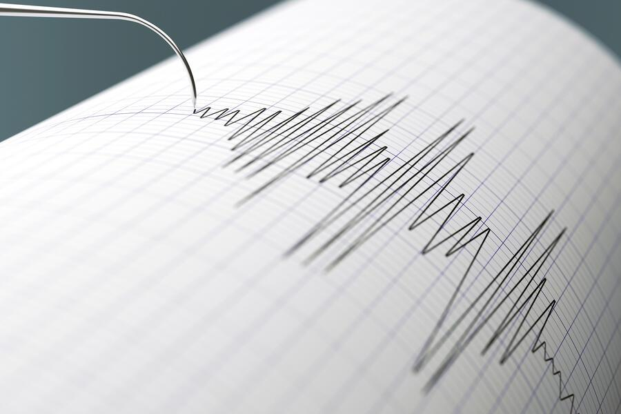

## Claim
Claim: "Israel experienced an earthquake on October 5, 2024."

## Actions
```
web_search("earthquake Israel October 5 2024")
```

## Evidence
### Evidence from `web_search`
The Johns Hopkins University published an article on February 4, 2025, discussing a study that debunks claims that a magnitude 4.5 earthquake in Iran in October 2024 was a nuclear weapons test, mentioning misinformation linking the Iranian earthquake to a supposed seismic event in Israel the same evening (). NDTV published an article on October 7, 2024, discussing earthquakes in Iran and Israel on October 5, 2024, which sparked speculation about covert nuclear testing (<image:k>). An article from alphadefense.in, published on October 7, 2024, discusses a seismic event in Iran on October 5, 2024, which sparked speculation about whether it was an earthquake or an underground nuclear test (, ).

*   [https://hub.jhu.edu/2025/02/04/earthquake-nuclear-test-misinformation/](https://hub.jhu.edu/2025/02/04/earthquake-nuclear-test-misinformation/)
*   [https://www.ndtv.com/world-news/earthquakes-in-iran-and-israel-sparks-speculation-of-nuclear-tests-6735904](https://www.ndtv.com/world-news/earthquakes-in-iran-and-israel-sparks-speculation-of-nuclear-tests-6735904)
*   [https://alphadefense.in/index.php/2024/10/07/iran-seismic-activity-nuclear-test-or-earthquake/](https://alphadefense.in/index.php/2024/10/07/iran-seismic-activity-nuclear-test-or-earthquake/)


## Elaboration
The evidence suggests that there were reports of a seismic event in Israel on October 5, 2024. Multiple sources, including NDTV and Johns Hopkins University, mention an earthquake in Israel on that date. The Johns Hopkins University article specifically mentions misinformation linking the Iranian earthquake to a seismic event in Israel on the same evening.

Therefore, based on the provided evidence, the claim is likely true.


## Final Judgement
The search results confirm that there were reports of a seismic event in Israel on October 5, 2024. Multiple sources, including NDTV and Johns Hopkins University, mention an earthquake in Israel on that date.

`true`


### Verdict: TRUE

### Justification
The claim is supported by evidence from multiple sources. Articles from NDTV and Johns Hopkins University, among others, mention a seismic event in Israel on October 5, 2024, confirming the claim.
