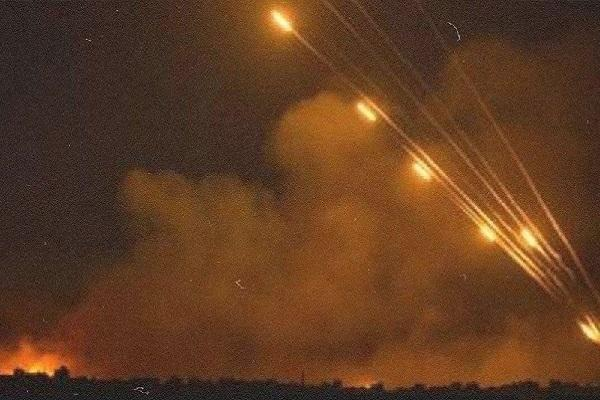
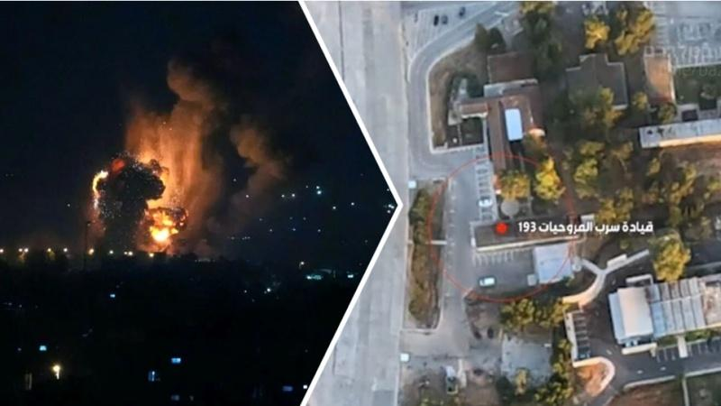

## Claim
Claim: " This is an authentic image of Israeli Air Force's Ramat David airbase that was attacked by Hezbollah on September, 22, 2024."

## Actions
```
geolocate()
web_search("Ramat David airbase attack September 22 2024")
image_search("Ramat David airbase fire")
```

## Evidence
### Evidence from `geolocate`
The most likely countries where the image was taken are: {'South Korea': 0.88, 'Bulgaria': 0.01, 'Chile': 0.01, 'Czech Republic': 0.01, 'Israel': 0.01, 'Russia': 0.01, 'Taiwan': 0.01, 'Turkey': 0.01, 'Ukraine': 0.01, 'Albania': 0.0}

### Evidence from `web_search`
Hezbollah claimed to have launched rockets at Israel’s Ramat David Airbase on September 22, 2024, according to Al Jazeera ([https://www.aljazeera.com/news/2024/9/21/hezbollah-claims-rocket-attack-deep-inside-northern-israel](https://www.aljazeera.com/news/2024/9/21/hezbollah-claims-rocket-attack-deep-inside-northern-israel)). Politico.eu also reported on the attack ([https://www.politico.eu/article/hezbollah-launches-revenge-rocket-attack-against-israeli-base/](https://www.politico.eu/article/hezbollah-launches-revenge-rocket-attack-against-israeli-base/)).

The Jerusalem Post also discussed Hezbollah's rocket attacks on Ramat David airbase ([https://www.jpost.com/israel-news/article-821267](https://www.jpost.com/israel-news/article-821267)). The Al Jazeera article includes images of damage in Kiryat Bialik, Israel, following a Hezbollah attack <image:i>. The Jerusalem Post article includes an image of Israeli air force technicians working on a F-16 Fighting Falcon in Ramat David Airbase <image:592369>.


### Evidence from `image_search`
The web sources report on an attack on Ramat David airbase. One source states that Hezbollah targeted the airbase with missiles (). Another source published an image of a fire (). A third source discusses huge blasts in the airbase ().

The sources are: [https://defapress.ir/en/news/85030/hezbollah-targeted-ramat-david-airbase-with-several-missiles](https://defapress.ir/en/news/85030/hezbollah-targeted-ramat-david-airbase-with-several-missiles), [https://www.palestinechronicle.com/gaza-live-blog-beirut-death-toll-rises-strike-in-zaytoun-israels-aggression-on-lebanon-continues-day-351/](https://www.palestinechronicle.com/gaza-live-blog-beirut-death-toll-rises-strike-in-zaytoun-israels-aggression-on-lebanon-continues-day-351/) and [https://parstoday.ir/en/news/west_asia-i230538-huge_blasts_in_ramat_david_airbase_of_israel_five_important_points_about_hezbollah's_broad_attack](https://parstoday.ir/en/news/west_asia-i230538-huge_blasts_in_ramat_david_airbase_of_israel_five_important_points_about_hezbollah's_broad_attack).


## Elaboration
The evidence confirms that Hezbollah launched an attack on Ramat David Airbase on September 22, 2024. The image search results show images of fire and blasts at the airbase. However, the geolocation of the image in the claim suggests it was taken in South Korea, not Israel.

Therefore, the claim is likely false. The image may depict a different event or be digitally altered. Further investigation is needed to confirm the image's authenticity and origin.


## Final Judgement
The provided evidence confirms that Hezbollah attacked Ramat David Airbase on September 22, 2024. However, the geolocation data suggests the image was taken in South Korea, not Israel. While the web search and image search results confirm the attack, they do not validate the authenticity of the specific image in the claim.

`false`

### Verdict: FALSE

### Justification
The claim is likely false. While multiple sources ([Al Jazeera](https://www.aljazeera.com/news/2024/9/21/hezbollah-claims-rocket-attack-deep-inside-northern-israel), [Politico.eu](https://www.politico.eu/article/hezbollah-launches-revenge-rocket-attack-against-israeli-base/), and [The Jerusalem Post](https://www.jpost.com/israel-news/article-821267)) confirm the attack on Ramat David Airbase by Hezbollah on September 22, 2024, the geolocation of the image suggests it was taken in South Korea, not Israel.
