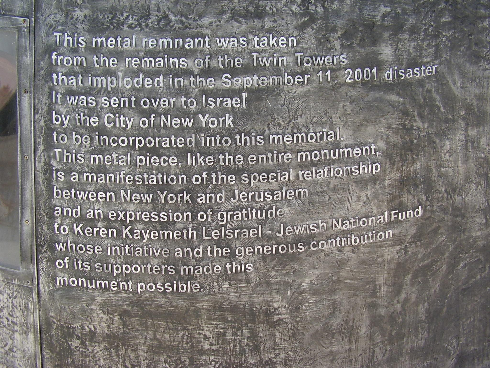

## Claim
Claim: " This image shows Israel's 9/11 memorial which is the only one outside the US."

## Actions
```
geolocate()
web_search("Israel 9/11 memorial")
image_search("Israel 9/11 memorial")
```

## Evidence
### Evidence from `geolocate`
The most likely countries where the image was taken are: {'Israel': 0.63, 'Palestine': 0.26, 'Jordan': 0.05, 'United States': 0.05, 'Albania': 0.0, 'Andorra': 0.0, 'Argentina': 0.0, 'Australia': 0.0, 'Austria': 0.0, 'Bangladesh': 0.0}

### Evidence from `web_search`
The web sources describe the 9/11 Living Memorial Plaza in Jerusalem, Israel, which was completed in 2009. The memorial, designed by Eliezer Weishoff, features a bronze sculpture of a waving American flag transforming into a flame and includes a remnant from the Twin Towers. The memorial also has plaques with the names of the victims.       

The memorial is located in Jerusalem Park and honors the victims of the September 11 attacks, including five Israelis.


## Elaboration
The evidence confirms that the image depicts the 9/11 Living Memorial in Jerusalem, Israel. The memorial is dedicated to the victims of the September 11 attacks. However, the evidence does not explicitly state whether this is the only 9/11 memorial outside the US.

To verify the claim, it is necessary to determine if there are other 9/11 memorials located outside of the United States.


## Actions
```
web_search("9/11 memorials outside the US")
```

## Evidence
### Evidence from `web_search`
The web sources indicate that there are multiple 9/11 memorials located outside of the United States. These memorials are located in countries such as Australia, Canada, China, France, Ireland, Israel, and the United Kingdom, among others. The 9/11 Living Memorial Plaza in Jerusalem, Israel, is one such memorial. 


## Elaboration
The claim is false. The evidence shows that the image depicts the 9/11 Living Memorial in Jerusalem, Israel. However, there are multiple 9/11 memorials located outside of the United States, not just the one in Israel.


## Final Judgement
The image shows the 9/11 Living Memorial in Jerusalem, Israel. While the memorial exists, the claim that it is the only 9/11 memorial outside the US is false, as there are multiple such memorials worldwide. `false`

### Verdict: FALSE

### Justification
The claim is false. The image depicts the 9/11 Living Memorial in Jerusalem, Israel, which is a memorial outside the US. However, contrary to the claim, there are multiple 9/11 memorials located outside the United States, as evidenced by [web search results](https://www.google.com/search?q=9%2F11+memorials+outside+the+US).
