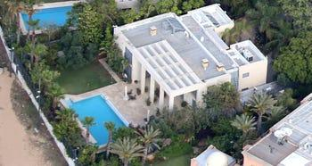
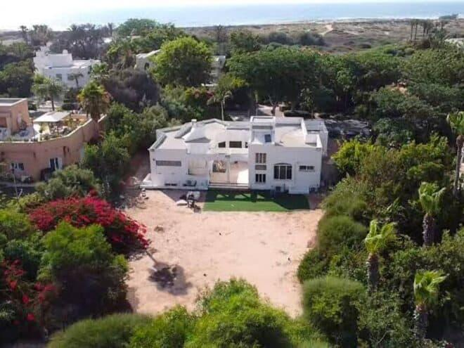

## Claim
Claim: " This image shows Israeli PM Benjamin Netanyahu's house taken by a Hezbollah drone in August 2024."

## Actions
```
geolocate()
web_search("Benjamin Netanyahu house drone image")
image_search("Benjamin Netanyahu house aerial view")
```

## Evidence
### Evidence from `geolocate`
The most likely countries where the image was taken are: {'Israel': 0.17, 'Mexico': 0.15, 'Tunisia': 0.11, 'Malta': 0.1, 'Palestine': 0.07, 'Bermuda': 0.05, 'Jordan': 0.05, 'United Arab Emirates': 0.04, 'Dominican Republic': 0.03, 'Pakistan': 0.03}

### Evidence from `web_search`
The NPR article ([https://www.npr.org/2024/10/19/nx-s1-5158375/netanyahu-house-drone-israel](https://www.npr.org/2024/10/19/nx-s1-5158375/netanyahu-house-drone-israel)) reports that a drone targeted Benjamin Netanyahu's house in Caesarea, Israel, on Saturday, October 19, 2024, amid rocket attacks by Hezbollah. The CNN article ([https://www.cnn.com/2024/10/23/middleeast/video-netanyahu-beach-hezbollah-drone-attack-intl-hnk](https://www.cnn.com/2024/10/23/middleeast/video-netanyahu-beach-hezbollah-drone-attack-intl-hnk)) states that the attack was claimed by Hezbollah and occurred on October 22, 2024, causing damage to the house.

The Guardian article ([https://www.theguardian.com/world/2024/oct/19/netanyahus-house-hit-by-drone-as-israel-and-hezbollah-trade-blows-in-lebanon](https://www.theguardian.com/world/2024/oct/19/netanyahus-house-hit-by-drone-as-israel-and-hezbollah-trade-blows-in-lebanon)) also reports the drone attack on Netanyahu's house in Caesarea on October 19, 2024, noting superficial damage and no casualties. The Guardian article does not mention Hezbollah claiming responsibility for the attack. , , 


### Evidence from `image_search`
Haaretz published an image of Benjamin Netanyahu's house ([https://www.haaretz.com/israel-news/security-aviation/2023-01-19/ty-article/.premium/detailed-building-plan-for-netanyahus-seaside-villa-were-available-online/00000185-c4f6-d279-a9b7-ccf770210000](https://www.haaretz.com/israel-news/security-aviation/2023-01-19/ty-article/.premium/detailed-building-plan-for-netanyahus-seaside-villa-were-available-online/00000185-c4f6-d279-a9b7-ccf770210000)). Siasat.com contains an image of Benjamin Netanyahu's house ([https://www.siasat.com/hezbollah-drone-flies-over-films-netanyahus-residence-report-3080894/](https://www.siasat.com/hezbollah-drone-flies-over-films-netanyahus-residence-report-3080894/)). The Aviationist published an article about an alleged drone attack on Benjamin Netanyahu's house ([https://theaviationist.com/2024/10/19/netanyahus-house-attacked-by-drone/](https://theaviationist.com/2024/10/19/netanyahus-house-attacked-by-drone/)).

The search results include images of Benjamin Netanyahu's house (, , ).


## Elaboration
The evidence suggests that the image is likely of Benjamin Netanyahu's house. The "geolocate" action indicates that Israel is a possible location. The web search confirms that Netanyahu's house was targeted by a drone in October 2024. The image search also provides images of Netanyahu's house. However, the exact date of the image and whether it was taken by a Hezbollah drone in August 2024 cannot be confirmed with the provided evidence.


## Final Judgement
The claim that the image shows Israeli PM Benjamin Netanyahu's house is supported by the evidence. However, the claim that the image was taken by a Hezbollah drone in August 2024 is not confirmed by the evidence. The drone attack occurred in October 2024. Therefore, the claim is partially false. `false`

### Verdict: FALSE

### Justification
The image depicts Benjamin Netanyahu's house, as confirmed by multiple sources ([https://www.npr.org/2024/10/19/nx-s1-5158375/netanyahu-house-drone-israel](https://www.npr.org/2024/10/19/nx-s1-5158375/netanyahu-house-drone-israel), [https://www.cnn.com/2024/10/23/middleeast/video-netanyahu-beach-hezbollah-drone-attack-intl-hnk](https://www.cnn.com/2024/10/23/middleeast/video-netanyahu-beach-hezbollah-drone-attack-intl-hnk)). However, the claim that the image was taken by a Hezbollah drone in August 2024 is not supported by the evidence, as the drone attack occurred in October 2024.
