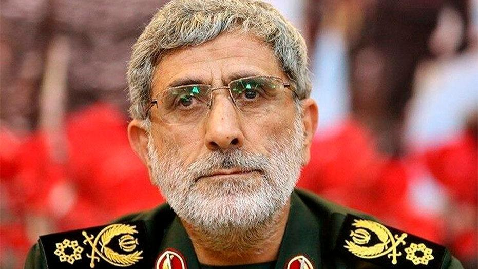
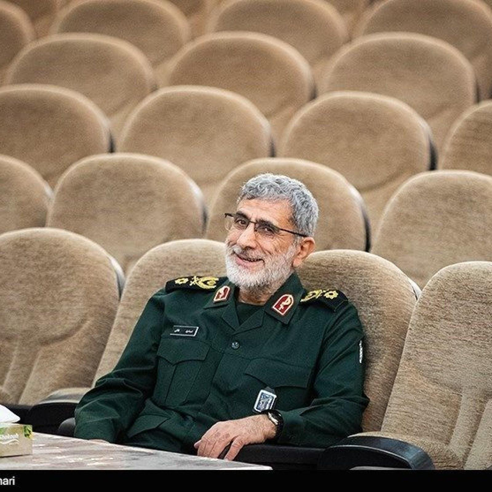
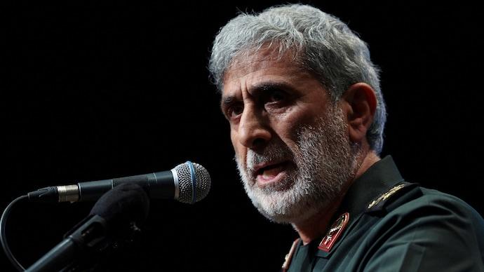
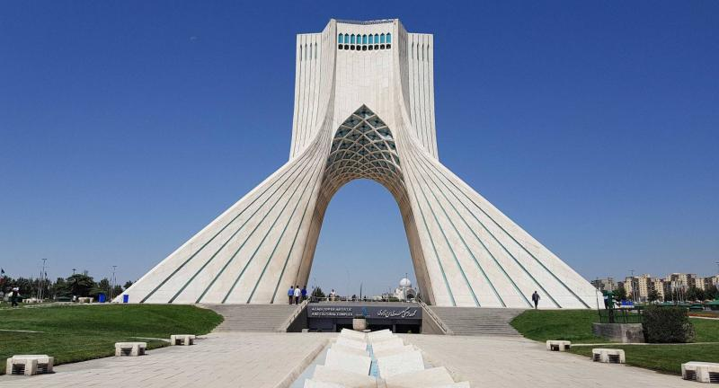
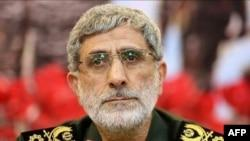

## Claim
Claim: " This is an authentic image of Esmail Qaani, the commander of the Iranian Revolutionary Guards, disguised in a hijab in fear of Israeli bombing."

## Actions
```
image_search("Esmail Qaani hijab disguise")
web_search("Esmail Qaani disguised image")
```

## Evidence
### Evidence from `image_search`
Fox News ([https://www.foxnews.com/world/esmail-qaani-quds-force-iran-us-foe](https://www.foxnews.com/world/esmail-qaani-quds-force-iran-us-foe)) and The International Business Times ([https://www.ibtimes.com/who-esmail-qaani-irans-supreme-leader-appoints-successor-soleimani-2895952](https://www.ibtimes.com/who-esmail-qaani-irans-supreme-leader-appoints-successor-soleimani-2895952)) published images of Esmail Qaani. India Today ([https://www.indiatoday.in/global/story/iran-rejects-allegations-against-quds-force-commander-esmail-qaani-as-fake-news-2616700-2024-10-14](https://www.indiatoday.in/global/story/iran-rejects-allegations-against-quds-force-commander-esmail-qaani-as-fake-news-2616700-2024-10-14)) published an article about Esmail Qaani.

The sources provide images of Esmail Qaani (, , ).


### Evidence from `web_search`
An article from Waradana.com ([https://waradana.com/english/article/143531-irgc-commander-disguised-in-womens-clothing-out-of-fear-of-assassinations](https://waradana.com/english/article/143531-irgc-commander-disguised-in-womens-clothing-out-of-fear-of-assassinations)) states that the image of Esmail Qaani in women's clothing is digitally altered, and the original photo shows Qaani wearing a black outfit, a head cap, and sunglasses. 

The Voice of America ([https://www.voanews.com/a/extremism-watch_afghan-officials-irans-new-quds-chief-likely-faked-identity-2018/6182322.html](https://www.voanews.com/a/extremism-watch_afghan-officials-irans-new-quds-chief-likely-faked-identity-2018/6182322.html)) discusses Esmail Qaani's visit to Afghanistan in 2018, where he introduced himself as an Iranian diplomat.  The Jerusalem Post ([https://www.jpost.com/israel-news/article-859504](https://www.jpost.com/israel-news/article-859504)) also published an article about Esmail Qaani. <image:0>


## Elaboration
The claim is not supported by the evidence. The image of Esmail Qaani in women's clothing is digitally altered, according to Waradana.com ([https://waradana.com/english/article/143531-irgc-commander-disguised-in-womens-clothing-out-of-fear-of-assassinations](https://waradana.com/english/article/143531-irgc-commander-disguised-in-womens-clothing-out-of-fear-of-assassinations)). The original photo shows Qaani wearing a black outfit, a head cap, and sunglasses.


## Final Judgement
The evidence indicates that the image of Esmail Qaani in a hijab is digitally altered. The original photo shows him in a black outfit, head cap, and sunglasses. Therefore, the claim that the image is authentic and shows Qaani disguised is false.

`false`

### Verdict: FALSE

### Justification
The claim is false. The image of Esmail Qaani in a hijab is digitally altered, as reported by Waradana.com ([https://waradana.com/english/article/143531-irgc-commander-disguised-in-womens-clothing-out-of-fear-of-assassinations](https://waradana.com/english/article/143531-irgc-commander-disguised-in-womens-clothing-out-of-fear-of-assassinations)). The original photo shows Qaani in a black outfit, head cap, and sunglasses.
