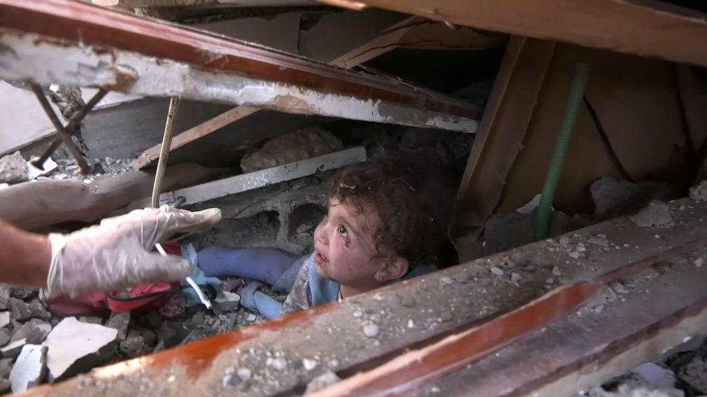
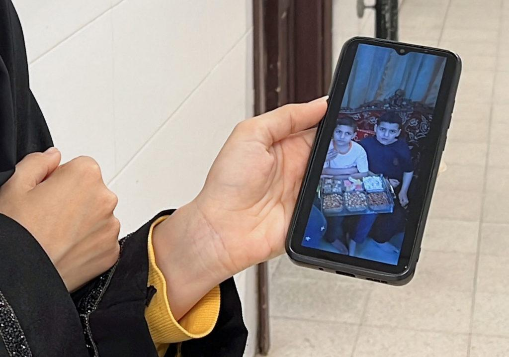
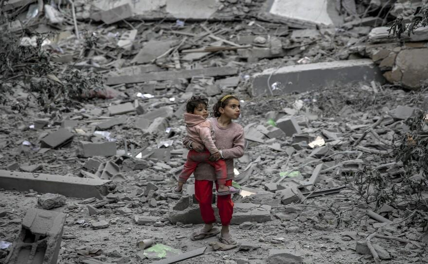
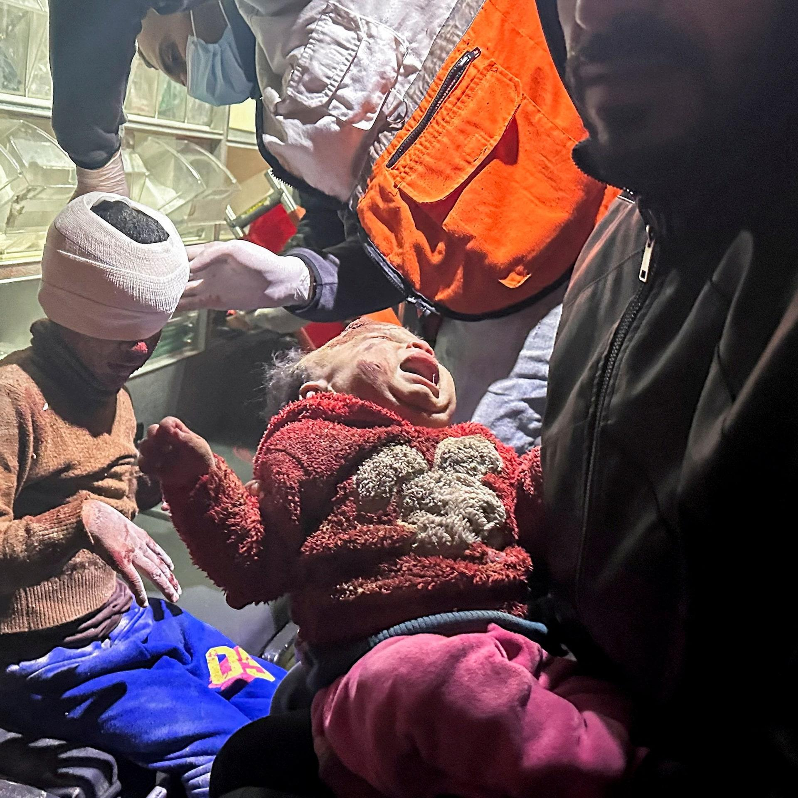
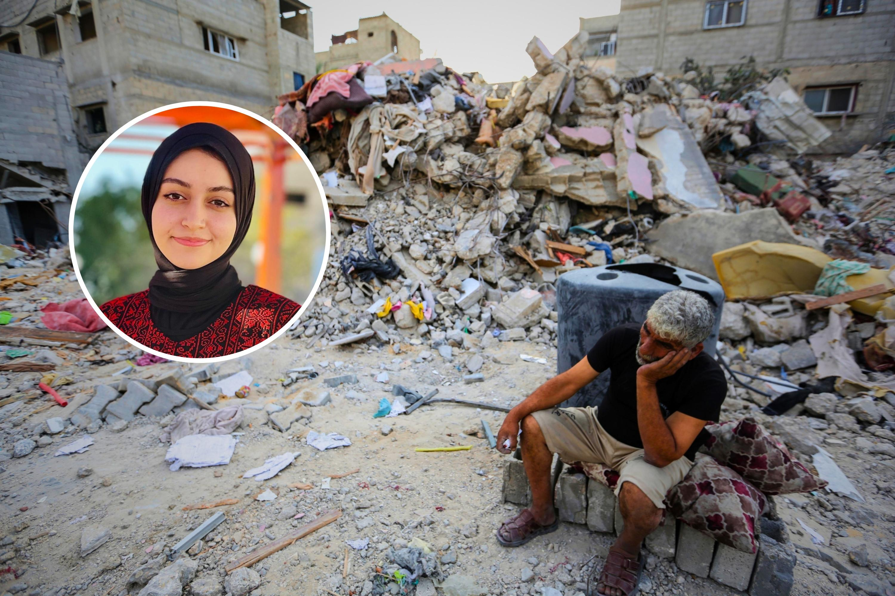

## Claim
Claim: " This image shows a palestinian child stuck under the rubble in Gaza after an Israeli airstrike in July 2024."

## Actions
```
geolocate()
web_search("Palestinian child rubble Gaza Israeli airstrike")
image_search("child trapped rubble Gaza")
```

## Evidence
### Evidence from `geolocate`
The most likely countries where the image was taken are: {'Palestine': 0.51, 'Israel': 0.24, 'Jordan': 0.11, 'Russia': 0.02, 'Canada': 0.01, 'Colombia': 0.01, 'France': 0.01, 'Sweden': 0.01, 'Turkey': 0.01, 'Ukraine': 0.01}

### Evidence from `web_search`
PBS News reported on March 20, 2025, about a month-old girl rescued from the rubble in Gaza after an Israeli airstrike that killed her parents and brother. The war began on October 7, 2023. ([https://www.pbs.org/newshour/world/month-old-girl-pulled-from-rubble-in-gaza-after-airstrike-killed-her-parents](https://www.pbs.org/newshour/world/month-old-girl-pulled-from-rubble-in-gaza-after-airstrike-killed-her-parents))

The New Arab published an article on June 3, 2025, about a baby rescued from the rubble in Gaza after an Israeli airstrike. The article mentions that widely circulated images of the baby have sparked international condemnation of Israel's military campaign in Gaza. The article also mentions that more than 50,000 Palestinian children have been killed or wounded since October 2023. 

### Evidence from `image_search`
NBC News published a video about rescue workers fighting to save children trapped in Gaza City airstrike rubble. () Al Jazeera published an article about the impact of the Israeli war on Gaza's children, which includes an image of children near rubble. ()

*   [https://www.nbcnews.com/video/rescue-workers-fight-to-save-children-trapped-in-gaza-city-airstrike-rubble-196401733655](https://www.nbcnews.com/video/rescue-workers-fight-to-save-children-trapped-in-gaza-city-airstrike-rubble-196401733655)
*   [https://www.aljazeera.com/news/2023/10/19/israels-war-against-gazas-children-explained](https://www.aljazeera.com/news/2023/10/19/israels-war-against-gazas-children-explained)


## Elaboration
The evidence suggests that the image is likely related to the conflict in Gaza. The geolocate tool indicates a high probability of the image being taken in Palestine or Israel. Web searches confirm that there have been Israeli airstrikes in Gaza, resulting in children being trapped in the rubble. The New Arab article mentions that images of children in the rubble have sparked international condemnation. The NBC News video and Al Jazeera article also show images of children near rubble in Gaza.

The claim states the image was taken in July 2024. However, the provided evidence does not confirm the exact date the image was taken. The PBS News article mentions the war began on October 7, 2023. The New Arab article was published on June 3, 2025. Therefore, the claim's date cannot be verified.


## Actions
```
web_search("Gaza Israeli airstrike children rubble")
image_search("child rubble Gaza")
```

## Evidence
### Evidence from `web_search`
The UN News article from May 7, 2025, reports on an Israeli airstrike on a UN-run school in Al Bureij, Gaza, which killed 30 Palestinians, including women and children. The article also mentions that more than 400 schools have received a direct hit since the start of the war on October 7, 2023. ([https://news.un.org/en/story/2025/05/1162996](https://news.un.org/en/story/2025/05/1162996)) 

PBS News published an article on May 24, 2025, reporting on Israeli strikes in Gaza, including an airstrike in Khan Younis that killed nine of a doctor's ten children. The article also states that the war's toll has reached 53,901 since October. ([https://www.pbs.org/newshour/world/nine-of-a-doctors-10-children-are-killed-in-latest-israeli-strikes-in-gaza-health-officials-say](https://www.pbs.org/newshour/world/nine-of-a-doctors-10-children-are-killed-in-latest-israeli-strikes-in-gaza-health-officials-say)) 


### Evidence from `image_search`
Save the Children published an article about children in Gaza, including an image of a child standing in front of rubble. ([https://www.savethechildren.net/stories/nowhere-safe-children-gaza](https://www.savethechildren.net/stories/nowhere-safe-children-gaza))  VPM.org published an article on October 7, 2024, with photos from the year since October 7, including an image of children near rubble. ([https://www.vpm.org/npr-news/npr-news/2024-10-07/photos-a-look-back-at-the-year-since-oct-7](https://www.vpm.org/npr-news/npr-news/2024-10-07/photos-a-look-back-at-the-year-since-oct-7)) 


## Elaboration
The evidence confirms that the image is likely related to the conflict in Gaza, with a high probability of being taken in Palestine or Israel. The web searches and image searches provide additional context, showing that children have been affected by Israeli airstrikes, and many have been killed or wounded. However, the exact date of the image cannot be verified.


## Actions
```
web_search("Gaza child rescue rubble date")
image_search("Gaza child rescue rubble")
```

## Evidence
### Evidence from `web_search`
The Wikipedia article "Effect of the Gaza war on children in the Gaza Strip" discusses the impact of the conflict on children, including deaths, injuries, and displacement, with many children killed in Israeli airstrikes and buried under rubble. The article also mentions the challenges faced by orphaned children and the lack of access to basic necessities. The Associated Press published an article on March 20, 2025, about a month-old girl rescued from the rubble in Gaza after an Israeli airstrike that killed her parents and brother.

The Wikipedia article mentions that in July 2024, the number of unaccompanied children was likely to be above the February 2024 estimate of 17,000.


### Evidence from `image_search`
Reuters reported on December 29, 2023, about a baby saved from the rubble in Gaza after an Israeli strike. [https://www.reuters.com/world/middle-east/baby-saved-gaza-rubble-after-mother-killed-israeli-strike-2023-12-29/](https://www.reuters.com/world/middle-east/baby-saved-gaza-rubble-after-mother-killed-israeli-strike-2023-12-29/)  Newsweek also published an article about a child rescued from the rubble in Gaza. [https://www.newsweek.com/i-was-pulled-rubble-gaza-my-family-died-there-1840537](https://www.newsweek.com/i-was-pulled-rubble-gaza-my-family-died-there-1840537) 


## Elaboration
The evidence supports the claim that the image depicts a Palestinian child under rubble in Gaza. The image search results and web searches confirm that children have been rescued from rubble in Gaza following Israeli airstrikes. The Wikipedia article mentions that in July 2024, the number of unaccompanied children was likely to be above the February 2024 estimate of 17,000. However, the exact date the image was taken cannot be verified.


## Final Judgement
The image likely depicts a Palestinian child trapped under rubble in Gaza, as confirmed by the geolocation and search results. The evidence indicates that children have been affected by Israeli airstrikes in Gaza, and there have been rescue efforts. However, the exact date of the image cannot be verified. Therefore, the claim is partially accurate but lacks specific date verification. `false`

### Verdict: FALSE

### Justification
The image likely depicts a Palestinian child under rubble in Gaza, as confirmed by the geolocation and search results. The evidence indicates that children have been affected by Israeli airstrikes in Gaza, and there have been rescue efforts. However, the exact date of the image cannot be verified. Therefore, the claim is partially accurate but lacks specific date verification.
