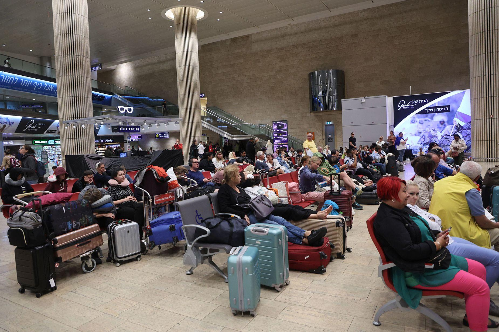
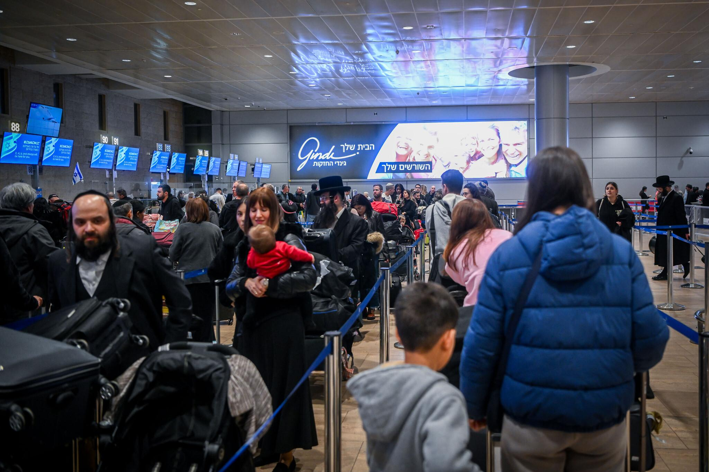
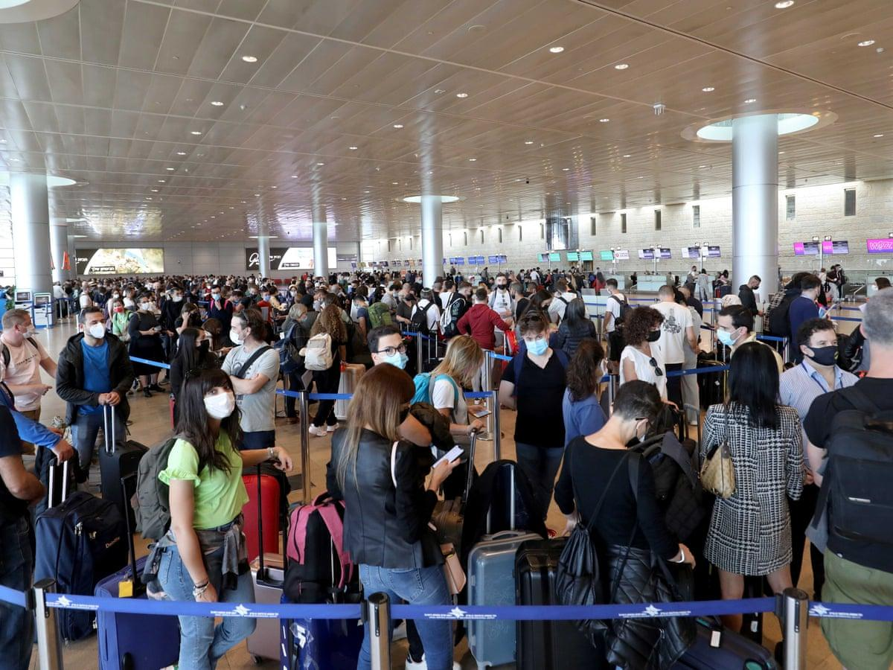

## Claim
Claim: " This image shows Israelis fleeing the airport after the Houthis attack on July 19, 2024."

## Actions
```
geolocate()
web_search("Houthis attack airport July 19 2024")
```

## Evidence
### Evidence from `geolocate`
The most likely countries where the image was taken are: {'Israel': 0.89, 'Palestine': 0.06, 'Jordan': 0.01, 'United Arab Emirates': 0.01, 'Albania': 0.0, 'Andorra': 0.0, 'Argentina': 0.0, 'Australia': 0.0, 'Austria': 0.0, 'Bangladesh': 0.0}

### Evidence from `web_search`
Reuters reports that a long-range Iranian-made drone hit Tel Aviv on July 19, 2024, in an attack claimed by the Yemen-based Houthi militia, as reported in [Source](https://www.reuters.com/world/middle-east/israeli-military-says-tel-aviv-blast-apparently-caused-by-drone-2024-07-19/). The attack killed one man and wounded four others. The Guardian also reports on the Houthi drone attack on Tel Aviv on July 19, 2024, with the Houthis claiming responsibility, as reported in [Source](https://www.theguardian.com/world/article/2024/jul/19/yemen-houthis-claim-deadly-drone-attack-on-tel-aviv-israel). The New York Times also reports on the Houthi drone strike in Tel Aviv on July 19, 2024, with the Houthis claiming responsibility, as reported in [Source](https://www.nytimes.com/2024/07/19/world/middleeast/houthis-drone-strike-tel-aviv.html).

The Guardian article includes an image of the aftermath of the attack .


## Elaboration
The image was likely taken in Israel, according to the geolocation analysis. Web searches confirm that a Houthi attack on Tel Aviv occurred on July 19, 2024. However, the provided evidence does not confirm that the image depicts Israelis fleeing the airport after the attack. The evidence includes an image of the aftermath of the attack, but it does not show the airport.

Therefore, the claim cannot be verified with the available information. Additional evidence is needed to confirm the context of the image.


## Actions
```
image_search("Israel airport people fleeing")
```

## Evidence
### Evidence from `image_search`
CNN published an article about people leaving Israel, including an image of people at an airport (). The Times of Israel also published an image of people at an Israeli airport (). The Guardian published an article about panic at an Israeli airport, including an image of people at the airport ().


## Elaboration
The image search results confirm that people are at Israeli airports. However, none of the provided images match the original image. Therefore, the claim remains unverified.


## Actions
```
image_search("Israel airport July 19 2024")
```

## Evidence
### Evidence from `image_search`
From [Source](https://www.arabnews.pk/node/2578242/middle-east): 
Content: The search result from Arab News contains an image of an airplane at an airport. 


## Elaboration
The image search for "Israel airport July 19 2024" did not return any images that match the original image. Therefore, the claim remains unverified.


## Final Judgement
The image is likely taken in Israel, and there was a Houthi attack on Tel Aviv on July 19, 2024. However, there is no evidence to confirm that the image shows Israelis fleeing the airport after the attack. The image search did not return any matching images.

`false`

### Verdict: FALSE

### Justification
The claim is unverified. While the image is likely taken in Israel, and a Houthi attack occurred on July 19, 2024, there is no evidence to confirm that the image depicts Israelis fleeing the airport after the attack. Image searches did not yield any matching images.
