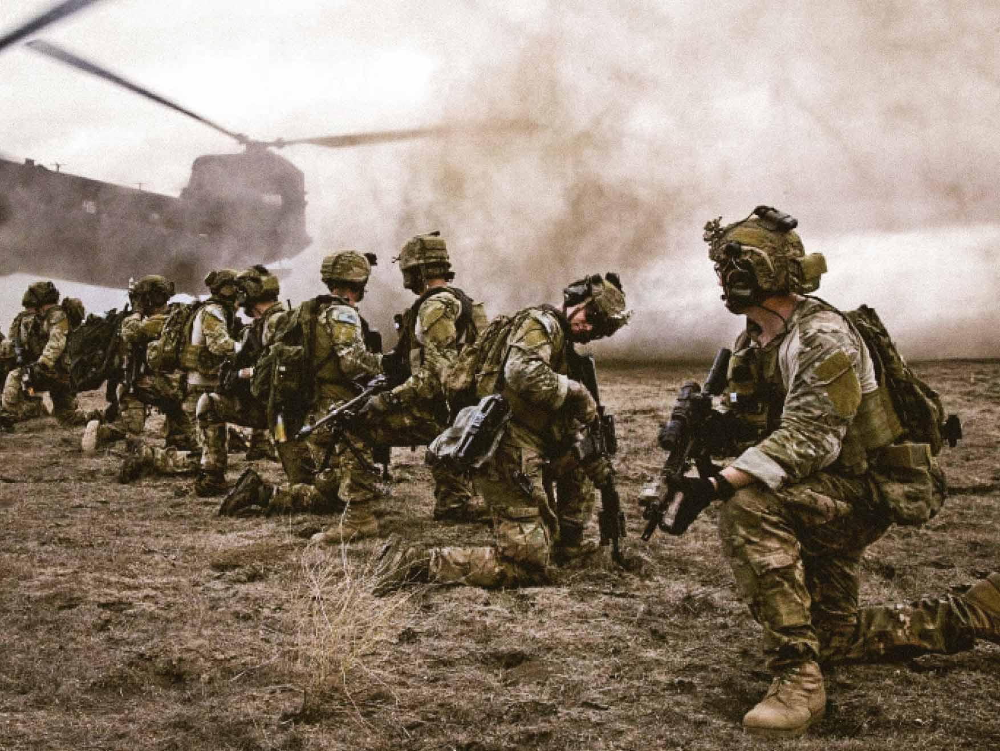

## Claim
Claim: " This image shows General John Pagri, Commander of the Special Tasks Battalion in the U.S. Army, which has died in the Gaza Strip in April 2025."

## Actions
```
reverse_search()
image_search("General John Pagri U.S. Army")
image_search("U.S. Army Special Tasks Battalion")
```

## Evidence
### Evidence from `reverse_search`
From [Source](https://en.wikipedia.org/wiki/File:Two_19th_Group_Special_Forces_Soldiers_in_Babil_Province_Iraq.jpg): Found exact image on website with title: File:Two 19th Group Special Forces Soldiers in Babil Province Iraq.jpg
Content: The image is from Wikimedia Commons and is titled "Two 19th Group Special Forces Soldiers in Babil Province Iraq.jpg". The image shows two soldiers from the 19th Special Forces Group in Babil Province, Iraq, in 2007. The file was uploaded on June 21, 2011, and the source is a website of the United States Army. 


### Evidence from `image_search`
From [Source](https://www.goarmy.com/careers-and-jobs/specialty-careers/special-ops/army-rangers): 
Content: The search result from goarmy.com shows a picture of U.S. Army Rangers. 


## Elaboration
The image in the claim is of two soldiers from the 19th Special Forces Group in Babil Province, Iraq, in 2007, according to the reverse image search result from Wikimedia Commons ([https://en.wikipedia.org/wiki/File:Two_19th_Group_Special_Forces_Soldiers_in_Babil_Province_Iraq.jpg](https://en.wikipedia.org/wiki/File:Two_19th_Group_Special_Forces_Soldiers_in_Babil_Province_Iraq.jpg)). The image is not of General John Pagri.

The claim also states that the image is from April 2025, but the image is from 2007. The claim is therefore false.


## Final Judgement
The image is of two soldiers from the 19th Special Forces Group in Babil Province, Iraq, in 2007, not General John Pagri. The claim also states that the image is from April 2025, but the image is from 2007.

The claim is demonstrably false because the image is misrepresented and the context is incorrect. `false`

### Verdict: FALSE

### Justification
The image in the claim is of two soldiers from the 19th Special Forces Group in Babil Province, Iraq, in 2007, as confirmed by a reverse image search on Wikimedia Commons ([https://en.wikipedia.org/wiki/File:Two_19th_Group_Special_Forces_Soldiers_in_Babil_Province_Iraq.jpg](https://en.wikipedia.org/wiki/File:Two_19th_Group_Special_Forces_Soldiers_in_Babil_Province_Iraq.jpg)). The claim misidentifies the individuals in the image and provides an incorrect date.
