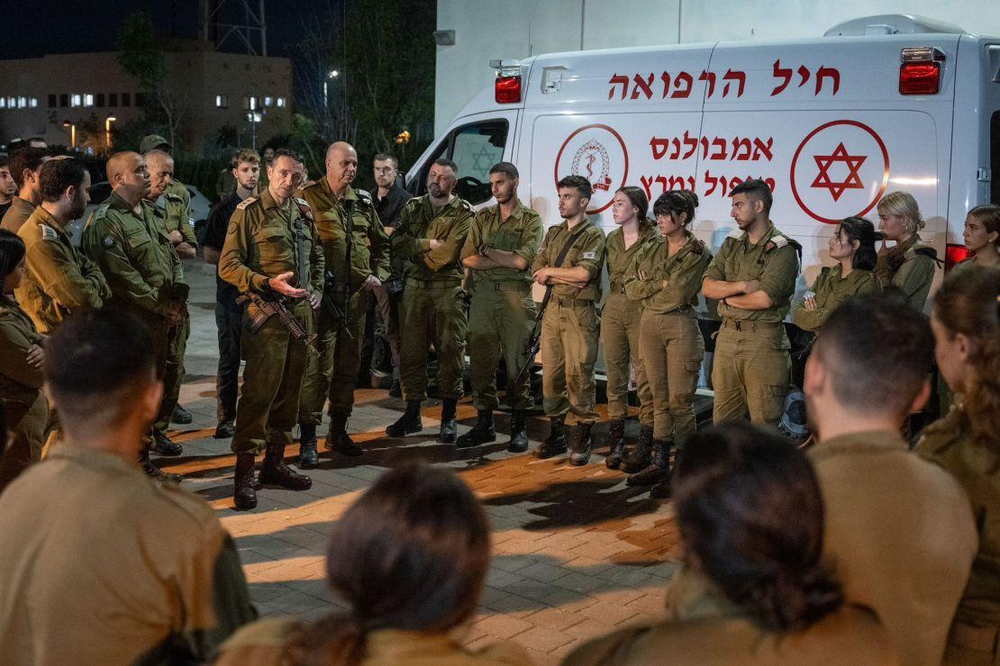

## Claim
Claim: "The chief of the Israeli Defense Forces (IDF), Herzi Halevi, was assassinated in a Hezbollah drone attack on an Israeli military base on October 13, 2024."

## Actions
```
image_search("Herzi Halevi Hezbollah drone attack October 13 2024")
```

## Evidence
### Evidence from `image_search`
CNN published an article discussing Hezbollah attacks on Israel, including an image of Herzi Halevi with other soldiers (). ABC News contains an image of a helicopter (). Al Jazeera reports on a Hezbollah drone attack on an Israeli military site on October 13, 2024, which wounded more than 60 people ().

The sources are: [CNN](https://www.cnn.com/2024/10/14/middleeast/hezbollah-attack-israel-weaknesses-drones-intl-cmd), [ABC News](https://abcnews.go.com/International/live-updates/israel-hamas-hezbollah?id=114770972&entryId=114771236), and [Al Jazeera](https://www.aljazeera.com/news/2024/10/13/more-than-60-wounded-in-hezbollah-drone-attack-on-israeli-military-site).


## Elaboration
The evidence confirms a Hezbollah drone attack on an Israeli military site on October 13, 2024, as reported by Al Jazeera, which resulted in injuries. CNN published an article discussing Hezbollah attacks on Israel, and an image shows Herzi Halevi with other soldiers.

However, the evidence does not mention that Herzi Halevi was assassinated in the attack. Therefore, the claim that he was assassinated is not supported by the provided evidence.

The evidence is insufficient to verify the claim's veracity.


## Final Judgement
The evidence confirms a Hezbollah drone attack on an Israeli military site on October 13, 2024, but does not mention the assassination of Herzi Halevi. The provided sources do not support the claim that Herzi Halevi was assassinated.

`false`

### Verdict: FALSE

### Justification
The claim is false. While there is evidence of a Hezbollah drone attack on an Israeli military site on October 13, 2024, as reported by [Al Jazeera](https://www.aljazeera.com/news/2024/10/13/more-than-60-wounded-in-hezbollah-drone-attack-on-israeli-military-site), the provided sources, including [CNN](https://www.cnn.com/2024/10/14/middleeast/hezbollah-attack-israel-weaknesses-drones-intl-cmd) and [ABC News](https://abcnews.go.com/International/live-updates/israel-hamas-hezbollah?id=114770972&entryId=114771236), do not support the assertion that Herzi Halevi was assassinated in the attack.
