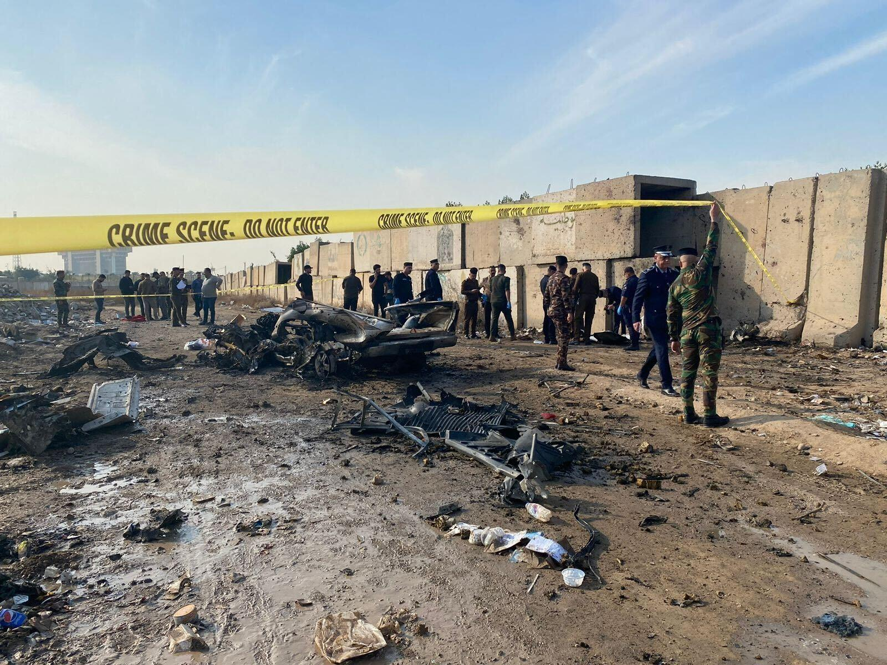

## Claim
Claim: " This image shows a US factility come under attack in Baghdad on September 30, 2024 as the conflict between Israel and the Iran-backed militant group Hezbollah escalated."

## Actions
```
reverse_search()
image_search("Baghdad facility attack September 30 2024")
```

## Evidence
### Evidence from `reverse_search`
The image 

### Evidence from `image_search`
Al Jazeera published an article on February 8, 2024, that includes an image of a burning car (). The Washington Post published an article about an attack on a facility in Baghdad (). The Denver Post published an article on August 19, 2023, commemorating the 20th anniversary of an attack on the UN headquarters in Iraq ().

The provided sources do not contain information about the claim.


## Elaboration
Insufficient information to verify the claim. The evidence does not contain any information about the image or the events described in the claim.


## Actions
```
geolocate()
```

## Evidence
### Evidence from `geolocate`
The most likely countries where the image was taken are: {'Nigeria': 0.13, 'United Arab Emirates': 0.09, 'Ukraine': 0.08, 'Chile': 0.05, 'Ecuador': 0.03, 'Ghana': 0.03, 'Taiwan': 0.03, 'Bangladesh': 0.02, 'Belgium': 0.02, 'Brazil': 0.02}

## Elaboration
The geolocation analysis suggests that the image was not taken in Iraq. The most likely countries are Nigeria, the United Arab Emirates, and Ukraine. This contradicts the claim that the image shows a US facility in Baghdad.


## Final Judgement
The image analysis and geolocation data contradict the claim that the image depicts a US facility in Baghdad. The geolocation analysis suggests the image was not taken in Iraq.

`false`

### Verdict: FALSE

### Justification
The claim is false. The image analysis and geolocation data contradict the claim that the image depicts a US facility in Baghdad. The geolocation analysis suggests the image was not taken in Iraq.
