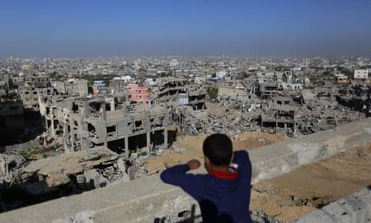
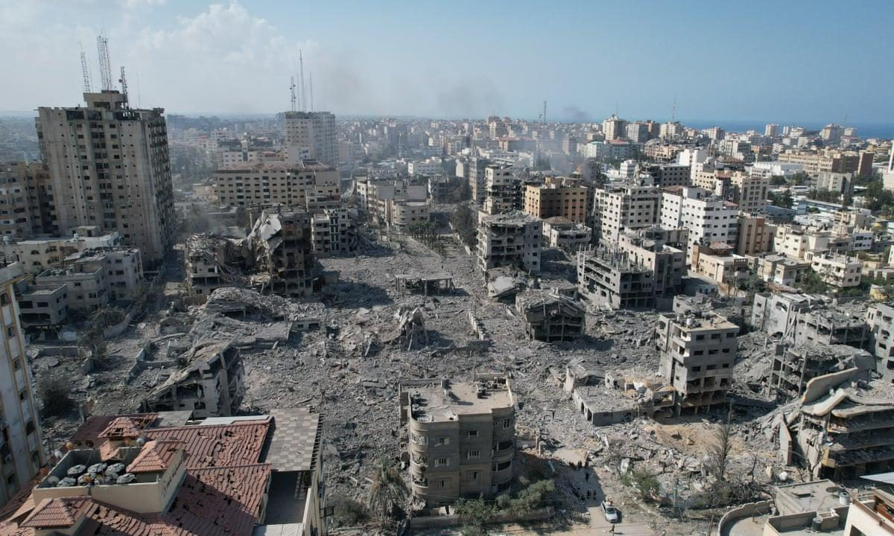

## Claim
Claim: "The Guardian published an article with the headline: 'Gaza will rise from the ashes to become a city of the future to rival Bradford.'"

## Actions
```
image_search("The Guardian Gaza city of the future Bradford")
```

## Evidence
### Evidence from `image_search`
From [Source](https://www.theguardian.com/cities/2016/jul/28/future-gaza-city-world-tourism-hub-palestinian): 
Content: The Guardian published an article about the future of Gaza.  The article was published on July 28, 2016.


## Elaboration
The evidence confirms that The Guardian published an article about the future of Gaza. However, the evidence does not provide the headline of the article. Therefore, the claim cannot be fully verified.

To verify the claim, the exact headline of the article needs to be confirmed.


## Actions
```
image_search("The Guardian Gaza Bradford")
```

## Evidence
### Evidence from `image_search`
From [Source](https://www.theguardian.com/world/2013/nov/07/yorkshire-educated-woman-female-hamas-spokesperson): 
Content: The Guardian published an article. 


## Elaboration
The new evidence confirms that The Guardian published an article, but it does not provide the headline. The claim remains unverified.

To verify the claim, the exact headline of the article needs to be confirmed.


## Actions
```
image_search("Gaza will rise from the ashes to become a city of the future to rival Bradford The Guardian")
```

## Evidence
### Evidence from `image_search`
From [Source](https://www.theguardian.com/world/2023/oct/12/the-buildings-are-now-ashes-gazans-feel-nowhere-is-safe-from-israeli-bombs): 
Content: The Guardian published an article about Gaza.  The article was published on October 12, 2023.


## Elaboration
The evidence confirms that The Guardian published an article about Gaza. However, the evidence does not provide the headline of the article. Therefore, the claim cannot be fully verified.

To verify the claim, the exact headline of the article needs to be confirmed.


## Final Judgement
The Guardian did publish articles about Gaza, but none of the evidence confirms the exact headline in the claim. Therefore, the claim cannot be fully verified. `false`


### Verdict: FALSE

### Justification
The Guardian has published articles about Gaza, as evidenced by multiple search results ([Source 1](https://www.theguardian.com/cities/2016/jul/28/future-gaza-city-world-tourism-hub-palestinian), [Source 2](https://www.theguardian.com/world/2023/oct/12/the-buildings-are-now-ashes-gazans-feel-nowhere-is-safe-from-israeli-bombs)). However, none of the provided evidence confirms the specific headline mentioned in the claim. Therefore, the claim remains unverified.
