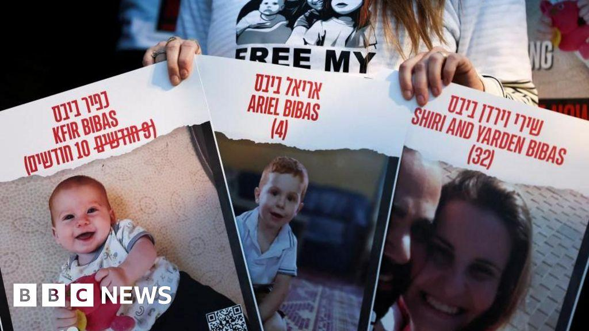
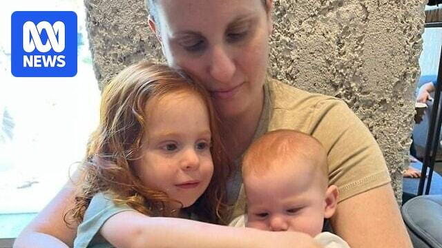
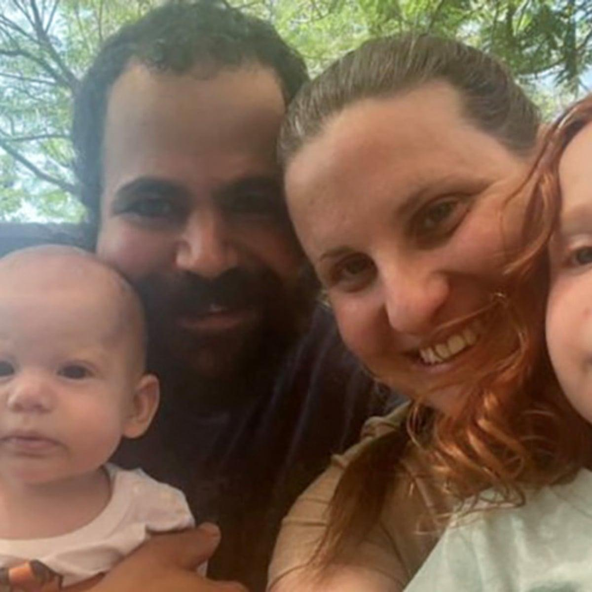

## Claim
Claim: " This image shows a screenshot of an authentic BBC article from February 2025 with the title 'Hamas just wanted to protect the Bibas family but Israel killed them - Hamas said.'"

## Actions
```
image_search("BBC Hamas Bibas family Israel")
```

## Evidence
### Evidence from `image_search`
The search results include a BBC News image of the Bibas family (), an ABC News article from February 19, 2025, about Hamas releasing the remains of the Bibas family (), and a Guardian article from January 31, 2025, about Hamas releasing Israeli hostage Yarden Bibas, his wife, and children ().

The BBC News image is available at [Source](https://www.bbc.com/news/articles/czdnp4ly5d1o). The ABC News article is available at [Source](https://www.abc.net.au/news/2025-02-19/hamas-to-release-remains-of-bibas-family-israel/104953098). The Guardian article is available at [Source](https://www.theguardian.com/world/2025/jan/31/hamas-to-release-israeli-hostage-yarden-bibas-wife-children-family).


## Elaboration
The evidence confirms the existence of a BBC News image related to the Bibas family, as well as ABC News and Guardian articles about the family. However, the evidence does not contain the specific BBC article mentioned in the claim.

The claim states that the BBC article's title is "Hamas just wanted to protect the Bibas family but Israel killed them - Hamas said." The search results do not provide the title of the BBC article.

Therefore, the veracity of the claim cannot be fully determined without the actual BBC article.


## Actions
```
image_search("BBC article Hamas Bibas family")
```

## Evidence
### Evidence from `image_search`
From [Source](https://www.aljazeera.com/news/liveblog/2025/2/21/live-israel-ramps-up-west-bank-assault-after-bus-blasts-near-tel-aviv): 
Content: Al Jazeera published an article on February 21, 2025, that includes an image of people holding posters with pictures of the Bibas family. 


## Elaboration
The new evidence from Al Jazeera shows that the Bibas family was a subject of media coverage. However, it does not provide the specific BBC article mentioned in the claim. The claim's veracity remains unconfirmed.


## Actions
```
image_search("BBC news Bibas family Hamas Israel")
```

## Evidence
No new evidence found.

## Elaboration
The claim cannot be verified. While there is evidence of BBC News coverage related to the Bibas family, the specific article title mentioned in the claim ("Hamas just wanted to protect the Bibas family but Israel killed them - Hamas said") has not been found.


## Final Judgement
The search results confirm that the Bibas family was a subject of media coverage, including BBC News. However, the specific BBC article title mentioned in the claim ("Hamas just wanted to protect the Bibas family but Israel killed them - Hamas said") has not been found. Therefore, the claim cannot be verified.

`false`

### Verdict: FALSE

### Justification
The claim is unverified. While there is evidence of BBC News coverage related to the Bibas family, the specific article title mentioned in the claim ("Hamas just wanted to protect the Bibas family but Israel killed them - Hamas said") has not been found. The search results show a BBC News image of the Bibas family ([Source](https://www.bbc.com/news/articles/czdnp4ly5d1o)), and other news articles about the family, but not the specific article mentioned in the claim.
