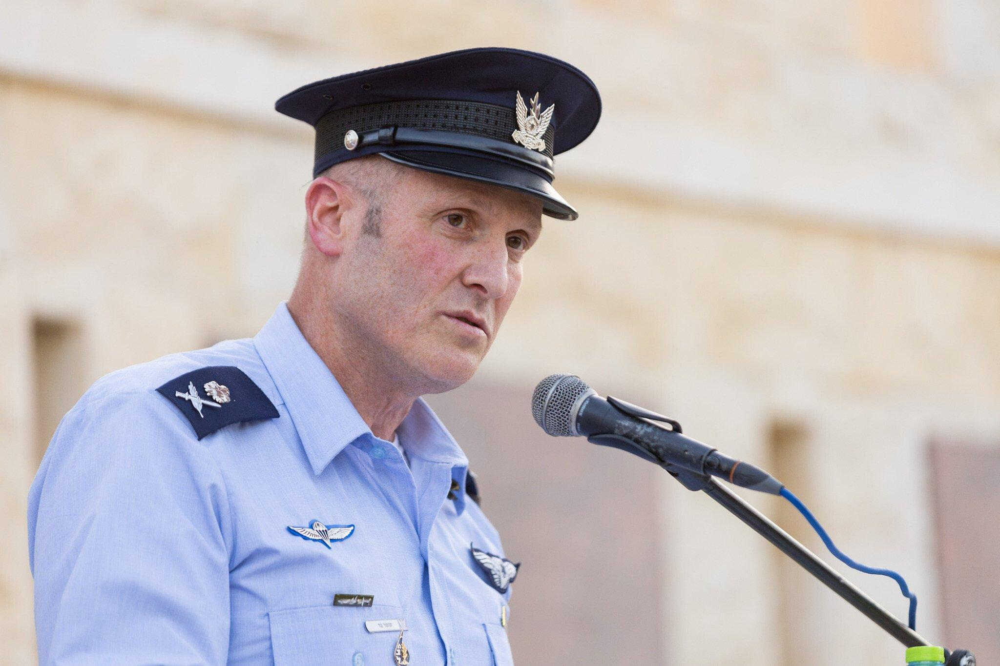
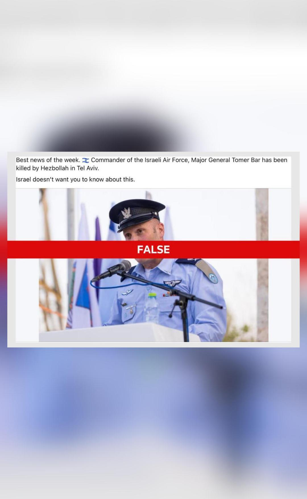

## Claim
Claim: "Commander of the Israeli Air Force, Major General Tomer Bar has been killed by Hеzbollаh in Tel Aviv in a drone attack in November 2024."

## Actions
```
image_search("Tomer Bar")
image_search("Tomer Bar killed")
```

## Evidence
### Evidence from `image_search`
From [Source](https://www.timesofisrael.com/air-force-chief-reportedly-vows-to-keep-politics-away-from-service/): 
Content: The Times of Israel provides an image of Tomer Bar. 


### Evidence from `image_search`
From [Source](https://inshorts.com/en/news/israeli-air-force-chief-tomer-bar-alive--not-killed-by-hezbollah-1733746115536): 
Content: The search result from inshorts.com states that the claim that Commander of the Israeli Air Force, Major General Tomer Bar, was killed by Hezbollah in Tel Aviv is false. 


## Elaboration
The evidence from inshorts.com ([https://inshorts.com/en/news/israeli-air-force-chief-tomer-bar-alive--not-killed-by-hezbollah-1733746115536](https://inshorts.com/en/news/israeli-air-force-chief-tomer-bar-alive--not-killed-by-hezbollah-1733746115536)) explicitly states that the claim is false.


## Final Judgement
The search results indicate that the claim of Major General Tomer Bar's death by Hezbollah is false. The evidence includes an image from inshorts.com that labels the claim as false.

The claim is demonstrably false, as indicated by the search results. `false`


### Verdict: FALSE

### Justification
The claim that Major General Tomer Bar was killed by Hezbollah is false. A search result from inshorts.com ([https://inshorts.com/en/news/israeli-air-force-chief-tomer-bar-alive--not-killed-by-hezbollah-1733746115536](https://inshorts.com/en/news/israeli-air-force-chief-tomer-bar-alive--not-killed-by-hezbollah-1733746115536)) explicitly states that the claim is false.
