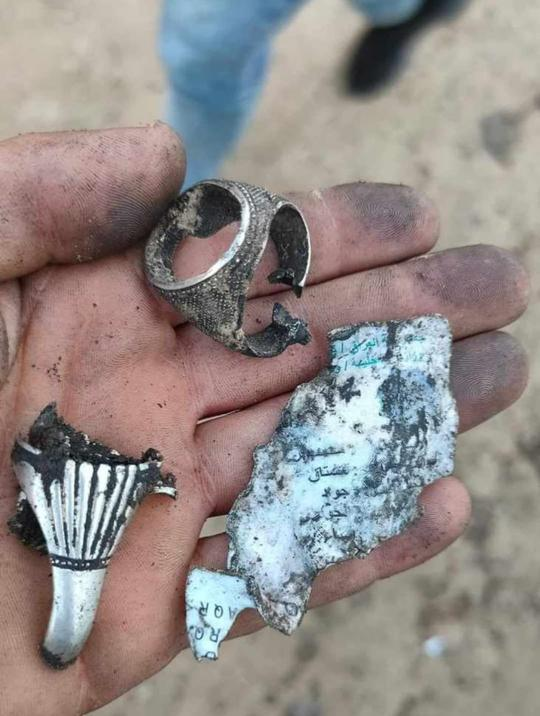
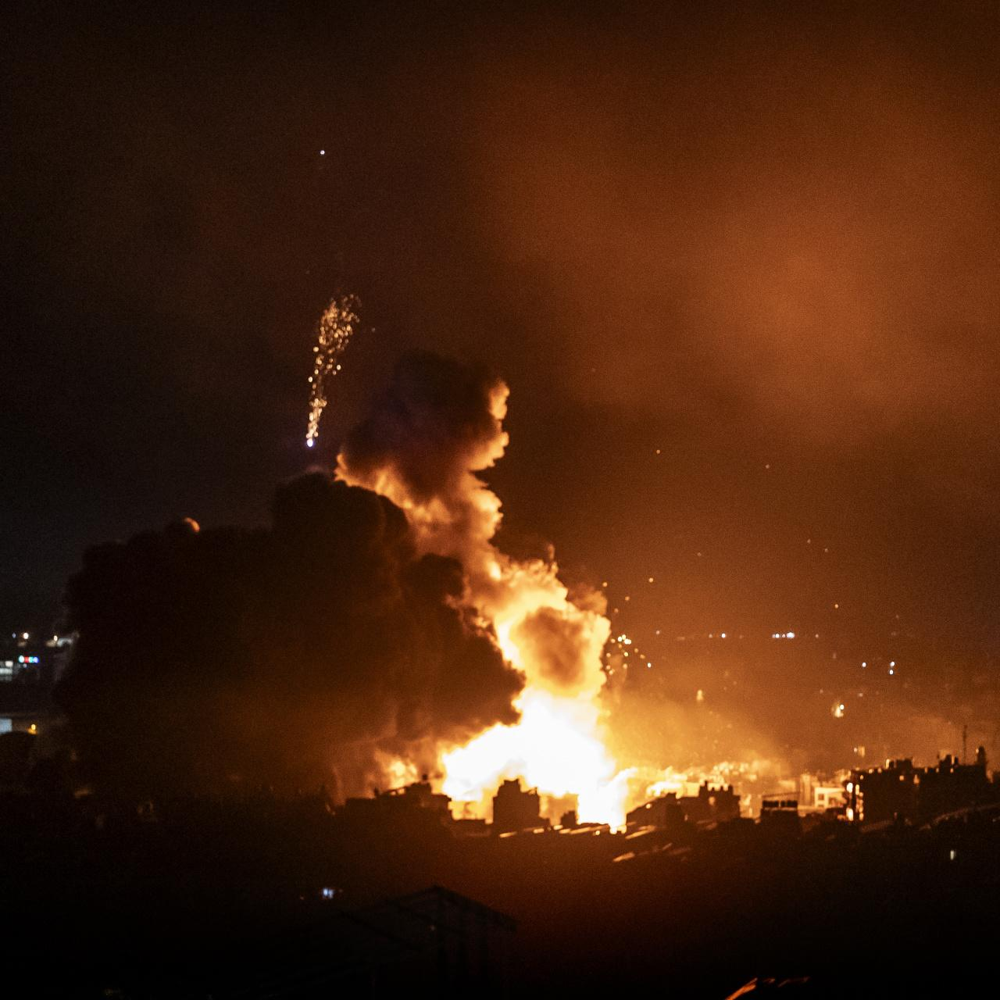
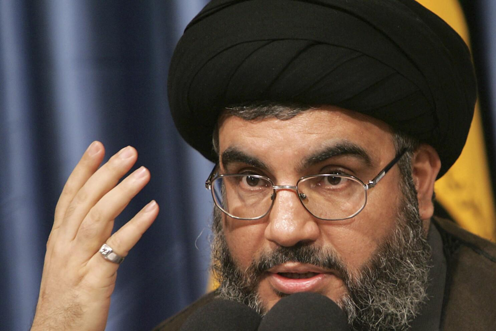

## Claim
Claim: " This image shows the remains of Nasrallah's ring after being killed in an Israeli airstrike in Beirut on September 28, 2024."

## Actions
```
reverse_search()
image_search("Nasrallah ring Israeli airstrike Beirut")
```

## Evidence
### Evidence from `reverse_search`
The image () shows a ring and fragments. According to the sources, the ring belonged to General Mohammad Reza Zahedi, who was killed in an Israeli airstrike in Damascus. The ring was a gift from Imam Reza shrine. The image was published on April 2 and 3, 2024, on websites such as [khabaronline.ir](https://www.khabaronline.ir/news/1890386/%D8%B9%DA%A9%D8%B3%DB%8C-%D8%AA%D9%84%D8%AE-%D8%A7%D8%B2-%D8%A7%D9%86%DA%AF%D8%B4%D8%AA%D8%B1-%D8%A8%D8%B1%D8%AC%D8%A7%DB%8C-%D9%85%D8%A7%D9%86%D8%AF%D9%87-%D8%A7%D8%B2-%D8%B3%D8%B1%D8%AF%D8%A7%D8%B1-%D8%B2%D8%A7%D9%87%D8%AF%DB%8C-%D8%A8%D8%B9%D8%AF-%D8%A7%D8%B2-%D8%B4%D9%87%D8%A7%D8%AF%D8%AA-%D9%87%D8%AF%DB%8C%D9%87) and [etemadonline.com](https://www.etemadonline.com/%D8%A8%D8%AE%D8%B4-%D8%B3%DB%8C%D8%A7%D8%B3%DB%8C-9/655901-%D8%A7%D9%86%DA%AF%D8%B4%D8%AA%D8%B1-%D8%A7%D9%87%D8%AF%D8%A7%DB%8C%DB%8C-%D8%B4%D9%87%DB%8C%D8%AF%D8%B2%D8%A7%D9%87%D8%AF%DB%8C-%D8%AD%D9%85%D9%84%D9%87-%D8%A7%D8%B3%D8%B1%D8%A7%D8%A6%DB%8C%D9%84) and [598.ir](https://www.598.ir/fa/news/535490/%D8%AA%D8%B5%D9%88%DB%8C%D8%B1%DB%8C-%D8%A7%D8%B2-%D8%A7%D9%86%DA%AF%D8%B4%D8%AA%D8%B1-%D8%B4%D9%87%DB%8C%D8%AF-%D8%B2%D8%A7%D9%87%D8%AF%DB%8C).


### Evidence from `image_search`
The Wall Street Journal published an image of an explosion in Beirut (). The Associated Press published an image of Nasrallah wearing a ring ().


## Elaboration
The claim is false. The image () shows the ring of General Mohammad Reza Zahedi, who was killed in an Israeli airstrike in Damascus, not Nasrallah. The image was published in April 2024.


## Final Judgement
The image shows the ring of General Mohammad Reza Zahedi, who was killed in an Israeli airstrike in Damascus, not Nasrallah. The image was published in April 2024.

`false`

### Verdict: FALSE

### Justification
The claim is false. The image depicts the ring of General Mohammad Reza Zahedi, who was killed in an Israeli airstrike in Damascus, as reported by sources like [khabaronline.ir](https://www.khabaronline.ir/news/1890386/%D8%B9%DA%A9%D8%B3%DB%8C-%D8%AA%D9%84%D8%AE-%D8%A7%D8%B2-%D8%A7%D9%86%DA%AF%D8%B4%D8%AA%D8%B1-%D8%A8%D8%B1%D8%AC%D8%A7%DB%8C-%D9%85%D8%A7%D9%86%D8%AF%D9%87-%D8%A7%D8%B2-%D8%B3%D8%B1%D8%AF%D8%A7%D8%B1-%D8%B2%D8%A7%D9%87%D8%AF%DB%8C-%D8%A8%D8%B9%D8%AF-%D8%A7%D8%B2-%D8%B4%D9%87%D8%A7%D8%AF%D8%AA-%D9%87%D8%AF%DB%8C%D9%87) and [etemadonline.com](https://www.etemadonline.com/%D8%A8%D8%AE%D8%B4-%D8%B3%DB%8C%D8%A7%D8%B3%DB%8C-9/655901-%D8%A7%D9%86%DA%AF%D8%B4%D8%AA%D8%B1-%D8%A7%D9%87%D8%AF%D8%A7%DB%8C%DB%8C-%D8%B4%D9%87%DB%8C%D8%AF%D8%B2%D8%A7%D9%87%D8%AF%DB%8C-%D8%AD%D9%85%D9%84%D9%87-%D8%A7%D8%B3%D8%B1%D8%A7%D8%A6%DB%8C%D9%84).
