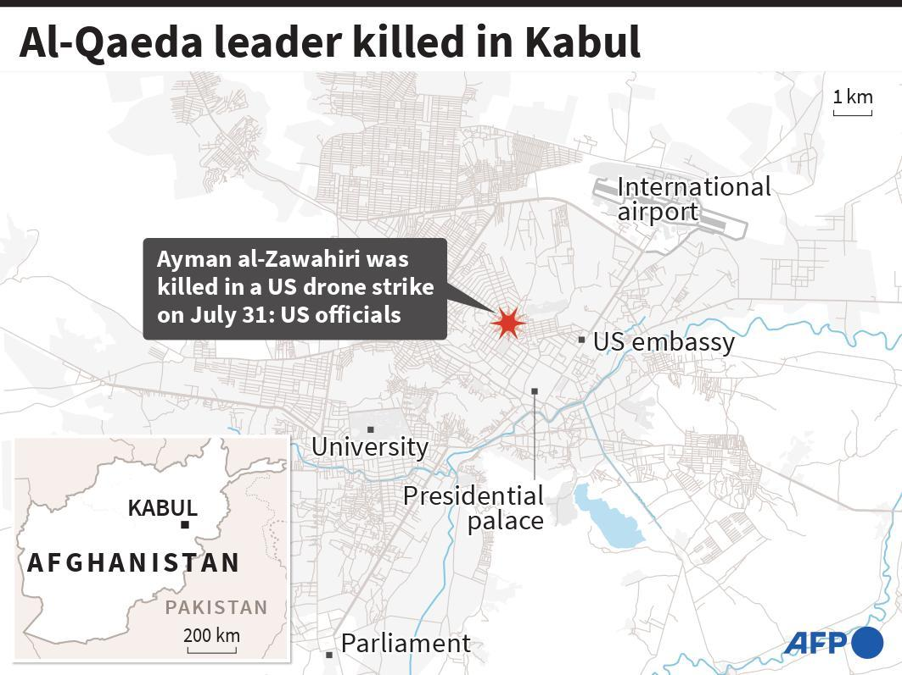
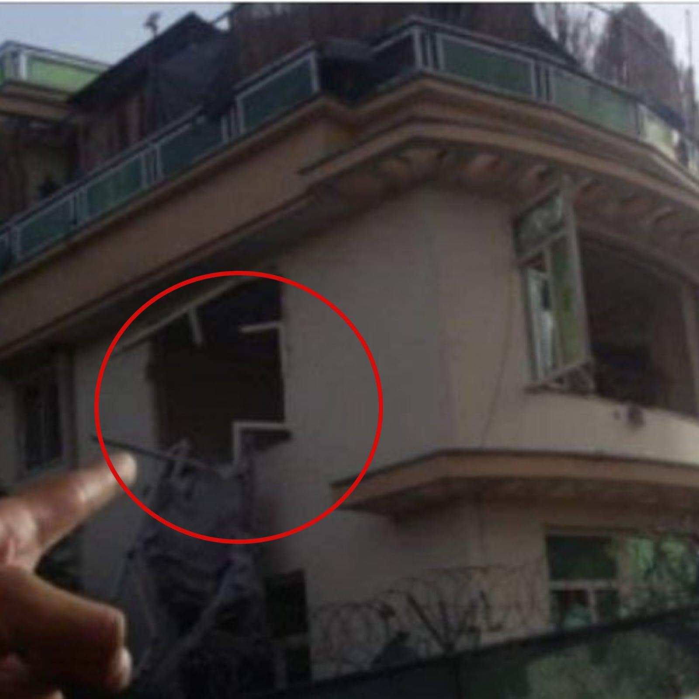
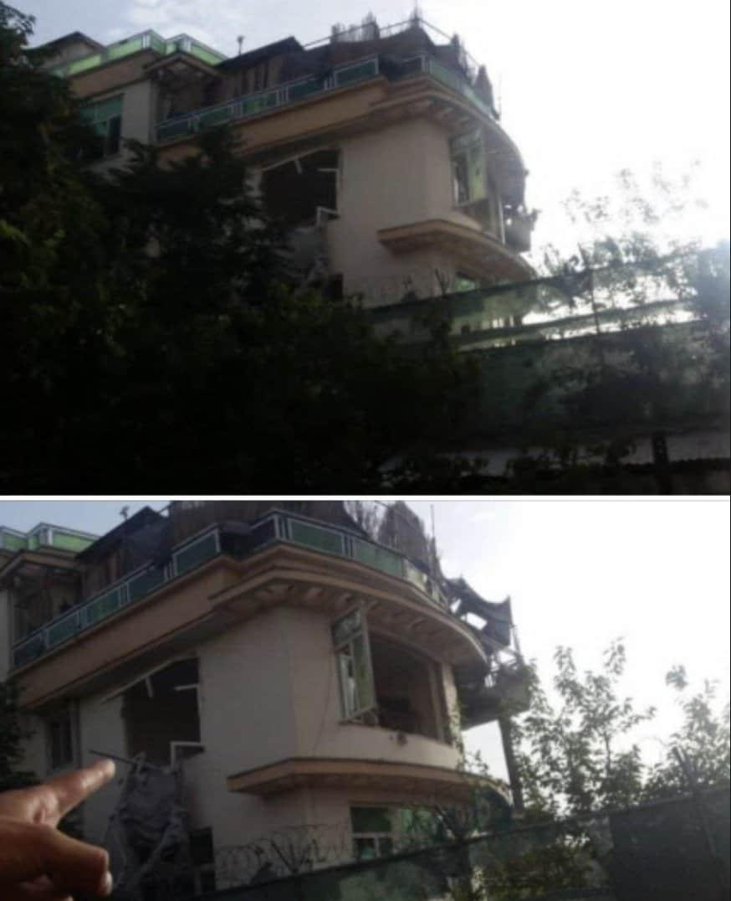
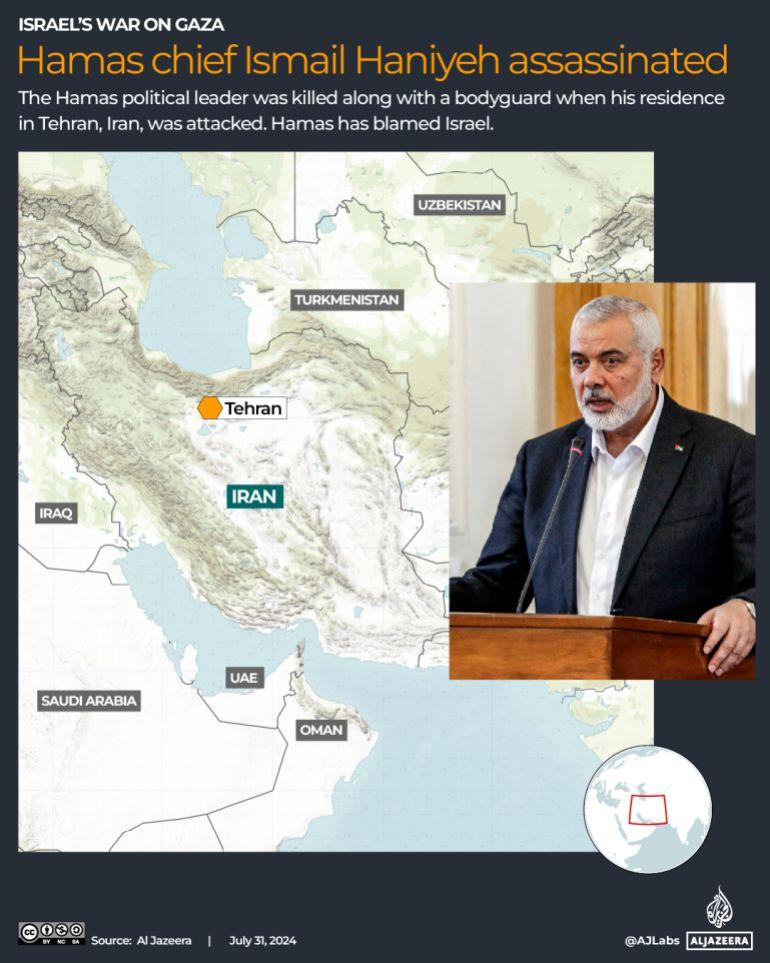
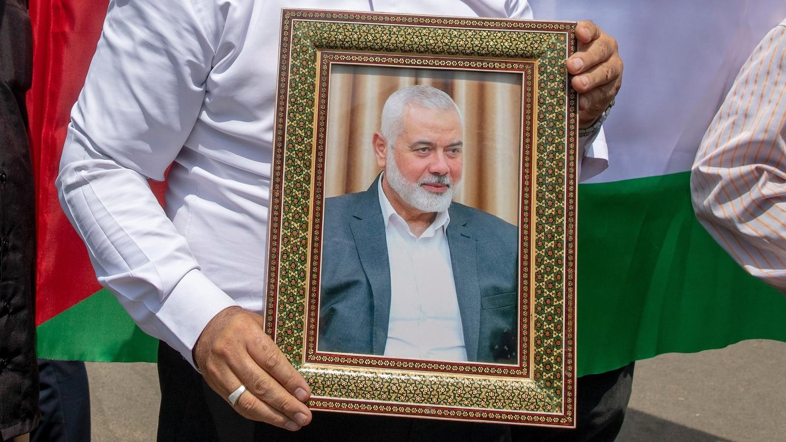

## Claim
Claim: " This image shows the assassination of Hamas leader Ismail Haniyeh on July 31st, 2024. This is how a precision strike looks like: a single missile through the window, and only Haniyeh and his bodyguard are dead. Nobody else in the building is even injured."

## Actions
```
reverse_search()
image_search("Ismail Haniyeh assassination July 31 2024")
```

## Evidence
### Evidence from `reverse_search`
The image  appears in multiple sources related to the killing of al-Qaeda leader Ayman al-Zawahiri in Kabul, Afghanistan, on July 31, 2022. The New York Post ([https://nypost.com/2022/08/01/biden-to-speak-after-us-takes-out-al-qaeda-target-in-afghanistan/](https://nypost.com/2022/08/01/biden-to-speak-after-us-takes-out-al-qaeda-target-in-afghanistan/)) and News18.com ([https://www.news18.com/news/world/al-zawahiri-liked-sitting-outside-on-his-balcony-the-cia-watched-for-months-before-killing-him-5671915.html](https://www.news18.com/news/world/al-zawahiri-liked-sitting-outside-on-his-balcony-the-cia-watched-for-months-before-killing-him-5671915.html)) both use the image, with the latter also including a map of the strike location  and other related images , .

Kyle Orton's article ([https://www.kyleorton.com/p/ayman-al-zawahiri-life-in-jihad](https://www.kyleorton.com/p/ayman-al-zawahiri-life-in-jihad)) also features the image  and discusses al-Zawahiri's life and the location of the strike in the Sherpur area of Kabul.


### Evidence from `image_search`
Le Monde published an article on July 31, 2024, about the assassination of Hamas leader Ismail Haniyeh (). Al Jazeera reports that Hamas chief Ismail Haniyeh was assassinated along with a bodyguard when his residence in Tehran, Iran, was attacked (). ABC News published an article about Ismail Haniyeh ().

The articles can be found at the following URLs: [https://www.lemonde.fr/en/international/article/2024/07/31/hamas-chief-ismail-haniyeh-assassinated-in-tehran_6705742_4.html](https://www.lemonde.fr/en/international/article/2024/07/31/hamas-chief-ismail-haniyeh-assassinated-in-tehran_6705742_4.html), [https://www.aljazeera.com/news/2024/7/31/hamas-chief-ismail-haniyeh-killed-in-iran-what-to-know-whats-next](https://www.aljazeera.com/news/2024/7/31/hamas-chief-ismail-haniyeh-killed-in-iran-what-to-know-whats-next), and [https://abcnews.go.com/International/ismail-haniyeh-assassinated-hamas-political-bureau-history/story?id=112430229](https://abcnews.go.com/International/ismail-haniyeh-assassinated-hamas-political-bureau-history/story?id=112430229).


## Elaboration
The image 

## Final Judgement
The image in the claim is associated with the killing of al-Qaeda leader Ayman al-Zawahiri in Kabul, Afghanistan, on July 31, 2022, not the assassination of Hamas leader Ismail Haniyeh. The claim misrepresents the image's context.

`false`

### Verdict: FALSE

### Justification
The image provided in the claim is associated with the killing of al-Qaeda leader Ayman al-Zawahiri in Kabul, Afghanistan, on July 31, 2022, as evidenced by sources like the New York Post ([https://nypost.com/2022/08/01/biden-to-speak-after-us-takes-out-al-qaeda-target-in-afghanistan/](https://nypost.com/2022/08/01/biden-to-speak-after-us-takes-out-al-qaeda-target-in-afghanistan/)) and News18.com ([https://www.news18.com/news/world/al-zawahiri-liked-sitting-outside-on-his-balcony-the-cia-watched-for-months-before-killing-him-5671915.html](https://www.news18.com/news/world/al-zawahiri-liked-sitting-outside-on-his-balcony-the-cia-watched-for-months-before-killing-him-5671915.html)). The claim incorrectly attributes the image to the assassination of Hamas leader Ismail Haniyeh.
