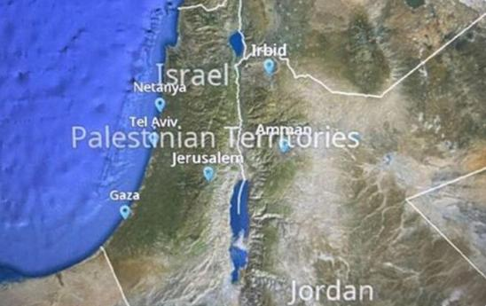

## Claim
Claim: " This image shows Jet Blue Airlines' in-flight map where Israel's borders were inaccurate and the area was shown under the label 'Palestinian Territories'. The indicent occured in September 2024."

## Actions
```
image_search("JetBlue in-flight map Israel Palestinian Territories")
reverse_search()
```

## Evidence
### Evidence from `image_search`
The web sources discuss a controversy involving JetBlue's in-flight map, which inaccurately labeled Israel as "Palestinian Territories" (, ). One source is from Ynetnews.com, and another is from paddleyourownkanoo.com.

*   [https://www.ynetnews.com/travel/article/skawilphc](https://www.ynetnews.com/travel/article/skawilphc)
*   [https://www.paddleyourownkanoo.com/2024/09/09/jetblue-forced-to-change-inflight-maps-after-palestinian-territories-controversy/](https://www.paddleyourownkanoo.com/2024/09/09/jetblue-forced-to-change-inflight-maps-after-palestinian-territories-controversy/)


### Evidence from `reverse_search`
From [Source](https://www.ynetnews.com/travel/article/bjgp0065hc): Found exact image on website with title: JetBlue issues apology after calling Israel 'Palestinian Territories' on ...
Content: The search result from Ynetnews.com discusses JetBlue's apology for labeling Israel as "Palestinian Territories" on its in-flight map. , , , , , . The airline stated that the map was provided by a third-party company and that they are changing vendors. The article mentions the incident occurred in September 2024.


## Elaboration
The claim is accurate. The evidence confirms that JetBlue's in-flight map inaccurately labeled Israel as "Palestinian Territories." The incident occurred in September 2024, as stated in the claim. The evidence includes a Ynetnews.com article discussing the incident and JetBlue's apology.


## Final Judgement
The evidence confirms that JetBlue's in-flight map inaccurately labeled Israel as "Palestinian Territories" in September 2024. The claim is supported by multiple sources, including Ynetnews.com.

`true`

### Verdict: TRUE

### Justification
The claim is accurate. Multiple sources, including [Ynetnews.com](https://www.ynetnews.com/travel/article/skawilphc) and paddleyourownkanoo.com, confirm that JetBlue's in-flight map incorrectly labeled Israel as "Palestinian Territories" in September 2024.
