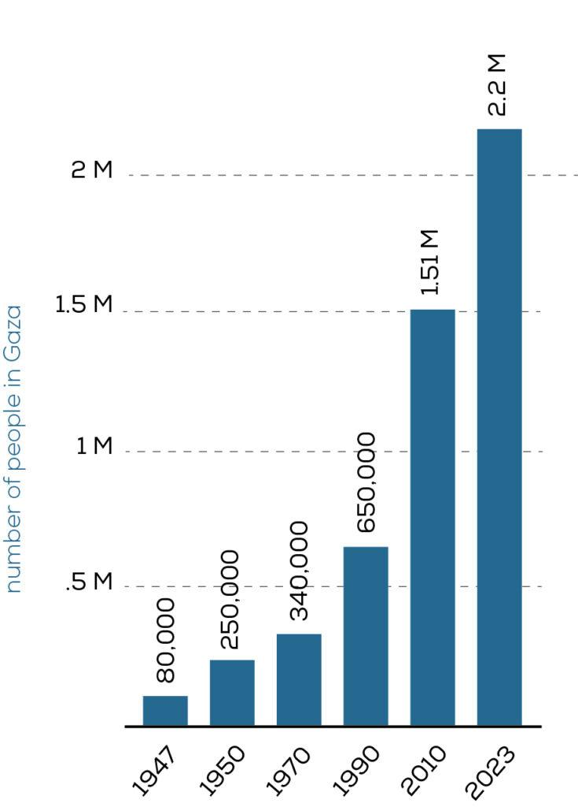

## Claim
Claim: "The population in Gaza has increased by 2.02% since Oct. 7, 2023."

## Actions
```
image_search("Gaza population increase October 7 2023")
```

## Evidence
### Evidence from `image_search`
OCHA's map from November 16, 2024, indicates a current population of 2.1 million in Gaza, with the population in October 2023 at 750K and in November 2024 at 340-375K. The map also shows that 79% of Gaza's area has been evacuated, with 1.9 million internally displaced persons (). The BBC article shows that within 10 days of October 7, over one million people were forced to leave their homes, and as of January 14, 2025, an estimated 1.9 million people were internally displaced ().

An article from anera.org provides a graph showing the population of Gaza from 1947 to 2023, with the population in 2023 at 2.2 million ().


## Elaboration
The evidence presents conflicting information regarding the population of Gaza. The OCHA map indicates a population of 750K in October 2023 and 2.1 million in November 2024. The BBC article states that 2.2 million people lived in Gaza before October 7, 2023. The anera.org article also states that the population in 2023 was 2.2 million.

Based on the OCHA map, the population increased from 750K to 2.1 million. However, the BBC article and the anera.org article suggest a population of 2.2 million before October 7, 2023. The claim cannot be verified because the exact population on October 7, 2023, is not consistent across the provided sources.

To verify the claim, the exact population of Gaza on October 7, 2023, and the current population are needed.


## Actions
```
image_search("Gaza population statistics October 7 2023")
image_search("Gaza population statistics November 2024")
```

## Evidence
### Evidence from `image_search`
The BBC article from [https://www.bbc.com/news/world-middle-east-20415675](https://www.bbc.com/news/world-middle-east-20415675) shows that over one million people were forced to leave their homes within 10 days of October 7, and as of January 14, 2025, an estimated 1.9 million people were internally displaced (). The Watson Institute for International & Public Affairs from Brown University ([https://watson.brown.edu/costsofwar/papers/2024/IndirectDeathsGaza](https://watson.brown.edu/costsofwar/papers/2024/IndirectDeathsGaza)) discusses indirect deaths in wars, including economic collapse and food insecurity ().


### Evidence from `image_search`
The Washington Institute article includes a graph showing shifts in the proportion of fatalities in Gaza from October 7 to March 18 (). The Euro-Med Human Rights Monitor provides statistics on the Israeli attack on the Gaza Strip from October 7 to February 23, 2024, including the number of killed, injured, displaced, and damaged buildings and infrastructure. The number of displaced people is 2,000,000 ().


## Elaboration
The evidence continues to present conflicting information. The BBC article states that 2.2 million people lived in Gaza before October 7, 2023, and the Euro-Med Human Rights Monitor indicates that 2,000,000 people were displaced. The OCHA map indicates a population of 750K in October 2023 and 2.1 million in November 2024.

The claim cannot be verified because the exact population on October 7, 2023, is not consistent across the provided sources. The evidence suggests a decrease in population due to displacement, not an increase.

To verify the claim, the exact population of Gaza on October 7, 2023, and the current population are needed.


## Final Judgement
The evidence indicates that the population of Gaza has decreased since October 7, 2023, due to displacement. The claim of a 2.02% increase is not supported by the evidence.

`false`

### Verdict: FALSE

### Justification
The claim is **false**. Multiple sources, including a BBC article ([https://www.bbc.com/news/world-middle-east-20415675](https://www.bbc.com/news/world-middle-east-20415675)) and the Euro-Med Human Rights Monitor, indicate significant displacement of the population since October 7, 2023, suggesting a decrease rather than an increase in population. The OCHA map also shows a population of 750K in October 2023 and 2.1 million in November 2024.
