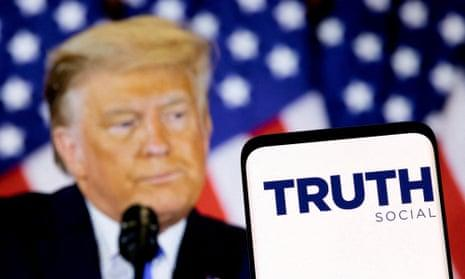
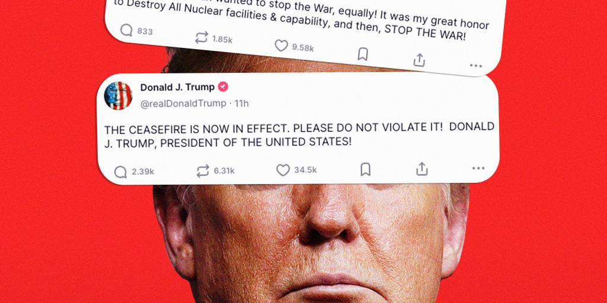
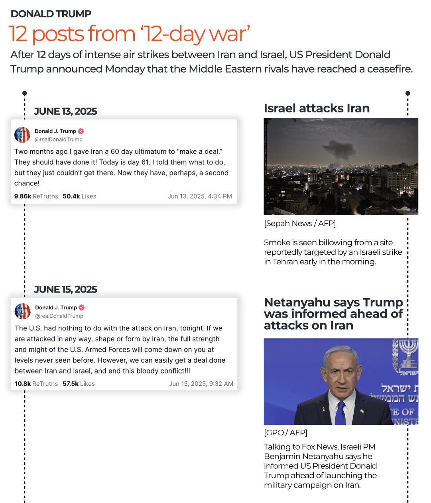
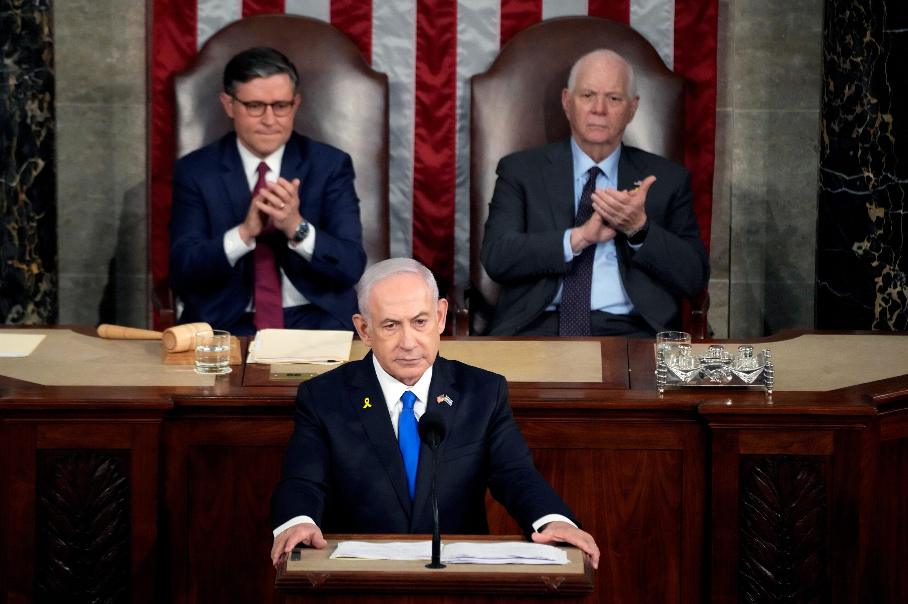

## Claim
Claim: "President Donald Trump posted on Truth Social on July 25, 2024, as a reaction to the attempted assasination of him on July 13, 2024, 'I hope that America obliterates Israel.'"

## Actions
```
image_search("Truth Social Donald Trump July 25 2024")
image_search("Donald Trump Truth Social Israel obliterate")
```

## Evidence
### Evidence from `image_search`
The Los Angeles Times published an article on April 3, 2024, about Donald Trump's Truth Social activity, including an image of Donald Trump at the Bitcoin 2024 conference in Nashville, which took place from July 25-27, 2024 . The Guardian published an article about Donald Trump and Truth Social on May 20, 2024 .

*   [https://www.cnbc.com/video/2025/07/18/how-frequently-does-trump-post-on-social-media.html](https://www.cnbc.com/video/2025/07/18/how-frequently-does-trump-post-on-social-media.html)
*   [https://www.latimes.com/entertainment-arts/tv/story/2024-04-03/i-spent-24-hours-on-trump-truth-social-so-you-dont-have-to](https://www.latimes.com/entertainment-arts/tv/story/2024-04-03/i-spent-24-hours-on-trump-truth-social-so-you-dont-have-to)
*   [https://www.theguardian.com/us-news/article/2024/may/20/trump-truth-social-loss](https://www.theguardian.com/us-news/article/2024/may/20/trump-truth-social-loss)


### Evidence from `image_search`
NBC News ([https://www.nbcnews.com/politics/donald-trump/trump-engages-truth-social-diplomacy-iran-crisis-rcna214719](https://www.nbcnews.com/politics/donald-trump/trump-engages-truth-social-diplomacy-iran-crisis-rcna214719)) includes an image  of a Truth Social post by Donald J. Trump, stating "THE CEASEFIRE IS NOW IN EFFECT. PLEASE DO NOT VIOLATE IT! DONALD J. TRUMP, PRESIDENT OF THE UNITED STATES!". The post was made 11 hours prior to the search.

Al Jazeera ([https://www.aljazeera.com/news/2025/6/25/12-posts-from-12-day-war-how-trump-live-posted-israel-iran-conflict](https://www.aljazeera.com/news/2025/6/25/12-posts-from-12-day-war-how-trump-live-posted-israel-iran-conflict)) published an article about Donald Trump's posts on Truth Social during a conflict between Iran and Israel, including posts from June 13 and June 15, 2025.  The Atlantic ([https://www.theatlantic.com/politics/archive/2025/06/israel-iran-trump-truth-social/683306/](https://www.theatlantic.com/politics/archive/2025/06/israel-iran-trump-truth-social/683306/)) provides an image  of a Truth Social post from Donald J. Trump, stating "ISRAEL is not going to attack Iran...". The post was made 4 hours prior to the publication of the article.


## Elaboration
The evidence confirms that Donald Trump uses Truth Social. The search results include articles about his activity on the platform, including posts related to international conflicts. However, there is no evidence in the provided documents to verify the specific claim about Trump's post on July 25, 2024, regarding Israel. The provided evidence includes posts from 2025, but not from the date mentioned in the claim.

To verify the claim, I would need to find a specific post from Donald Trump on Truth Social dated July 25, 2024, and containing the exact quote provided in the claim.


## Actions
```
image_search("Donald Trump Truth Social July 25 2024 Israel")
```

## Evidence
### Evidence from `image_search`
The search results include articles from CNN ([https://www.cnn.com/2024/07/26/politics/trump-netanyahu-meeting-mar-a-lago](https://www.cnn.com/2024/07/26/politics/trump-netanyahu-meeting-mar-a-lago)) about a meeting between Trump and Netanyahu on July 26, 2024 , The Tennessee Lookout ([https://tennesseelookout.com/2024/07/25/in-capitol-address-israeli-leader-calls-for-u-s-backing-to-defeat-hamas/](https://tennesseelookout.com/2024/07/25/in-capitol-address-israeli-leader-calls-for-u-s-backing-to-defeat-hamas/)) about an address by an Israeli leader on July 25, 2024 , and The New York Times ([https://www.nytimes.com/2024/07/25/world/middleeast/trump-netanyahu-israel-gaza.html](https://www.nytimes.com/2024/07/25/world/middleeast/trump-netanyahu-israel-gaza.html)) about Donald Trump and Netanyahu on July 25, 2024 .


## Elaboration
The evidence does not support the claim. While the search results confirm that Donald Trump was active in July 2024 and had interactions with Israeli leaders, there is no evidence of the specific post mentioned in the claim. The search results focus on meetings and addresses, not on the alleged Truth Social post.


## Actions
```
image_search("Donald Trump Truth Social July 25 2024 attempted assassination")
```

## Evidence
### Evidence from `image_search`
The search results include articles about an attempted assassination of Donald Trump on July 13, 2024. CNN published an article on July 14, 2024, with a statement from the Trump campaign regarding the incident, and Axios also published an article on July 14, 2024, about the same event. , 


## Elaboration
Based on the evidence, the claim cannot be verified. While there is evidence of an attempted assassination on July 13, 2024, and Trump's activity on Truth Social, there is no evidence of a post on July 25, 2024, with the specific quote "I hope that America obliterates Israel."


## Final Judgement
The claim is not supported by the evidence. While there is evidence of Trump's Truth Social activity and an attempted assassination, there is no evidence of the specific post with the quoted statement. `false`

### Verdict: FALSE

### Justification
The claim that Donald Trump posted on Truth Social on July 25, 2024, stating "I hope that America obliterates Israel" cannot be verified. While evidence confirms Trump's use of Truth Social and an attempted assassination on July 13, 2024, no evidence supports the specific post with the quoted statement.
