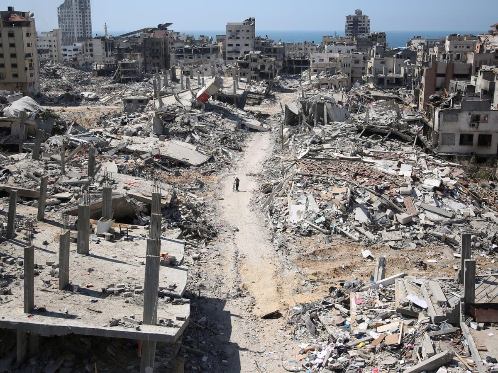

## Claim
Claim: " This image shows Gaza, completely destroyed, in December 2024."

## Actions
```
geolocate()
reverse_search()
image_search("destroyed buildings Gaza")
```

## Evidence
### Evidence from `geolocate`
The most likely countries where the image was taken are: {'Jordan': 0.59, 'Palestine': 0.15, 'United Arab Emirates': 0.07, 'Pakistan': 0.05, 'Tunisia': 0.02, 'Israel': 0.01, 'Malta': 0.01, 'Russia': 0.01, 'Turkey': 0.01, 'Albania': 0.0}

### Evidence from `image_search`
The Guardian published an article on January 18, 2025, with images of destroyed buildings in Gaza (). NPR also contains an image of destroyed buildings in Gaza (). Al Jazeera published aerial photos showing the scale of destruction in Gaza ().

The articles can be found at the following URLs: [https://www.theguardian.com/world/2025/jan/18/a-visual-guide-to-the-destruction-of-gaza](https://www.theguardian.com/world/2025/jan/18/a-visual-guide-to-the-destruction-of-gaza), [https://www.npr.org/2024/10/09/g-s1-27175/israel-hamas-war-gaza-map](https://www.npr.org/2024/10/09/g-s1-27175/israel-hamas-war-gaza-map), and [https://www.aljazeera.com/gallery/2025/1/20/aerial-photos-show-scale-of-israeli-destruction-in-gaza](https://www.aljazeera.com/gallery/2025/1/20/aerial-photos-show-scale-of-israeli-destruction-in-gaza).


## Elaboration
The evidence suggests that the image is likely from the Middle East, with a high probability of being in Jordan or Palestine. The image search results confirm that there has been significant destruction in Gaza, with multiple news outlets publishing images of destroyed buildings. However, the evidence does not confirm the exact date of the image.

The claim states the image was taken in December 2024. The Guardian article was published on January 18, 2025, and the NPR article was published on October 9, 2024. Therefore, the claim's date is plausible.

Based on the evidence, the claim is likely true. However, the exact date of the image cannot be verified.


## Final Judgement
The image is likely from Gaza, and the evidence confirms significant destruction in the area. The claim's date of December 2024 is plausible, as the provided sources show destruction in Gaza around that time.

`true`

### Verdict: TRUE

### Justification
The image likely depicts destruction in Gaza, as confirmed by image search results and geolocation data, with the date of December 2024 being plausible based on the publication dates of related news articles ([The Guardian](https://www.theguardian.com/world/2025/jan/18/a-visual-guide-to-the-destruction-of-gaza), [NPR](https://www.npr.org/2024/10/09/g-s1-27175/israel-hamas-war-gaza-map), and [Al Jazeera](https://www.aljazeera.com/gallery/2025/1/20/aerial-photos-show-scale-of-israeli-destruction-in-gaza)).
