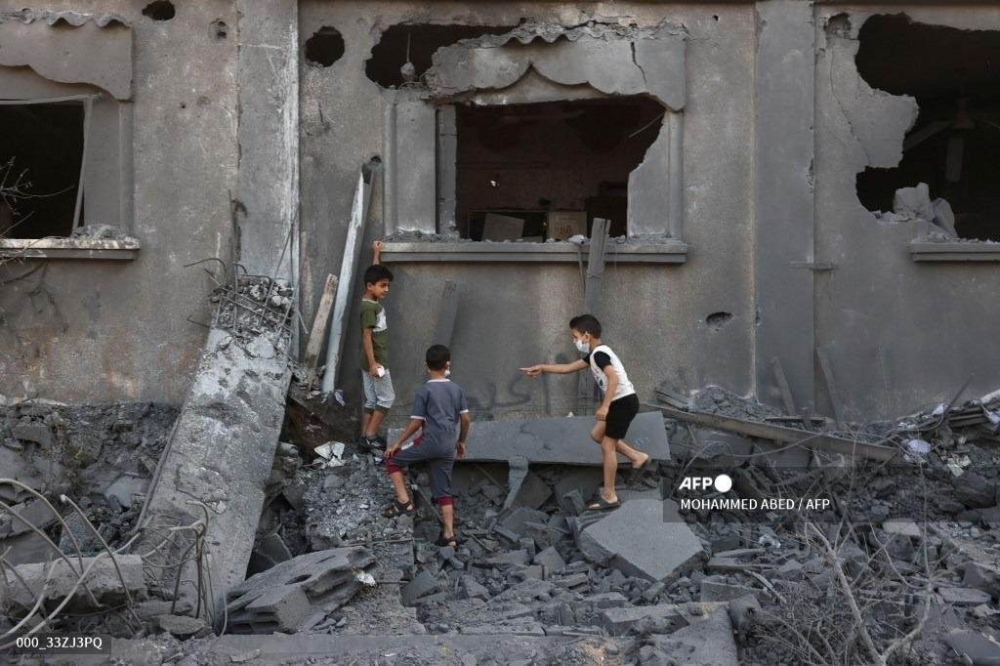
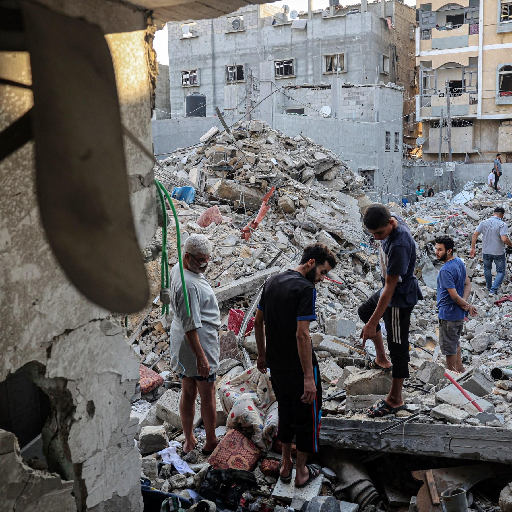

## Claim
Claim: " This image shows two children in Gaza in April 2025 found dead under the rubble of their home two months after an Israeli airstrike destroyed it."

## Actions
```
reverse_search()
image_search("children found rubble home")
image_search("children dead rubble home Gaza")
```

## Evidence
### Evidence from `reverse_search`
From [Source](https://kashif.ps/en/index.php/2025/04/14/image-of-two-mummified-children-in-a-bolivian-museum-goes-viral-as-from-gaza/): Found exact image on website with title: Image of two mummified children in a Bolivian museum goes viral as ...
Content: The image in the claim shows two mummified children from a Bolivian museum, not children found in Gaza. The image was posted on Instagram and the source of the claim is ali\_alhasasna1. The image was posted on Fliker on 25/12/2006 by Tanya Knight. The article was published on April 14, 2025, by Nadeen on Kashif.ps. , , .


### Evidence from `image_search`
Al Jazeera published an article about children being pulled from the rubble in Turkey and Syria. ([https://www.aljazeera.com/news/2023/2/8/hope-heartbreak-as-children-pulled-from-rubble-in-turkey-syria](https://www.aljazeera.com/news/2023/2/8/hope-heartbreak-as-children-pulled-from-rubble-in-turkey-syria))  The Guardian published a video on October 19, 2023, showing a child being pulled from the rubble after an Israeli airstrike in Gaza. ([https://www.theguardian.com/world/video/2023/oct/19/gaza-moment-children-are-pulled-from-rubble-after-home-hit-by-israeli-airstrike-video](https://www.theguardian.com/world/video/2023/oct/19/gaza-moment-children-are-pulled-from-rubble-after-home-hit-by-israeli-airstrike-video))  The UN News Center published an image of a teddy bear in the rubble. ([https://news.un.org/en/story/2016/08/537042](https://news.un.org/en/story/2016/08/537042)) 


### Evidence from `image_search`
The Defense for Children International - Palestine website includes an image of children standing in front of a destroyed building (). Al Jazeera published a photo of people standing in rubble (). The Save the Children website contains an image of a building destroyed in Gaza ().

*   [https://www.dci-palestine.org/40_percent_of_palestinians_killed_in_gaza_are_children](https://www.dci-palestine.org/40_percent_of_palestinians_killed_in_gaza_are_children)
*   [https://www.aljazeera.com/gallery/2022/8/7/photos-children-killed-as-israel-bombards-gaza](https://www.aljazeera.com/gallery/2022/8/7/photos-children-killed-as-israel-bombards-gaza)
*   [https://www.savethechildren.net/stories/nowhere-safe-children-gaza](https://www.savethechildren.net/stories/nowhere-safe-children-gaza)


## Elaboration
The claim is false. The image in the claim shows mummified children from a Bolivian museum, not children found in Gaza. The image was posted on Flickr in 2006.


## Final Judgement
The claim is demonstrably false. The image is of mummified children from a Bolivian museum, not children found in Gaza. The image was posted on Flickr in 2006. `false`

### Verdict: FALSE

### Justification
The image in the claim is of mummified children from a Bolivian museum, as confirmed by a reverse image search ([Source](https://kashif.ps/en/index.php/2025/04/14/image-of-two-mummified-children-in-a-bolivian-museum-goes-viral-as-from-gaza/)). The image was posted on Flickr in 2006, thus contradicting the claim that it depicts children found in Gaza in 2025.
