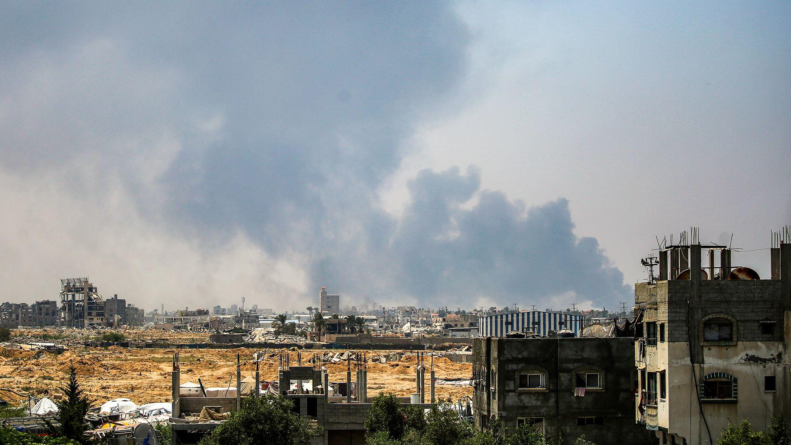
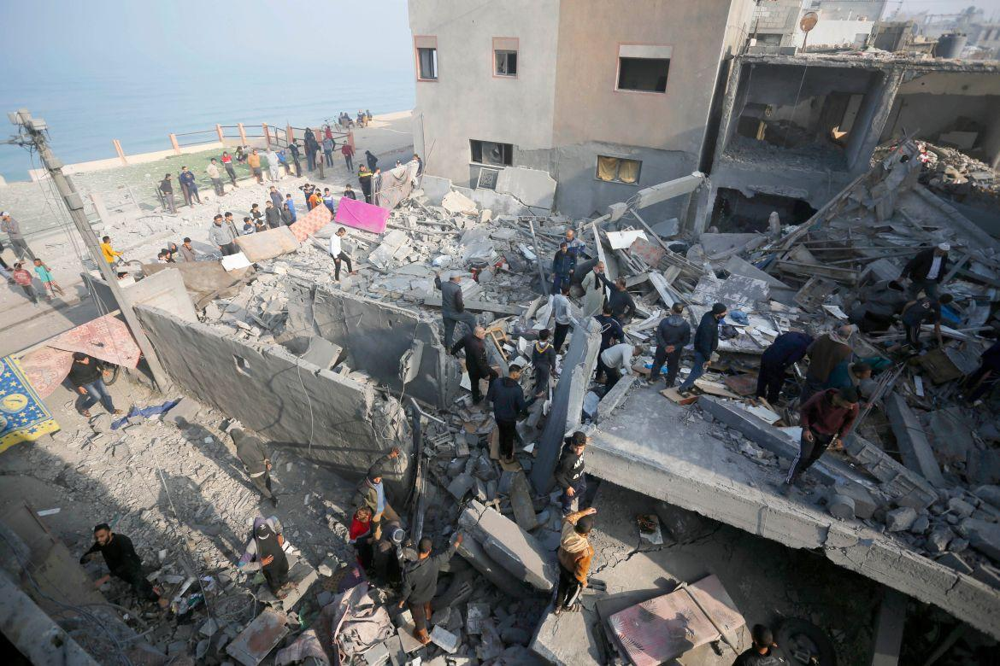

## Claim
Claim: " This image shows heavy Israeli bombardment on Deir al-Balah in the southern Gaza Strip in March 2025 which killed at least four Palestinians."

## Actions
```
reverse_search()
image_search("Deir al-Balah bombardment March 2025")
```

## Evidence
### Evidence from `reverse_search`
The image () appears in an article from L'Orient Today, which reports on an Israeli strike on Nabatieh, Lebanon, on June 26, 2024, which injured nine people. The article mentions the Israeli air force targeted the western part of the city. The same image is also found in an article from bhol.co.il, which discusses the ongoing conflict between Israel and Hezbollah, including reports of attacks, alerts, and diplomatic actions.

*   [Source](https://today.lorientlejour.com/article/1418485/israeli-strike-on-nabatieh-at-least-7-injured-and-14-suffocated.html)
*   [Source](https://www.bhol.co.il/news/1666411)


### Evidence from `image_search`
CNN published an article on July 21, 2025, about the Israeli military in Deir al-Balah, Gaza, including an image of smoke rising over the city. ([https://www.cnn.com/2025/07/21/middleeast/israel-military-deir-al-balah-gaza-intl](https://www.cnn.com/2025/07/21/middleeast/israel-military-deir-al-balah-gaza-intl)) 

The Guardian published an image of a building explosion. ([https://www.theguardian.com/world/live/2025/jul/21/gaza-israel-war-latest-situation-updates-live-news](https://www.theguardian.com/world/live/2025/jul/21/gaza-israel-war-latest-situation-updates-live-news))  Al Jazeera published an article about Israeli strikes on Deir al-Balah in central Gaza, including an image of the destruction. ([https://www.aljazeera.com/gallery/2023/12/2/hell-on-earth-as-israel-hits-deir-al-balah-in-central-gaza](https://www.aljazeera.com/gallery/2023/12/2/hell-on-earth-as-israel-hits-deir-al-balah-in-central-gaza)) 


## Elaboration
The image (

## Final Judgement
The image in question has been used in reports about an Israeli strike on Nabatieh, Lebanon, in June 2024, and is also found in articles discussing the conflict between Israel and Hezbollah. The image search results show that there have been Israeli strikes on Deir al-Balah, Gaza, but the provided image is not among them. Therefore, the claim that the image depicts an event in Deir al-Balah in March 2025 is not supported by the evidence.

`false`

### Verdict: FALSE

### Justification
The image in the claim is associated with an Israeli strike on Nabatieh, Lebanon, in June 2024, as reported by L'Orient Today ([https://today.lorientlejour.com/article/1418485/israeli-strike-on-nabatieh-at-least-7-injured-and-14-suffocated.html](https://today.lorientlejour.com/article/1418485/israeli-strike-on-nabatieh-at-least-7-injured-and-14-suffocated.html)). The image does not appear in the search results for events in Deir al-Balah, Gaza. Therefore, the claim is false.
