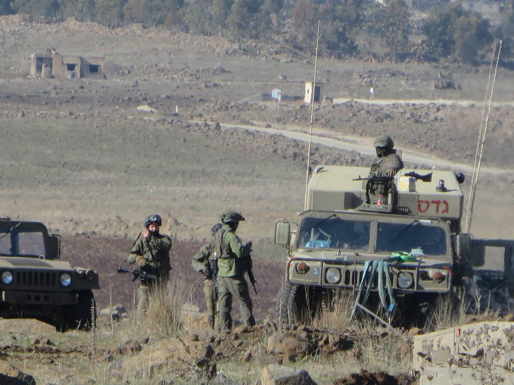

## Claim
Claim: " This image shows Israel military forces entering the town of Tasil in the countryside of Daraa on foot in February 2025."

## Actions
```
geolocate()
image_search("Israel military forces Tasil Daraa")
reverse_search()
```

## Evidence
### Evidence from `geolocate`
The most likely countries where the image was taken are: {'Palestine': 0.68, 'Israel': 0.27, 'Jordan': 0.03, 'United Arab Emirates': 0.01, 'Albania': 0.0, 'Andorra': 0.0, 'Argentina': 0.0, 'Australia': 0.0, 'Austria': 0.0, 'Bangladesh': 0.0}

### Evidence from `image_search`
From [Source](https://english.aawsat.com/arab-world/5178173-israeli-forces-infiltrate-several-syrian-villages-quneitra-and-daraa): 
Content: The search result from Asharq Al-Awsat discusses Israeli forces infiltrating several Syrian villages in Quneitra and Daraa. 


### Evidence from `reverse_search`
The image 

## Elaboration
The geolocation data suggests the image was most likely taken in Palestine or Israel. The image search reveals that Israeli forces have been reported in the Daraa region. However, the provided evidence does not confirm the specific claim that the image depicts Israeli military forces entering the town of Tasil in the countryside of Daraa.

More information is needed to verify the claim, such as the source of the image and any accompanying details about the location and date.


## Actions
```
image_search("Israel military forces Tasil Daraa February 2025")
```

## Evidence
### Evidence from `image_search`
The search results discuss the Israeli military presence in Syria and Israeli strikes in southern Syria. One source is from Syria Direct ([https://syriadirect.org/israel-in-syria-permanent-fortifications-and-attempts-to-win-over-residents/](https://syriadirect.org/israel-in-syria-permanent-fortifications-and-attempts-to-win-over-residents/)) and the other is from The Long War Journal ([https://www.longwarjournal.org/archives/2025/03/israel-strikes-gunmen-in-southern-syria-damascus-says-civilians-killed.php](https://www.longwarjournal.org/archives/2025/03/israel-strikes-gunmen-in-southern-syria-damascus-says-civilians-killed.php)).  and 


## Elaboration
The new evidence from the image search provides additional context. It confirms the presence of Israeli military forces in the region, including reports of strikes in southern Syria. However, the search results do not specifically mention the town of Tasil or the date February 2025.

The claim cannot be verified with the available information. The evidence supports the presence of Israeli forces in the general area but lacks specific details to confirm the claim's location and date.


## Actions
```
image_search("Tasil Daraa February 2025")
```

## Evidence
### Evidence from `image_search`
The search results discuss protests in Syria against Israeli strikes, as reported by MEMRI ([https://www.memri.org/jttm/protesting-israeli-strikes-syria-actions-gaza-syrians-chant-nation-wants-jihad-declared](https://www.memri.org/jttm/protesting-israeli-strikes-syria-actions-gaza-syrians-chant-nation-wants-jihad-declared)). Etana Syria provides a Syria update from February 19-22, 2025, including a map of incidents in Daraa province ([https://etanasyria.org/syria-update-19-22-february-2025/](https://etanasyria.org/syria-update-19-22-february-2025/)).  and 


## Elaboration
The latest search results provide more context, including a map of incidents in Daraa province from February 19-22, 2025. However, the evidence still does not directly confirm the claim. The map from Etana Syria ([https://etanasyria.org/syria-update-19-22-february-2025/](https://etanasyria.org/syria-update-19-22-february-2025/)) shows incidents in Daraa, but it does not specifically mention Tasil or Israeli military forces entering the town.

The claim remains unverified due to the lack of specific evidence linking the image to the town of Tasil and the date February 2025.


## Final Judgement
The image search results confirm the presence of Israeli military forces in the region and provide a map of incidents in Daraa province during the specified time frame. However, the evidence does not specifically mention the town of Tasil or confirm that the image depicts Israeli forces entering the town. Therefore, the claim cannot be verified. `false`

### Verdict: FALSE

### Justification
The claim is unverified. While evidence confirms Israeli military presence in the region and incidents in Daraa province during the specified timeframe, there's no direct link to the image depicting Israeli forces entering Tasil. The provided sources, including reports from Asharq Al-Awsat and a map from Etana Syria ([https://etanasyria.org/syria-update-19-22-february-2025/](https://etanasyria.org/syria-update-19-22-february-2025/)), do not provide the necessary details to confirm the claim.
