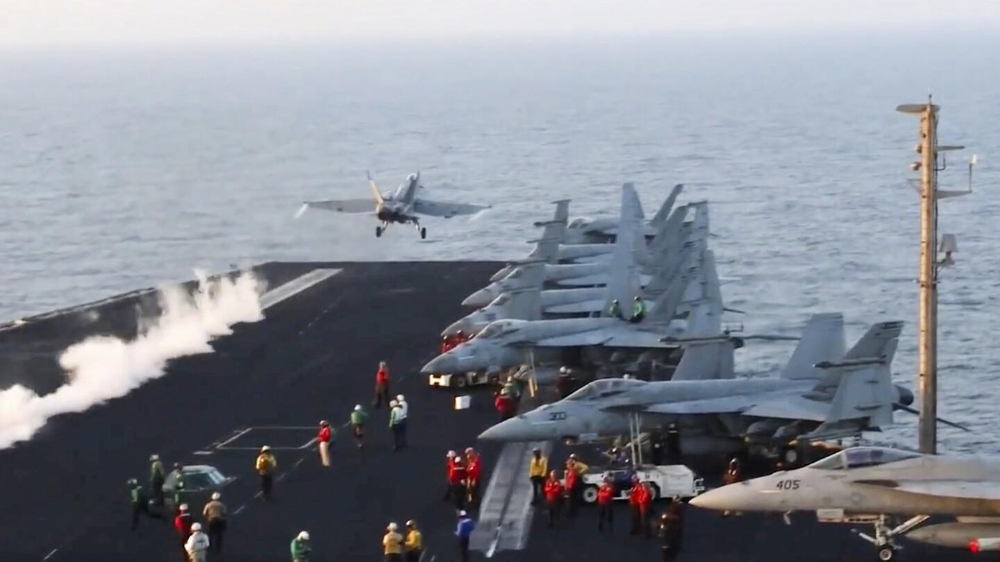
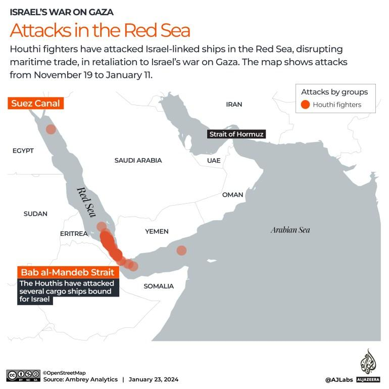

## Claim
Claim: "The Huthi rebels announced the final cessation of their military operations in international waters after Trump won the 2024 US presidential election."

## Actions
```
image_search("Huthi rebels military operations international waters Trump 2024")
```

## Evidence
### Evidence from `image_search`
The Associated Press provides an image of military aircraft on an aircraft carrier (). The Washington Post published an image of soldiers (). The Los Angeles Times published an article on January 17, 2024, about the U.S. putting Yemen's Houthi rebels back on the list of specially designated global terrorists, including an image of Houthi rebels ().

The sources are: [Source](https://apnews.com/article/trump-yemen-houthis-rebels-attack-airstrike-11b0e080b3982542dd621338a7b18afd), [Source](https://www.washingtonpost.com/world/2024/06/22/yemen-houthis-red-sea-us-military/), and [Source](https://www.latimes.com/world-nation/story/2024-01-17/u-s-puts-yemens-houthis-rebels-back-on-list-of-specially-designated-global-terrorists).


## Elaboration
The evidence includes images of military aircraft, soldiers, and Houthi rebels. The Los Angeles Times published an article on January 17, 2024, about the U.S. putting Yemen's Houthi rebels back on the list of specially designated global terrorists.

The provided evidence does not contain any information about the Huthi rebels announcing the cessation of military operations in international waters or the US presidential election in 2024.

Therefore, there is insufficient information to verify the claim.


## Actions
```
image_search("Huthi rebels cease military operations international waters 2024")
```

## Evidence
### Evidence from `image_search`
AOL provides an image of Houthi rebels (). Al Jazeera published an article on January 23, 2024, about Houthi fighters attacking Israel-linked ships in the Red Sea (). India Shipping News contains an image of a boat with armed people in front of a ship ().

The provided sources do not mention the cessation of military operations in international waters or the 2024 US presidential election.


## Elaboration
The new evidence includes images of Houthi rebels and an article from Al Jazeera on January 23, 2024, detailing attacks on Israel-linked ships in the Red Sea. Another image shows a boat with armed people near a ship.

This evidence contradicts the claim, as it shows that Houthi rebels were actively engaged in military operations in international waters in January 2024. The evidence does not mention the cessation of military operations or the 2024 US presidential election.

Therefore, the claim is false.


## Final Judgement
The fact-check reveals that the Huthi rebels were actively engaged in military operations in international waters in January 2024, contradicting the claim. The evidence includes images of Houthi rebels and an article detailing attacks on ships. The evidence does not mention the cessation of military operations or the 2024 US presidential election.

`false`


### Verdict: FALSE

### Justification
The fact-check reveals that the Huthi rebels were actively engaged in military operations in international waters in January 2024, as evidenced by an article from Al Jazeera ([Source](https://www.aljazeera.com/news/2024/1/23/houthis-attack-israel-linked-ships-in-red-sea-disrupting-trade)) detailing attacks on ships. This contradicts the claim that they ceased operations.
