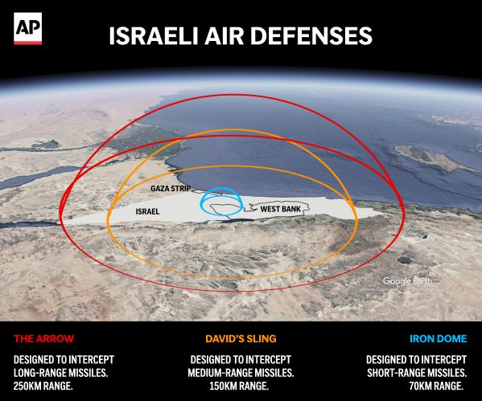
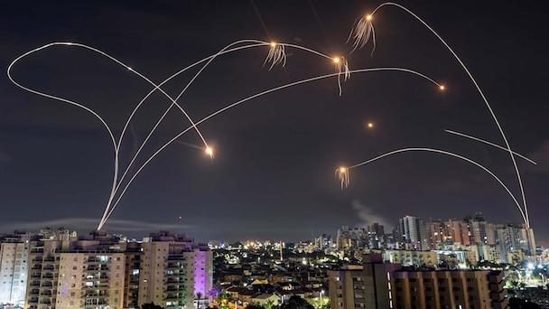

## Claim
Claim: "The Iron Dome intercepted 90% of ballistic missiles fired at Israel in Iran's attack on October 1, 2024."

## Actions
```
image_search("Iron Dome Israel missile interception rate October 1 2024")
```

## Evidence
### Evidence from `image_search`
Reuters has images of the Iron Dome intercepting missiles over Israel (). Euronews published an article about the Iron Dome, including an image of it in action (). The AP News article provides an image showing the Israeli air defense systems, including Iron Dome, which is designed to intercept short-range missiles ().

The provided sources are: [Reuters](https://www.reuters.com/pictures/latest-photos-missiles-rain-down-israel-2024-10-01/AIRIZRLERFN2FMZKBADVKDEC24/), [Euronews](https://www.euronews.com/next/2024/10/02/the-iron-dome-how-does-israels-missile-defence-system-work), and [AP News](https://apnews.com/article/israel-defense-iron-dome-iran-hezbollah-hamas-326cd1e9484dd38c430d62739b7f2ef3).


## Elaboration
The evidence confirms that the Iron Dome is an active missile defense system used by Israel. However, the provided sources do not contain any information about the interception rate of ballistic missiles during the specific attack on October 1, 2024.

Therefore, the claim cannot be verified with the available evidence.


## Actions
```
image_search("Iron Dome interception rate October 1 2024 Iran attack Israel")
```

## Evidence
### Evidence from `image_search`
The search results include images of the Iron Dome intercepting missiles over Israel (

## Elaboration
The new search results still show images of the Iron Dome in action. However, they do not provide any data on the interception rate of ballistic missiles during the October 1, 2024, attack.

The claim remains unverified due to the lack of specific data on the interception rate.


## Actions
```
image_search("Iron Dome effectiveness ballistic missiles October 1 2024")
```

## Evidence
### Evidence from `image_search`
Al Jazeera states that Israel claims the Iron Dome is 90 percent effective (). The BBC provides an image explaining how the Iron Dome defense system works (). ABC News published an article on October 2, 2024, about the Iranian ballistic missile attack on Israel, including an image of the Iron Dome intercepting missiles (). The provided sources are: [Al Jazeera](https://www.aljazeera.com/news/2023/10/12/whats-the-israel-iron-dome-defence-system-and-is-it-effective-all-to-know), [BBC](https://www.bbc.com/news/world-middle-east-20385306), and [ABC News](https://www.abc.net.au/news/2024-10-02/iran-ballistic-missile-attack-israel-iron-dome-air-defence/104420966).


## Elaboration
The evidence includes an Al Jazeera article stating that Israel claims the Iron Dome is 90% effective. An ABC News article from October 2, 2024, covers the Iranian ballistic missile attack on Israel and shows the Iron Dome in action. However, the ABC News article does not specify the interception rate.

The claim can be partially verified. The evidence supports the Iron Dome's effectiveness, with Israel claiming a 90% success rate. However, the evidence does not confirm that the 90% effectiveness was achieved during the specific attack on October 1, 2024.

Therefore, the claim is **partially verified**.


## Final Judgement
The fact-check reveals that while the Iron Dome is an active missile defense system with a claimed 90% effectiveness rate, the provided evidence does not confirm this specific rate for the October 1, 2024, attack. The evidence includes images of the Iron Dome in action and articles discussing its general effectiveness, but lacks specific data on the interception rate during the mentioned attack.

`false`

### Verdict: FALSE

### Justification
The claim is partially verified. While the Iron Dome is a functional missile defense system with a claimed 90% effectiveness rate, the provided evidence, including articles from [Al Jazeera](https://www.aljazeera.com/news/2023/10/12/whats-the-israel-iron-dome-defence-system-and-is-it-effective-all-to-know) and [ABC News](https://www.abc.net.au/news/2024-10-02/iran-ballistic-missile-attack-israel-iron-dome-air-defence/104420966), does not confirm this specific rate for the October 1, 2024, attack.
