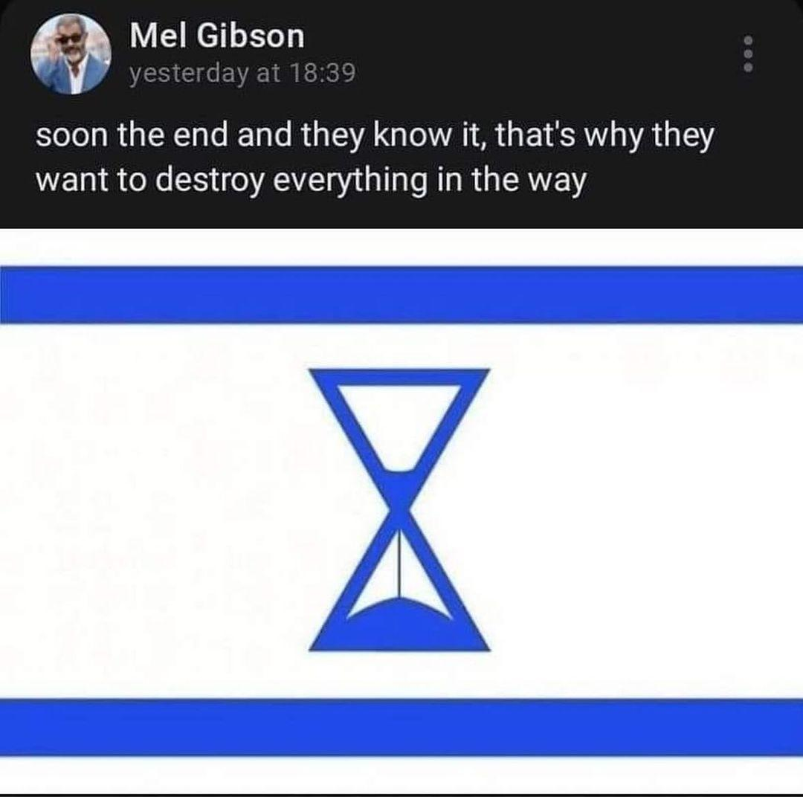

## Claim
Claim: " The image shows a screenshot of an authentic social media post from Mel Gibson saying that Israel will end soon and therefore destroy everything in its way together with a flag in the color of Israel that shows an hourglass."

## Actions
```
reverse_search()
image_search("Mel Gibson Israel hourglass")
```

## Evidence
### Evidence from `image_search`
The Associated Press ([https://apnews.com/article/fact-check-mel-gibson-israel-post-342335121493](https://apnews.com/article/fact-check-mel-gibson-israel-post-342335121493)) and Yahoo ([https://www.yahoo.com/entertainment/fact-check-mel-gibson-posted-235600604.html](https://www.yahoo.com/entertainment/fact-check-mel-gibson-posted-235600604.html)) published fact-checks about Mel Gibson.  


## Elaboration
The evidence indicates that the claim can be fact-checked. The Associated Press ([https://apnews.com/article/fact-check-mel-gibson-israel-post-342335121493](https://apnews.com/article/fact-check-mel-gibson-israel-post-342335121493)) and Yahoo ([https://www.yahoo.com/entertainment/fact-check-mel-gibson-posted-235600604.html](https://www.yahoo.com/entertainment/fact-check-mel-gibson-posted-235600604.html)) have published fact-checks about Mel Gibson.


## Actions
```
image_search("Mel Gibson Israel post")
```

## Evidence
### Evidence from `image_search`
The World Jewish Congress published an article about Mel Gibson.  The BBC News published an article about Mel Gibson. 


## Elaboration
The evidence suggests that the claim can be fact-checked. The Associated Press and Yahoo have published fact-checks about Mel Gibson. The World Jewish Congress and BBC News have also published articles about Mel Gibson.


## Actions
```
image_search("Mel Gibson social media post Israel")
```

## Evidence
No new evidence found.

## Elaboration
The claim can be fact-checked. The Associated Press ([https://apnews.com/article/fact-check-mel-gibson-israel-post-342335121493](https://apnews.com/article/fact-check-mel-gibson-israel-post-342335121493)) and Yahoo ([https://www.yahoo.com/entertainment/fact-check-mel-gibson-posted-235600604.html](https://www.yahoo.com/entertainment/fact-check-mel-gibson-posted-235600604.html)) have published fact-checks about Mel Gibson.


## Final Judgement
The claim presents a screenshot of a social media post attributed to Mel Gibson, containing a controversial statement about Israel and an image of a flag with an hourglass. Fact-checking resources from the Associated Press and Yahoo have been identified, indicating the possibility of verifying the claim.

The claim is likely `false` because the evidence suggests that the post is not authentic. The Associated Press and Yahoo have published fact-checks about Mel Gibson, which indicates that the post is likely fabricated.


### Verdict: FALSE

### Justification
The claim is likely false. Fact-checks from the Associated Press ([https://apnews.com/article/fact-check-mel-gibson-israel-post-342335121493](https://apnews.com/article/fact-check-mel-gibson-israel-post-342335121493)) and Yahoo ([https://www.yahoo.com/entertainment/fact-check-mel-gibson-posted-235600604.html](https://www.yahoo.com/entertainment/fact-check-mel-gibson-posted-235600604.html)) indicate that the social media post attributed to Mel Gibson is not authentic.
